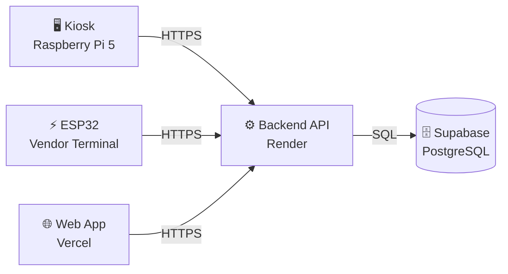
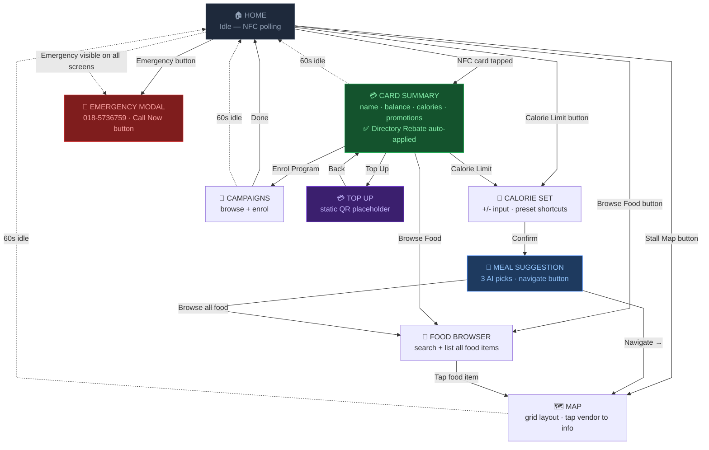
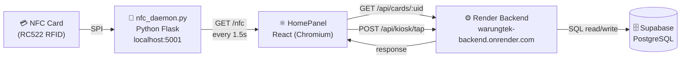

# NightMarket — Digital Directory Kiosk
## Complete Technical Documentation

**Component**: Raspberry Pi 5 Kiosk Terminal  
**Version**: 1.0 (Prototype)  
**Last updated**: 2026-05-14  
**Status**: Deployed — RC522 integration deferred

---

## Table of Contents

1. [What Is the Kiosk?](#1-what-is-the-kiosk)
2. [Hardware](#2-hardware)
3. [Tech Stack](#3-tech-stack)
4. [User Journey — 9 Screens](#4-user-journey--9-screens)
5. [Screen-by-Screen Breakdown](#5-screen-by-screen-breakdown)
6. [Architecture](#6-architecture)
7. [RC522 Wiring Reference](#7-rc522-wiring-reference)
8. [Deployment Guide](#8-deployment-guide)
9. [Ups & Downs — Honest Assessment](#9-ups--downs--honest-assessment)

---

## 1. What Is the Kiosk?

The kiosk is a **touchscreen digital directory** placed at the night market entrance or a common area. It is **not** a payment terminal — it does not deduct points. Its purpose is to help customers discover vendors, plan their meal, and receive a small loyalty reward for visiting.

### Role in the System



All three physical surfaces — kiosk, vendor terminal, and web app — talk to the same backend and the same database. The kiosk reads card data, logs visits, and displays directory information. It does **not** process food purchases.

### What a Customer Can Do

| Scenario | Available |
|---|---|
| Browse food menu and navigate to stall | ✅ No card needed |
| Set a calorie limit and get AI meal suggestions | ✅ No card needed |
| View the night market map | ✅ No card needed |
| Call for emergency assistance | ✅ No card needed |
| See their name, RM balance, calorie progress | ✅ Requires card tap |
| Receive a small points reward (Directory Rebate) | ✅ Requires card tap |
| Enrol in a campaign | ✅ Requires card tap |
| Top up points | 🟡 QR placeholder only |

### Connection to Backend

- **Backend URL**: `https://warungtek-backend.onrender.com`
- **NFC Daemon**: `http://localhost:5001` (runs on the Pi itself)
- **Kiosk ID**: `d0000001-0001-0001-0001-000000000001` (must exist in `kiosks` table in Supabase)

---

## 2. Hardware

### Component List

| Component | Spec | Status |
|---|---|---|
| **Main computer** | Raspberry Pi 5 — 4GB RAM, quad-core Cortex-A76 | ✅ In use |
| **Display** | 7" LCD touchscreen — HDMI + USB (touch) | ✅ Connected |
| **NFC reader** | RC522 RFID module — SPI interface | 🟡 Not wired yet |
| **Storage** | 128GB microSD (Class 10 recommended) | ✅ In use |
| **Power supply** | 5V / 5A USB-C (27W minimum) | ⚠️ Currently using 5V/2.4A power bank — insufficient |

### Power Supply Warning

> **Critical**: The Raspberry Pi 5 requires a minimum **5V / 5A (27W)** power supply. Running on a 5V/2.4A power bank causes:
> - Lightning bolt undervoltage warning on screen
> - CPU throttling (performance drops)
> - Random crashes
> - Risk of SD card corruption on sudden power loss
>
> **Use the official Raspberry Pi 27W USB-C PSU or equivalent.**

---

## 3. Tech Stack

| Layer | Technology | Notes |
|---|---|---|
| **Kiosk UI** | React 19 + TypeScript + Vite + Tailwind CSS | Built on PC, deployed as static files |
| **NFC Daemon** | Python 3.13 + Flask + mfrc522 + spidev | Runs on Pi, exposes `localhost:5001` |
| **Static server** | Python `http.server` (port 8080) | Serves the React `dist/` folder |
| **Process manager** | systemd | Keeps static server running on boot |
| **Autostart** | labwc (`~/.config/labwc/autostart`) | Launches Chromium kiosk mode on boot |
| **OS** | Raspberry Pi OS 64-bit Bookworm (Debian 12) | Pi 5 default — uses Wayland, not X11 |
| **Build machine** | Windows PC | `npm run build` → SCP to Pi |
| **AI** | Google Gemini 2.0 Flash | Via backend `/api/ai/meal-advisor` |

### Why Build on PC, Not Pi?

Building (`npm run build`) on the Pi is possible but slow due to SD card I/O. The recommended workflow is:

```
Windows PC                    Raspberry Pi 5
──────────────                ──────────────
npm run build          →      /home/hokahheng11/kiosk-web/
(2–3 seconds)          SCP    python3 -m http.server 8080
                              Chromium --kiosk → localhost:8080
```

---

## 4. User Journey — 9 Screens

### Full Navigation Flow



### Path Summary

| Path | Card Required | Screens Visited |
|---|---|---|
| Browse food → find stall | No | Home → Food Browser → Map |
| Calorie plan + AI suggestion | No | Home → Calorie Set → Meal Suggestion → Map |
| Quick map lookup | No | Home → Map |
| Emergency | No | Any screen → Emergency Modal |
| Card tap → rebate | Yes | Home → Card Summary |
| Card tap → enrol campaign | Yes | Home → Card → Campaigns |
| Card tap → top up | Yes | Home → Card → Top Up |
| Card tap → calorie + save | Yes | Home → Card → Calorie Set → Meal Suggestion → Map |
| Auto-idle return | — | Any screen → Home (60s timeout) |

---

## 5. Screen-by-Screen Breakdown

| # | Screen | File | Key Function | Status |
|---|---|---|---|---|
| 1 | HomePanel | `apps/kiosk/src/panels/HomePanel.tsx` | NFC polling every 1.5s · 5 action buttons · emergency | ✅ |
| 2 | CardPanel | `apps/kiosk/src/panels/CardPanel.tsx` | Name · RM balance · calorie bar · promotions · rebate CTA · 60s idle | ✅ |
| 3 | CalorieSetPanel | `apps/kiosk/src/panels/CalorieSetPanel.tsx` | +/− buttons · 5 preset shortcuts · save-to-card popup if card loaded | ✅ |
| 4 | MealSuggestionPanel | `apps/kiosk/src/panels/MealSuggestionPanel.tsx` | 3 Gemini AI suggestions · calories · navigate to stall | ✅ |
| 5 | FoodBrowserPanel | `apps/kiosk/src/panels/FoodBrowserPanel.tsx` | Live search · all food items from backend · tap to navigate on map | ✅ |
| 6 | MapPanel | `apps/kiosk/src/panels/MapPanel.tsx` | Grid map · yellow highlight for destination stall · tap stall for info | ✅ |
| 7 | CampaignsPanel | `apps/kiosk/src/panels/CampaignsPanel.tsx` | Browse campaigns · progress bar · enrol button | ✅ |
| 8 | TopUpPanel | `apps/kiosk/src/panels/TopUpPanel.tsx` | Static QR placeholder · step-by-step instructions | 🟡 Placeholder |
| 9 | EmergencyModal | `apps/kiosk/src/panels/EmergencyModal.tsx` | Full-screen overlay · phone number · `tel:` call link | ✅ |

### Screen Details

#### HomePanel — Entry Point
- Polls `GET localhost:5001/nfc` every **1.5 seconds** using `setTimeout` loop
- When a new UID is detected, calls `handleNfcTap(uid)` → fetches card + campaigns → navigates to CardPanel
- Silently retries if daemon is offline (no error shown)
- Emergency button always visible at bottom

#### CardPanel — Post-Tap Summary
- Auto-applies Directory Rebate on load via `handleKioskTap()` *(note: currently manual — button press required)*
- Shows calorie progress bar: green below 90%, red at 90%+
- Lists all enrolled campaigns with progress
- Auto-resets to Home after 60 seconds of inactivity

#### CalorieSetPanel — Calorie Goal
- Default value: 1800 kcal (or card's saved `calorie_limit` if card is loaded)
- +/− buttons adjust by 100 kcal
- Preset shortcuts: 1200, 1500, 1800, 2000, 2500
- On confirm: if card loaded → popup asks to save → `PATCH /api/cards/:uid/calorie-limit`
- Then calls `POST /api/ai/meal-advisor` with the budget → navigates to MealSuggestionPanel

#### MealSuggestionPanel — AI Meal Advisor
- Displays 3 Gemini suggestions: food name, vendor, calories, AI-generated reason
- First result labelled "Main Dish", rest "Side Dish"
- Navigate button → passes vendor info to `handleSelectStall()` → MapPanel highlights stall
- Total calorie count shown at top

#### FoodBrowserPanel — Food Discovery
- Fetches all food items with vendor + grid info via `GET /api/kiosk/foods`
- Client-side text search (food name or vendor name)
- Tap any item → MapPanel opens with that stall highlighted

#### MapPanel — Night Market Grid
- Fetches `GET /api/map` on mount
- Grid renders with `56px × 56px` cells
- Green = vendor stall, Blue = kiosk, Yellow + ring = navigation destination
- If `selectedStall` set in context → auto-highlights and shows tooltip on load

#### EmergencyModal — Always Accessible
- Z-index overlay — renders on top of any current panel
- Controlled by `showEmergency` boolean in KioskContext
- `href="tel:0185736759"` — opens phone dialler (works if Pi has SIP/softphone)

---

## 6. Architecture

### 6a. NFC Tap Data Flow



> **Current state**: RC522 not yet wired. Daemon runs in stub mode — no UIDs will be detected until wiring is complete and `nfc_daemon.py` is rewritten for mfrc522 (see Section 7).

### 6b. File Structure

```
claude_project/
├── apps/kiosk/
│   ├── src/
│   │   ├── App.tsx                      ← Panel router + EmergencyModal overlay
│   │   ├── context/
│   │   │   └── KioskContext.tsx         ← All state + API handlers
│   │   ├── lib/
│   │   │   └── api.ts                   ← All fetch calls (backend + daemon)
│   │   └── panels/
│   │       ├── HomePanel.tsx            ← Screen 1
│   │       ├── CardPanel.tsx            ← Screen 2
│   │       ├── CalorieSetPanel.tsx      ← Screen 3
│   │       ├── MealSuggestionPanel.tsx  ← Screen 4
│   │       ├── FoodBrowserPanel.tsx     ← Screen 5
│   │       ├── MapPanel.tsx             ← Screen 6
│   │       ├── CampaignsPanel.tsx       ← Screen 7
│   │       ├── TopUpPanel.tsx           ← Screen 8
│   │       └── EmergencyModal.tsx       ← Screen 9 (overlay)
│   ├── .env                             ← VITE_API_URL, VITE_NFC_DAEMON_URL, VITE_KIOSK_ID
│   └── vite.config.ts
│
├── daemon/
│   └── nfc_daemon.py                    ← Python Flask NFC daemon (written for PN532 — needs rewrite)
│
└── KIOSK_DOCS.md                        ← This file
```

### 6c. State Management (KioskContext)

All kiosk state lives in `apps/kiosk/src/context/KioskContext.tsx`. No external state library needed.

| State | Type | Purpose |
|---|---|---|
| `panel` | `KioskPanel` | Which of 9 screens is currently shown |
| `card` | `KioskCard \| null` | Loaded card data after NFC tap |
| `campaigns` | `any[]` | Active campaigns for the loaded card |
| `tapping` | `boolean` | Loading state for directory rebate tap |
| `selectedStall` | `SelectedStall \| null` | Vendor to highlight on MapPanel |
| `calorieInput` | `number` | Temporary calorie limit value being entered |
| `suggestions` | `any[]` | AI meal suggestions from Gemini |
| `showEmergency` | `boolean` | Controls EmergencyModal overlay visibility |

| Handler | What It Does |
|---|---|
| `handleNfcTap(uid)` | Fetches card + campaigns, sets state, navigates to CardPanel |
| `handleKioskTap()` | POSTs directory rebate, refreshes card data |
| `handleSelectStall(stall)` | Sets selectedStall, navigates to MapPanel |
| `handleGetSuggestions(budget)` | Calls AI meal advisor, sets suggestions, navigates to MealSuggestionPanel |
| `handleSaveCalorieLimit(limit)` | PATCHes calorie limit on card, shows toast |
| `toggleEmergency()` | Toggles showEmergency overlay |
| `reset()` | Clears all state, returns to HomePanel |

### 6d. API Connections

All calls go through `apps/kiosk/src/lib/api.ts`.

| Call | Method | Endpoint | Triggered When |
|---|---|---|---|
| Poll NFC daemon | GET | `localhost:5001/nfc` | Every 1.5s on HomePanel |
| Get card profile | GET | `/api/cards/:uid` | On NFC tap |
| Get campaigns | GET | `/api/campaigns?card_uid=` | On NFC tap |
| Log directory visit | POST | `/api/kiosk/tap` | "Tap for Directory Rebate" pressed |
| Get all foods | GET | `/api/kiosk/foods` | FoodBrowserPanel mounts |
| AI meal suggestion | POST | `/api/ai/meal-advisor` | CalorieSet confirmed |
| Save calorie limit | PATCH | `/api/cards/:uid/calorie-limit` | User taps card to confirm save |
| Enrol in campaign | POST | `/api/campaigns/:id/enrol` | Enrol button pressed |
| Get map data | GET | `/api/map` | MapPanel mounts |

### 6e. Environment Variables

File: `apps/kiosk/.env`

```env
VITE_API_URL=https://warungtek-backend.onrender.com
VITE_NFC_DAEMON_URL=http://localhost:5001
VITE_KIOSK_ID=d0000001-0001-0001-0001-000000000001
```

> **Important**: `VITE_KIOSK_ID` must match an active record in the `kiosks` table in Supabase. If the record doesn't exist, all `POST /api/kiosk/tap` requests will return 404 `VENDOR_NOT_FOUND`.

---

## 7. RC522 Wiring Reference

> **Status**: Deferred. RC522 is physically available but not yet wired to the Pi.  
> The daemon (`daemon/nfc_daemon.py`) is currently written for PN532 (I2C) and must be rewritten for RC522 (SPI) using the `mfrc522` library (already installed on Pi).

### SPI Pin Mapping — RC522 → Pi 5

| RC522 Pin | Function | Pi 5 GPIO (BCM) | Pi 5 Header Pin |
|---|---|---|---|
| SDA | SPI Chip Select | GPIO 8 (CE0) | Pin 24 |
| SCK | SPI Clock | GPIO 11 (SCLK) | Pin 23 |
| MOSI | Master Out | GPIO 10 | Pin 19 |
| MISO | Master In | GPIO 9 | Pin 21 |
| IRQ | Interrupt (unused) | — | — |
| GND | Ground | GND | Pin 6 |
| RST | Reset | GPIO 25 | Pin 22 |
| 3.3V | Power | 3.3V | Pin 1 |

**Warning**: RC522 is a 3.3V module — never connect VCC to the Pi's 5V pin.

### Daemon Rewrite Notes

When RC522 is wired, rewrite `daemon/nfc_daemon.py`:

```python
# Replace adafruit-circuitpython-pn532 with:
from mfrc522 import SimpleMFRC522

reader = SimpleMFRC522()
id, _ = reader.read_no_block()   # returns (int_id, text) or (None, None)

# Convert int ID to colon-hex format to match backend:
uid_str = ":".join(f"{b:02X}" for b in id.to_bytes(4, 'big'))
# Example: "04:AB:CD:EF"
```

Keep the Flask interface identical (`GET /nfc`, `GET /health`) — React app requires no changes.

---

## 8. Deployment Guide

### Prerequisites
- Node.js 24+ on the PC
- SSH access to the Pi (`hokahheng11@10.225.170.61` on personal hotspot)
- Pi powered on with kiosk-web.service running

### Step 1 — Build on PC

```powershell
cd C:\Users\HUAWEI\claude_project\apps\kiosk
npm run build
# Output: dist/ folder created in ~2–3 seconds
```

### Step 2 — Transfer to Pi

```powershell
scp -r C:\Users\HUAWEI\claude_project\apps\kiosk\dist\* hokahheng11@10.225.170.61:/home/hokahheng11/kiosk-web/
```

Password: Pi login password.

### Step 3 — Verify on Pi

The systemd service auto-serves the new files. No restart needed. Refresh Chromium on the Pi:

```bash
# Via SSH:
sudo reboot
# Or just refresh Chromium via xdotool if you prefer not to reboot
```

### Step 4 — Deploy Backend Changes

If you changed anything in `backend/src/`:

```bash
git add backend/
git commit -m "feat: ..."
git push
# Render auto-deploys on push to main branch (~2 min)
```

### systemd Service (reference)

File: `/etc/systemd/system/kiosk-web.service`

```ini
[Unit]
Description=NightMarket Kiosk Web Server
After=network.target

[Service]
Type=simple
User=hokahheng11
WorkingDirectory=/home/hokahheng11/kiosk-web
ExecStart=/usr/bin/python3 -m http.server 8080
Restart=always

[Install]
WantedBy=multi-user.target
```

Useful commands:
```bash
sudo systemctl status kiosk-web      # check if running
sudo systemctl restart kiosk-web     # restart after file changes
sudo systemctl enable kiosk-web      # enable on boot
```

### labwc Autostart (reference)

File: `/home/hokahheng11/.config/labwc/autostart`

```bash
chromium --kiosk --noerrdialogs --disable-infobars --app=http://localhost:8080 &
```

> **Note**: On Pi 5 with Bookworm, the desktop compositor is **labwc** (Wayland), not LXDE/Openbox (X11). The following paths do NOT work on this setup:
> - `~/.config/autostart/*.desktop`
> - `~/.config/lxsession/LXDE-pi/autostart`
> - `/etc/xdg/lxsession/LXDE-pi/autostart`

### Pi SSH Connection

```bash
ssh hokahheng11@10.225.170.61
```

- Connect both laptop and Pi to the **same mobile hotspot** — university/workplace WiFi uses client isolation and blocks SSH.
- The Pi's IP may change if the hotspot is reset. Run `hostname -I` on the Pi to get the current IP.

---

## 9. Ups & Downs — Honest Assessment

### What Worked Well ✅

| Win | Details |
|---|---|
| **Fast build cycle** | React + Vite builds the entire kiosk app in under 3 seconds |
| **Pre-installed libraries** | Previous developer had installed `mfrc522`, `spidev`, and Python 3.13 — saved ~30 min of setup |
| **SPI already enabled** | `/dev/spidev0.0` and `/dev/spidev0.1` active out of the box |
| **Backend reachable** | Render API fully accessible from Pi; `curl /api/health` confirmed on first try |
| **AI reused from existing route** | `POST /api/ai/meal-advisor` already existed — zero new backend code for meal suggestions |
| **labwc autostart** | Once correct path found, kiosk launches reliably on every reboot |
| **9 features built in one session** | Full feature expansion (Calorie Limit, Food Browser, AI Suggestions, Map Navigation, Emergency) implemented and deployed in ~2 hours |

---

### Pain Points & Mistakes ⚠️

#### 1. Pi 4 → Pi 5 Autostart Mismatch
**Problem**: Documentation and plans assumed Pi 4 with LXDE (X11). Pi 5 Bookworm uses labwc (Wayland) by default.  
**Symptom**: Kiosk app never launched after reboot — multiple autostart approaches failed.  
**Attempts that failed**:
- `~/.config/autostart/kiosk.desktop`
- `~/.config/lxsession/LXDE-pi/autostart`  

**Fix**: `~/.config/labwc/autostart` with a simple shell command (`chromium ... &`).  
**Lesson**: Always check `ps aux | grep -E "wayfire|lxde|labwc"` to identify the compositor before choosing autostart method.

---

#### 2. PN532 → RC522 Hardware Swap
**Problem**: Original codebase planned for PN532 (I2C) + `adafruit-circuitpython-pn532`. The RC522 (SPI) uses a completely different library (`mfrc522`) and wiring.  
**Current state**: Daemon is deferred — still contains PN532 code, runs in stub mode.  
**Impact**: NFC card tapping does not work until RC522 is wired and daemon rewritten.  
**Lesson**: Hardware changes must be reflected in software + wiring docs immediately. The substitution was not documented by the previous developer.

---

#### 3. Insufficient Power Supply
**Problem**: 5V/2.4A power bank used during development. Pi 5 requires 5V/5A (27W).  
**Symptom**: Lightning bolt icon on Pi desktop, potential CPU throttling.  
**Risk**: SD card corruption if Pi crashes during a write.  
**Fix needed**: Replace with official Raspberry Pi 27W USB-C PSU.

---

#### 4. Wrong SSH Username
**Problem**: Default Pi username assumed to be `pi`. Actual username: `hokahheng11`.  
**Symptom**: `ssh pi@10.225.170.61` timed out or was rejected.  
**Fix**: `whoami` on the Pi revealed the actual username. SSH then worked immediately.  
**Lesson**: Always confirm username before attempting remote access.

---

#### 5. Network Client Isolation (University WiFi)
**Problem**: Both devices on the same university WiFi network but couldn't reach each other.  
**Symptom**: `ping 10.225.170.61` timed out from laptop.  
**Root cause**: Client isolation — many university/corporate/hotel networks block device-to-device communication.  
**Fix**: Switch both devices to a personal mobile hotspot.

---

#### 6. Backend URL Not Updated (Railway → Render)
**Problem**: The project migrated from Railway to Render, but `apps/kiosk/.env` still pointed to `http://localhost:3000` (local dev).  
**Symptom**: All API calls failed silently — kiosk showed no data.  
**Fix**: Found the Render URL in `firmware/vendor-terminal/src/provision.cpp.txt`. Updated `.env` to `https://warungtek-backend.onrender.com`.  
**Lesson**: When migrating backend URLs, search all `.env` files across all sub-apps.

---

#### 7. MapPanel White Screen (Silent JS Crash)
**Problem**: Map panel showed a completely white screen after navigation.  
**Root cause**: IIFE pattern inside JSX (`{mapData && (() => { ... })()}`) caused a silent JavaScript exception that crashed the component without any visible error.  
**Fix**: Rewrote MapPanel using standard conditional rendering (`{mapData && (<div>...</div>)}`). Added explicit error state.  
**Lesson**: Avoid IIFEs inside JSX. Extract logic into variables or useMemo above the return statement.

---

#### 8. TypeScript `verbatimModuleSyntax` Build Failure
**Problem**: Build failed with: `'ReactNode' is a type and must be imported using a type-only import`.  
**Root cause**: `tsconfig.json` has `"verbatimModuleSyntax": true` which requires `import type` for type-only imports.  
**Fix**: Changed `import { ReactNode }` to `import type { ReactNode }` in KioskContext.tsx.  
**Lesson**: When `verbatimModuleSyntax` is enabled, always use `import type` for TypeScript interfaces and types.

---

### Not Yet Done 🔴

| Item | Priority | Notes |
|---|---|---|
| RC522 wiring + daemon rewrite | High | Core NFC functionality doesn't work without this |
| Proper 27W PSU | High | Current power bank is insufficient and risks SD card corruption |
| Insert kiosk_id into Supabase | High | `d0000001-0001-0001-0001-000000000001` must exist in `kiosks` table |
| Figma designs applied to panels | Medium | All 9 panels use placeholder Tailwind UI |
| Top Up QR code | Medium | Needs actual payment/top-up URL or flow |
| Screen blanking verified | Low | `sudo raspi-config nonint do_blanking 1` — verify it persists across reboots |
| NFC daemon rewritten for RC522 | Blocked | Blocked on hardware wiring |
| Auto-idle tested in production | Low | 60s timeout works in code but not verified on Pi hardware |

---

## Build Status Summary

```
✅ DONE                              🟡 PARTIAL / DEFERRED         🔴 NOT STARTED
──────────────────────               ──────────────────────         ──────────────────────
Pi 5 OS installed                    RC522 wiring                   Figma designs
SSH configured                       NFC daemon (PN532 → RC522)     Real QR top-up
SPI enabled                          Power supply upgrade            Payment gateway
Flask + mfrc522 installed            Screen blanking verified
Kiosk web app deployed
systemd kiosk-web.service
labwc autostart
All 9 panels implemented
Backend Render connection
AI meal advisor working
Food browser working
Map navigation working
Emergency modal working
```

---

*End of KIOSK_DOCS.md*
