# Smart Night Market — Master Overview
**Version 2.3** · [Technical specs → TECHNICAL.md](TECHNICAL.md) · [Setup → README.md](README.md)

A unified night market platform: consumers tap a physical NFC card at vendor stalls to spend points, track calories, and earn campaign vouchers. Vendors register, upload food, and claim government subsidies. A kiosk acts as a digital directory.

---

## Build Progress

```mermaid
flowchart LR
    subgraph P1["✅ PHASE 1 — CORE"]
        direction TB
        DB["🗄️ Database\n10 tables live"]
        BE["⚙️ Backend API\nRailway — all routes"]
        FE["🌐 Web App\nVercel — 13 pages"]
        HW["⚡ ESP32 Firmware\nRC522 + Bearer auth"]
    end
    subgraph P2["✅ PHASE 2 — CAMPAIGNS"]
        direction TB
        CE["🎯 Campaign Engine\n3 condition types"]
        VP["📊 Voucher Pipeline\nauto-issue on completion"]
        CP["📈 Consumer Progress\nper-card tracking"]
    end
    subgraph P3["✅ PHASE 3 — MAP & PORTAL"]
        direction TB
        GM["🗺️ Grid Map\nvendor positions"]
        VP2["🏪 Vendor Portal\nclaims + subsidy"]
    end
    subgraph PK["🟡 KIOSK — IN PROGRESS"]
        direction TB
        KUI["🖥️ Kiosk UI\n4 panels — not built"]
        KDM["🐍 NFC Daemon\nscaffolded only"]
    end

    P1 --> P2 --> P3
    P3 -.->|next| PK

    style P1 fill:#d4f4dd,stroke:#2d8a4f,color:#1a5c33
    style P2 fill:#d4f4dd,stroke:#2d8a4f,color:#1a5c33
    style P3 fill:#d4f4dd,stroke:#2d8a4f,color:#1a5c33
    style PK fill:#fff4cc,stroke:#b08800,color:#7a5c00
```

---

## Component Status

| Component | Status | Live URL |
|---|---|---|
| 🗄️ Database (Supabase) | ✅ Live | — |
| ⚙️ Backend API (Railway) | ✅ Live | `claudeproject-production-5b22.up.railway.app` |
| 🌐 Consumer + Vendor Web App | ✅ Live | `nightmarket-web.vercel.app` |
| ⚡ ESP32 Vendor Terminal | ✅ Tested end-to-end | On-device |
| 🖥️ Kiosk App (Raspberry Pi) | 🟡 Scaffolded | Runs locally on Pi |

---

## Three Physical Surfaces

| Surface | Hardware | Status |
|---|---|---|
| Consumer website | Any browser | ✅ Live |
| Vendor portal | Any browser (same URL) | ✅ Live |
| Vendor terminal | ESP32 DevKit v1 + RC522 RFID | ✅ Active |
| Digital directory kiosk | Raspberry Pi 4 + PN532 NFC | 🟡 Not built yet |

---

## User Roles

| Role | Access | Key Actions |
|---|---|---|
| 🧑 Consumer | nightmarket-web.vercel.app | Register card · top up points · tap at vendors · track calories · join campaigns · redeem vouchers |
| 🏪 Vendor | Same URL — vendor mode toggle | Register stall + SSM · upload food items · join campaigns · view subsidy dashboard · submit claims |
| 👤 Guest | Same URL | Browse vendors and map only |

---

## Diagram 1 — Website Setup

End-to-end view of the four website-side pieces (database, backend, frontend, network).
🟢 = done · 🟡 = scaffolded · 🔴 = not started

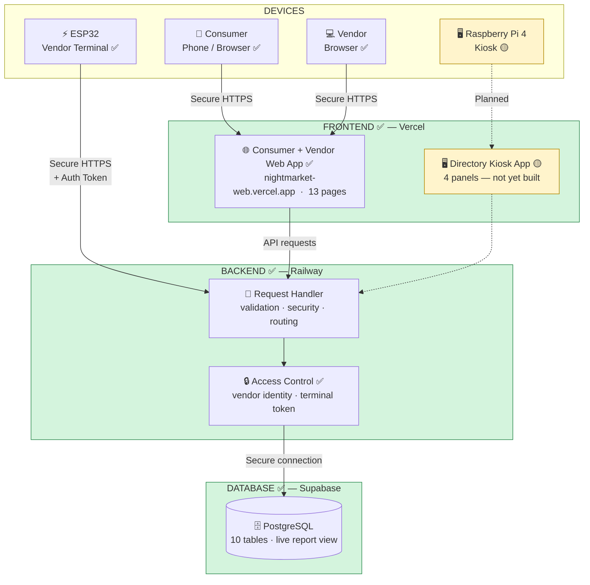

---

## Diagram 2 — User Journey & Features

Click-by-click flow showing what each step does, what API it calls, and completion status.

### Consumer Journey (apps/web) ✅

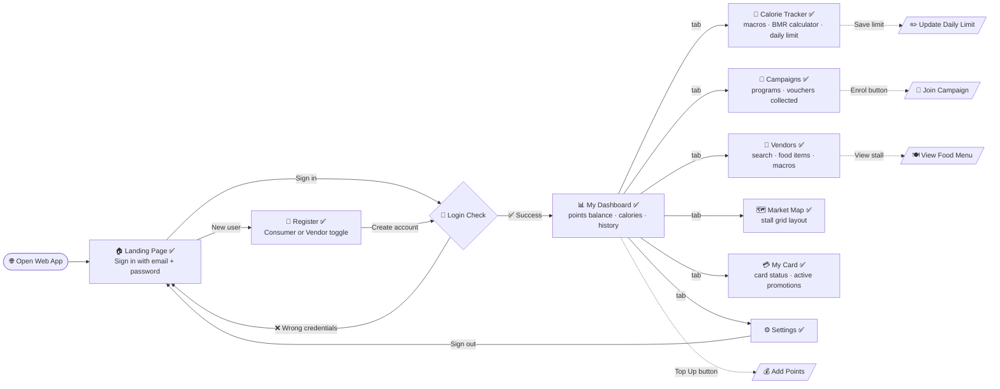

### Vendor Journey (apps/web — vendor mode) ✅

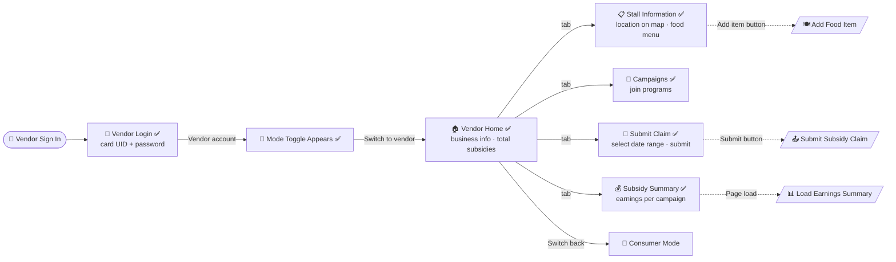

### Kiosk Journey (apps/kiosk) 🟡 Planned

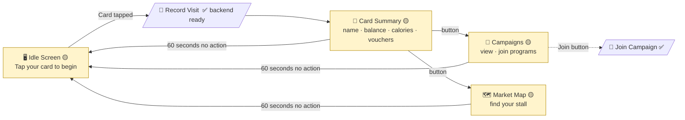

> Backend route `POST /api/kiosk/tap` is implemented. The React UI panels and Python NFC daemon are not yet built.

---

## Diagram 3 — Hardware Setup (ESP32 Vendor Terminal)

### System Flow — From Power On to Card Tap Result

```mermaid
flowchart LR
    S([▶ Start]) --> INIT[System\nInitialisation]
    INIT --> SCAN[Card Read\nCycle]
    SCAN --> PROC[Microcontroller\nMain Loop]
    PROC --> DISP[Update\nResult]
    DISP --> RESET[Reset\nCycle]
    RESET -->|loop back| SCAN

    %% ── Initialisation branch ──────────────────────────────
    INIT --> D1{Settings\nready?}
    D1 -->|no| HALT(["⛔ System Halt\nRe-provision device"])
    D1 -->|yes| D2{WiFi\nconnected?}
    D2 -->|no| RETRY(["↺ Retry\nconnection"])
    RETRY --> D2
    D2 -->|yes| SCAN

    %% ── Card scan branch ───────────────────────────────────
    SCAN --> D3{Card\ndetected?}
    D3 -->|no| SCAN
    D3 -->|yes| PROC

    %% ── Main loop branch ───────────────────────────────────
    PROC --> D4{Terminal\nauthorised?}
    D4 -->|no| E1(["🔴 Access Denied\ninvalid token"])
    D4 -->|yes| D5{Card active\n& has points?}
    D5 -->|no| E2(["🔴 Show Error\nno points · already visited\ncard not found"])
    D5 -->|yes| SAVE["Save Transaction\ndeduct points · log calories\nupdate campaign"]

    SAVE --> DISP

    %% ── Result branch ──────────────────────────────────────
    DISP --> D6{Success?}
    D6 -->|yes| OK(["🟢 Show Result\npoints spent · calories added\nnew balance"])
    D6 -->|no| FAIL(["🔴 Show Reason\nspecific error message"])

    OK --> RESET
    FAIL --> RESET
    E1 --> RESET
    E2 --> RESET

    style S fill:#d4f4dd,stroke:#2d8a4f
    style INIT fill:#e8f4fd,stroke:#2980b9
    style SCAN fill:#e8f4fd,stroke:#2980b9
    style PROC fill:#e8f4fd,stroke:#2980b9
    style DISP fill:#e8f4fd,stroke:#2980b9
    style RESET fill:#e8f4fd,stroke:#2980b9
    style SAVE fill:#d4f4dd,stroke:#2d8a4f
    style OK fill:#d4f4dd,stroke:#2d8a4f
    style HALT fill:#fde8e8,stroke:#c0392b
    style E1 fill:#fde8e8,stroke:#c0392b
    style E2 fill:#fde8e8,stroke:#c0392b
    style FAIL fill:#fde8e8,stroke:#c0392b
    style RETRY fill:#fff4cc,stroke:#b08800
```

### What Each Stage Does

| Stage | What Happens |
|---|---|
| **System Initialisation** | Load saved settings (WiFi, vendor ID, auth token), connect to WiFi, sync clock |
| **Card Read Cycle** | Continuously poll the RFID reader — wait until a card is tapped |
| **Microcontroller Main Loop** | Read card ID, verify with backend, check balance, save the transaction |
| **Update Result** | Show success or reason for failure |
| **Reset Cycle** | Clear the reader, wait 2 seconds to prevent double-taps, then scan again |

### Hardware Communication Path ✅

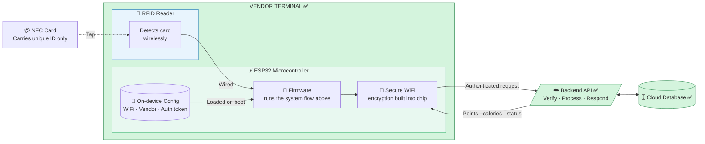

---

## Diagram 4 — Tech Stack & Tool Relationships

### Layer Architecture

How each technology is positioned in the stack — from device hardware up to cloud hosting.

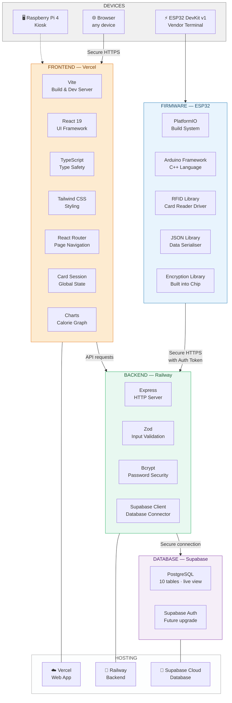

---

### How the Tools Connect

Which tool talks to which, and what role each plays.

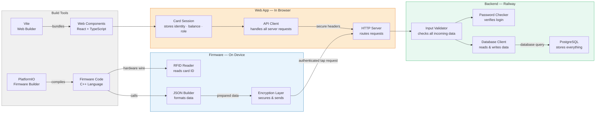

---

### Hosting & Deployment Map

Where each piece lives and how deployments are triggered.

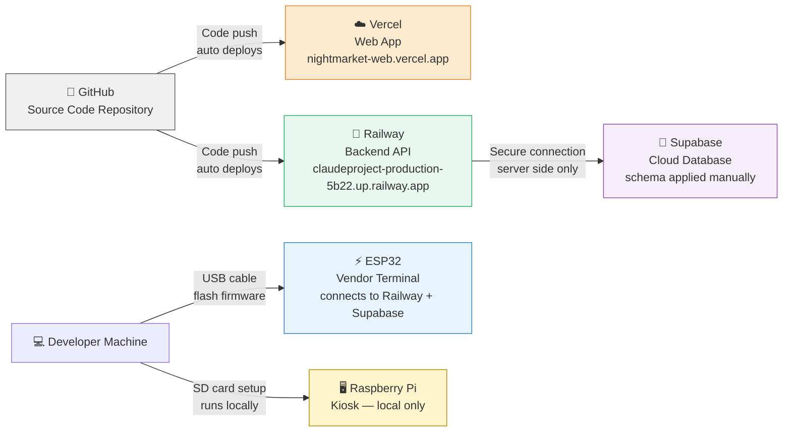

---

## Data Model Overview

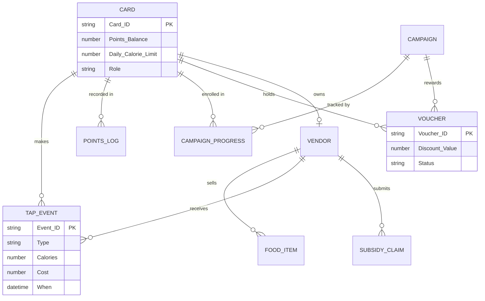

---

## Future / Parked Features

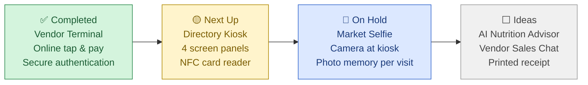

### Market Selfie — Parked

Camera module on the Raspberry Pi kiosk captures a photo after each card tap. Stored as a "market memory" linked to the card UID. Could be displayed in the consumer app or emailed.

**Status:** Concept only — revisit when basic kiosk UI is complete.
**Hardware needed:** Pi Camera Module v3 (CSI) · Supabase Storage pipeline · optional thermal printer for printed photo ticket.

---

## Where to Find the Details

| Need | Document |
|---|---|
| Database schema (full SQL) | [TECHNICAL.md → Database](TECHNICAL.md) |
| API contracts + request/response shapes | [TECHNICAL.md → API](TECHNICAL.md) |
| Firmware loop + Serial states + provisioning | [TECHNICAL.md → Firmware](TECHNICAL.md) |
| Architecture decisions and trade-offs | [TECHNICAL.md → Decisions Log](TECHNICAL.md) |
| Setup, deployment, env vars | [README.md](README.md) |

---

*v2.3 · React + TypeScript + Express + PostgreSQL (Supabase) + Railway + Vercel + ESP32*
