# Smart Night Market — Proof of Engineering Concept
**What this document covers:** How the hardware and software communicate, how data moves through the system, and why the design choices are sound.

> For full specs → [TECHNICAL.md](TECHNICAL.md) · For visual overview → [MASTER_v2_refined.md](MASTER_v2_refined.md)

---

## 1. The Core Idea

A physical NFC card carries **only a UID** (unique identifier). All data — points, calories, vouchers — lives in the cloud database. The card is just a key.

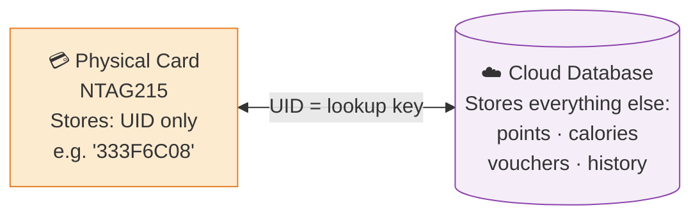

**Why this works:**
- Card can never be corrupted (no writable data)
- Lost card = block the UID in the database, issue a new card
- Any card reader anywhere in the world works — no pairing, no sync

---

## 2. Hardware Communication — SPI Bus

The ESP32 reads the NFC card's UID through the RC522 reader using the **SPI (Serial Peripheral Interface)** protocol — a high-speed, 4-wire synchronous communication bus.

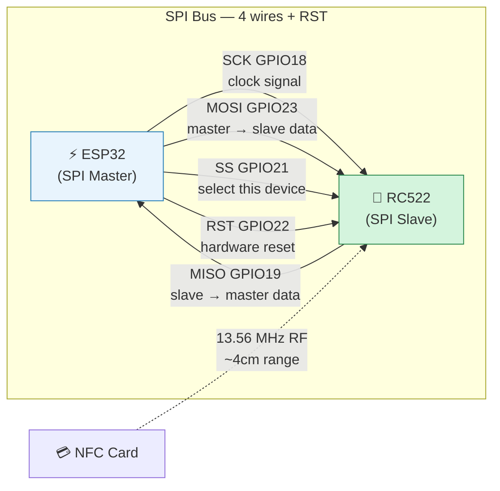

**What SPI gives us:**
- Full-duplex (send and receive at the same time)
- ~10 MHz clock — fast enough that a UID read takes ~50ms
- Deterministic timing — no bus contention on a single-device SPI bus

**How a card read works:**
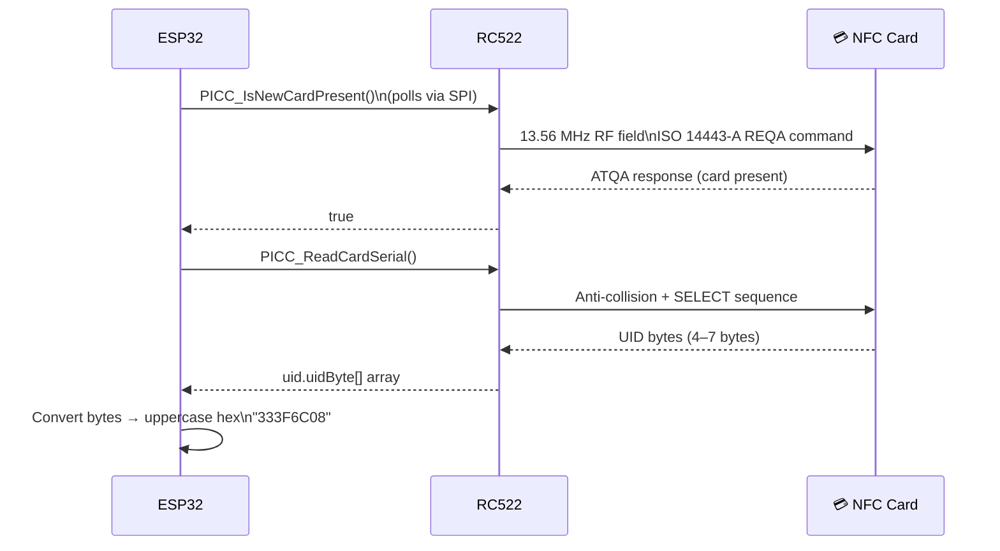

---

## 3. Network Communication — HTTPS over WiFi

Once the UID is read, the ESP32 sends it to the cloud backend over **HTTPS** (HTTP with TLS encryption).

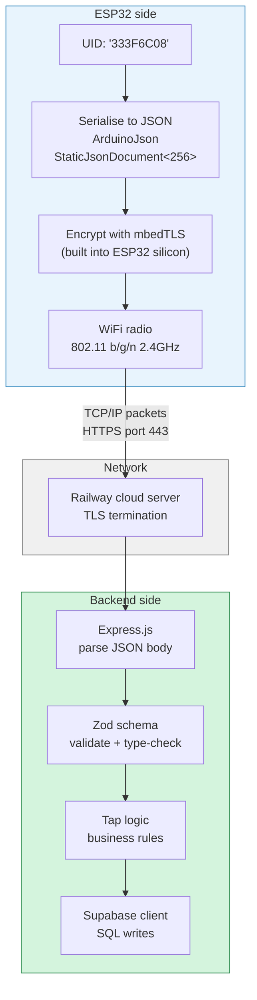

**Why HTTPS (not plain HTTP):**
- TLS encrypts everything — the Bearer token and card UID are never visible on the network
- ESP32 has **hardware TLS acceleration** (mbedTLS baked into the chip) — no performance cost
- Railway provides the server certificate automatically

**The request payload:**
```json
{
  "card_uid":         "333F6C08",
  "vendor_id":        "72f92f7e-efea-4e84-9eff-d916455d8e85",
  "food_id":          "7efa1b7c-3e54-4f8f-b8e0-37accb2263e5",
  "device_timestamp": "2026-04-28T14:32:01+08:00",
  "synced_from_queue": false
}
```
Total payload size: ~200 bytes — well within the StaticJsonDocument<256> buffer.

---

## 4. Full Data Journey — Tap to Response

End-to-end trace of what happens in the ~500ms between card tap and Serial output.

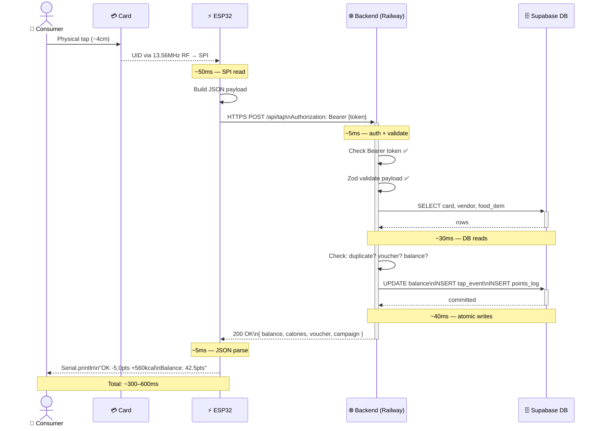

---

## 5. Security Model

Three independent security layers protect the system.

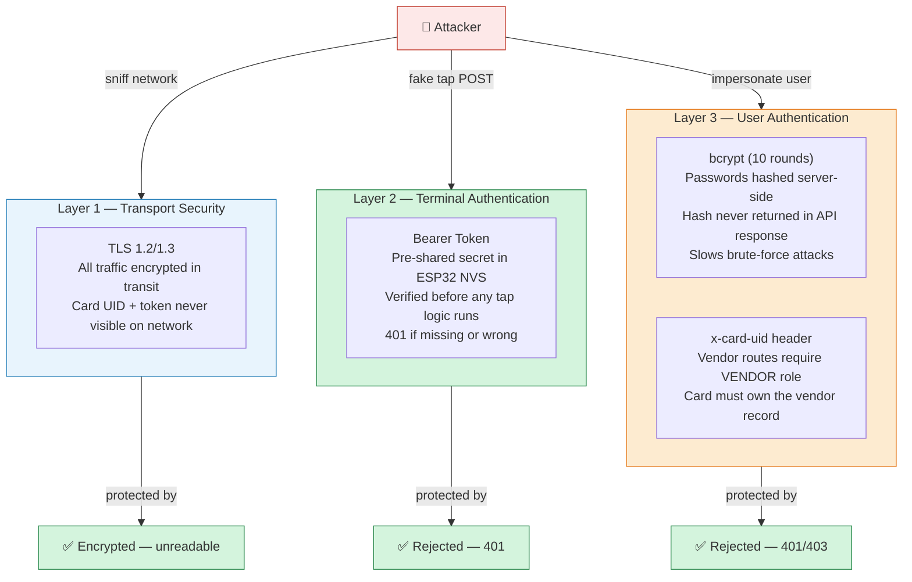

**Why NVS for the Bearer token:**
NVS (Non-Volatile Storage) is a key-value store in ESP32's flash memory. It survives power cycles and cannot be read without physical access to the chip and specialist tools. The token is never in the source code.

---

## 6. Data Validation Chain

Every piece of data is validated at the layer closest to its entry point.

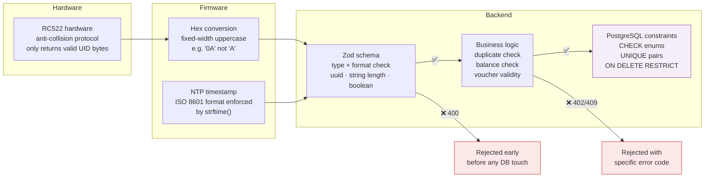

**Key principle:** Bad data is rejected at the earliest possible point — the hardware layer filters by physics, the firmware formats correctly, Zod rejects type errors, business logic rejects semantic errors, the database enforces structural integrity.

---

## 7. Data Storage Design

Why three separate stores, not one table.

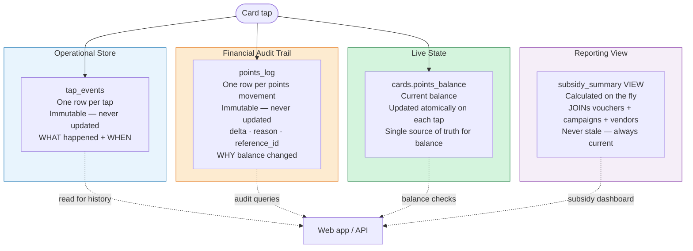

**Why immutable logs?**
- `tap_events` and `points_log` are append-only — rows are never deleted or updated
- This means any balance discrepancy can always be traced back to the exact tap that caused it
- `ON DELETE RESTRICT` on both tables prevents accidental cascade deletes

---

## 8. Atomic Writes — Why Nothing Gets Lost

The tap handler performs multiple database writes that must all succeed or all fail together.

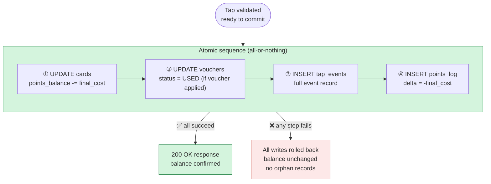

**Campaign progress** is updated *outside* this atomic block — intentionally. If the campaign update fails, the purchase is already committed. A tap that deducted points but failed to update campaign progress is better than a tap that deducted points but was never recorded.

---

## 9. Timestamp Design — Why Two Clocks

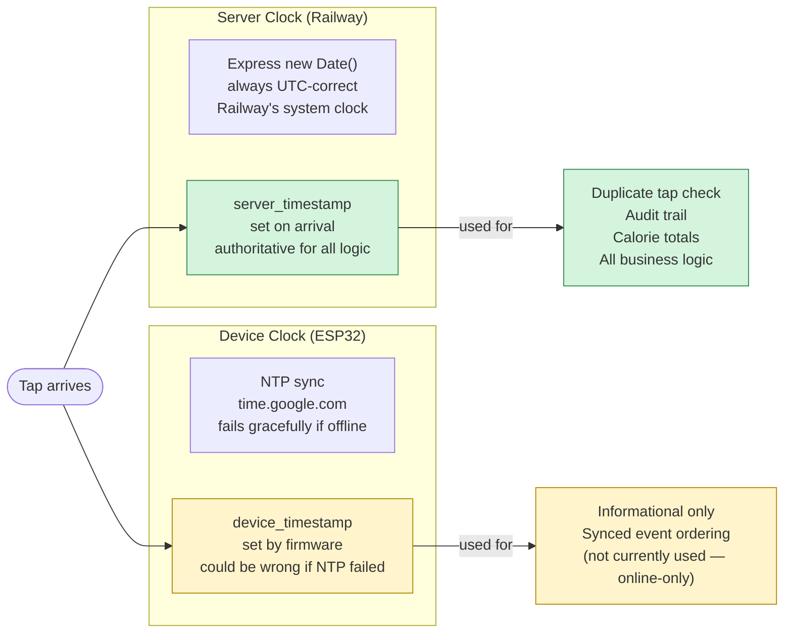

**The rule:** The server never trusts the client's timestamp for any decision. The device timestamp is recorded for information only — it cannot be manipulated to replay old taps or bypass the duplicate check.

---

## 10. Why Online-Only (No Offline Queue)

The original design included an offline queue (LittleFS on ESP32 flash). The current design is online-only. Here's the trade-off:

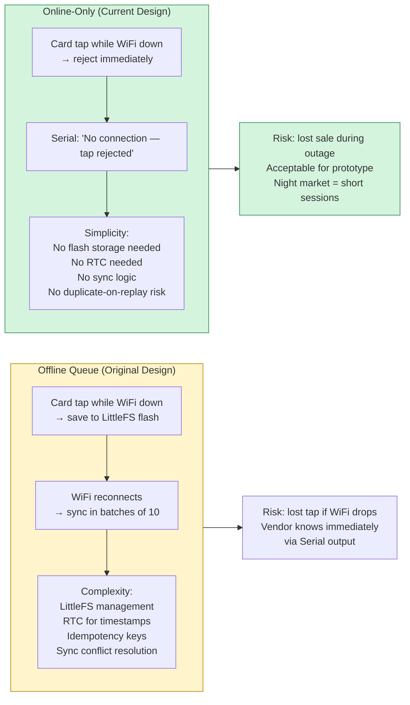

---

## 11. Web App ↔ Backend Communication

The web app communicates using the same REST/JSON API as the ESP32 — just from a browser instead of embedded firmware.

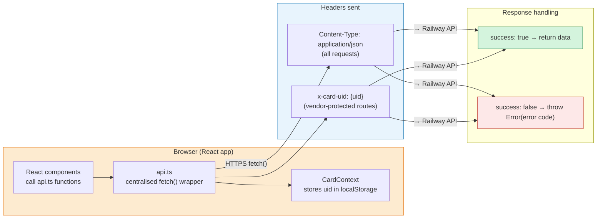

**Key design:** All 23 API functions live in one file (`src/lib/api.ts`). No component ever calls `fetch()` directly. This means:
- Auth headers are added in one place
- Error handling is consistent
- Easy to swap the base URL (dev vs prod)

---

## 12. Proof Summary

| Engineering Claim | How It Is Proved |
|---|---|
| Card UID is reliably read | RC522 ISO 14443-A anti-collision — hardware-level collision avoidance |
| Data is secure in transit | TLS 1.2/1.3 — ESP32 mbedTLS hardware acceleration |
| Fake taps are rejected | Bearer token auth — 401 before any DB access |
| Points cannot go negative | Balance check before any DB write — 402 if insufficient |
| Double-charging is impossible | Atomic duplicate check — same card + vendor + date → 409 |
| No data loss on write failure | Atomic DB sequence — all writes or none committed |
| Financial audit is complete | Immutable `points_log` — every delta recorded with reason + reference |
| Timestamps cannot be faked | `server_timestamp` set by Express `NOW()` — client value ignored |
| Vendor data is protected | `x-card-uid` header + role=VENDOR + ownership check before any write |
| Card compromise is recoverable | Set `is_active = false` — card rejected at tap, data preserved |

---

*PROOF_OF_CONCEPT.md — Smart Night Market v2.3*
*Cross-ref: [MASTER_v2_refined.md](MASTER_v2_refined.md) (visual) · [TECHNICAL.md](TECHNICAL.md) (full specs) · [README.md](README.md) (setup)*
