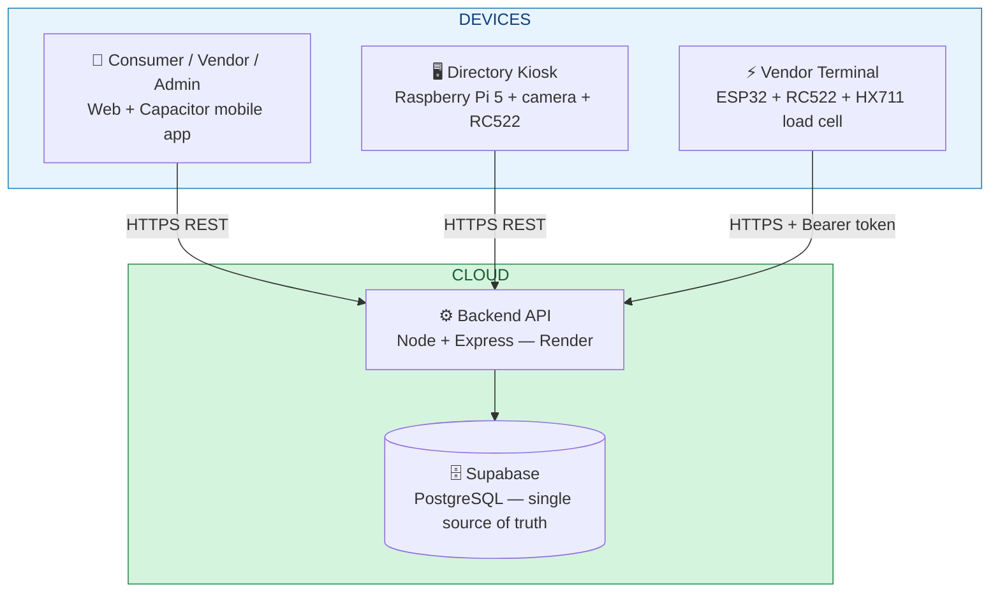

# WarungTek — Smart Night Market System

> Formerly **NightMarket**. A unified night-market platform that links consumers, vendors,
> and authority admins through one NFC card, an indoor Bluetooth navigation layer, a
> Raspberry Pi directory kiosk, and ESP32 vendor terminals — all talking to one cloud backend.

WarungTek replaces cash and paper loyalty cards at a night market. A consumer taps a single
NFC card at any stall to pay with points, and the system automatically tracks their calories,
campaign progress, and vouchers. Vendors register a stall, list food (priced per-100g via a
load cell or at a flat price), join campaigns, and claim government subsidies. Authority admins
approve vendors, assign stall slots, and review compliance. A kiosk helps shoppers discover
stalls and navigate to them; a camera at the kiosk can recognise returning customers without a
tap.

> There is **no live payment gateway** — a prepaid top-up adjusts the points balance directly.

---

## The three roles

| Role | Where | What they do |
|---|---|---|
| 🧑 **Consumer** | Web / mobile app | Link & top up an NFC card, tap to pay at stalls, track calories, join campaigns, redeem vouchers, navigate the market, play mini-games with a chick mascot |
| 🏪 **Vendor** | Web app (mode toggle) + onboarding app | Register a stall, manage a menu with weight pricing, calibrate the terminal, join campaigns, submit subsidy claims |
| 🛡️ **Admin** | Web app (`/admin`) | Approve vendor applications, review campaign applications, assign stall grid slots, monitor compliance |

A **Guest** can browse vendors and the map without signing in.

---

## Physical surfaces



The phone, kiosk, and vendor terminal never touch the database directly — every device talks
to the Express API on Render, which holds the only Supabase service key.

---

## Status

| Component | Hosting | Status |
|---|---|---|
| Database | Supabase | ✅ Live |
| Backend API | Render — `warungtek-backend.onrender.com` | ✅ Live |
| Consumer + Vendor + Admin web app | Vercel — `nightmarket-web.vercel.app` | ✅ Live |
| Vendor onboarding app (`apps/vendor`) | Deploy separately | ✅ Built |
| Kiosk app (`apps/kiosk`) | Local on Raspberry Pi 5 | ✅ Running |
| NFC daemon (`daemon/nfc_daemon.py`) | Pi 5 — `localhost:5001` | ✅ RC522 over SPI |
| Face daemon (`daemon/face/`) | Pi 5 — `localhost:5002` | ✅ On-device recognition |
| ESP32 vendor terminal | On-device | ✅ Two-tap weighing + NFC tap |
| BLE indoor positioning | ESP32 beacons + phone | ✅ Demo / Android + native app |
| AI (chat + meal advisor) | DeepSeek V4.0 via backend | ✅ Live |

---

## Tech stack

| Layer | Technology |
|---|---|
| Frontend | React 19 · TypeScript · Vite · Tailwind CSS · React Router · Recharts · Capacitor (mobile) |
| Backend | Node.js · Express · TypeScript · Zod · bcryptjs |
| Database | Supabase (PostgreSQL) |
| AI | DeepSeek V4.0 (chat assistant + meal advisor) |
| Vendor terminal | ESP32 (Arduino C++) · MFRC522 RFID (SPI) · HX711 load cell · BLE beacon · WiFi/HTTPS |
| Kiosk | Raspberry Pi 5 · Python (Flask) · RC522 (SPI) · InsightFace + OpenCV for face recognition |
| Positioning | ESP32 BLE beacons · Web Bluetooth / `@capacitor-community/bluetooth-le` · trilateration |

---

## Repository layout

```
claude_project/
├── apps/
│   ├── web/         # Consumer + Vendor + Admin app (React + Capacitor; games hub in src/pages/)
│   ├── vendor/      # Vendor onboarding app (register, menu, calibration, claims)
│   └── kiosk/       # Raspberry Pi 5 directory kiosk (React + Vite)
├── backend/         # Express API (routes: auth, cards, vendors, tap, campaigns, map, ai, face)
├── daemon/
│   ├── nfc_daemon.py    # Kiosk NFC reader (RC522 over SPI → GET /nfc)
│   └── face/            # On-device face-recognition pipeline + sync service
├── firmware/
│   ├── vendor-terminal-arduino/   # Shipped ESP32 firmware (RC522 + HX711 + BLE)
│   ├── positioning-beacon/        # ESP32 BLE positioning beacon
│   └── ble-scanner/               # BLE scanner test sketch
├── database/        # schema.sql, seed.sql, migrations/
├── docs/            # deep dives; the high-level overview is at /master.md
├── README.md        # ← you are here (the brief)
└── master.md        # high-level overview + user-journey diagrams
```

---

## Quick start

```bash
# 1. Database — run in Supabase SQL editor: database/schema.sql, then migrations/ in order, then seed.sql

# 2. Backend (or use the live Render deploy)
cd backend && npm install && npm run dev          # http://localhost:3000

# 3. Consumer / Vendor / Admin web app
cd apps/web && npm install && npm run dev          # http://localhost:5173

# 4. Vendor onboarding app
cd apps/vendor && npm install && npm run dev        # http://localhost:5174

# 5. Kiosk app (on the Pi)
cd apps/kiosk && npm install && npm run dev          # http://localhost:8080
py -3.11 daemon/nfc_daemon.py                         # RC522 NFC reader on :5001
py -3.11 -m daemon.face.face_daemon                   # face recognition on :5002
```

Per-app environment variables are listed in the per-app READMEs
([apps/web](apps/web/README.md), [apps/vendor](apps/vendor/README.md),
[apps/kiosk](apps/kiosk/README.md)) and summarised in [master.md](master.md).

---

## Where to find more

| You want… | Read |
|---|---|
| The high-level story: objective, all features, tech stack, **user journeys** | [master.md](master.md) |
| The full **technical report**: architecture, data flow, hardware, MCP tools, deploy pipeline | [docs/technical-report.md](docs/technical-report.md) |
| The **design decisions**: doubts, logical challenges & how each was solved | [docs/system-design-critical-thinking.md](docs/system-design-critical-thinking.md) |
| How data syncs across kiosk / terminal / phone / backend | [docs/backend-sync-dataflow.md](docs/backend-sync-dataflow.md) |
| Face recognition (kiosk) | [docs/features/face-recognition.md](docs/features/face-recognition.md) → deep dive: [daemon/face/README.md](daemon/face/README.md) |
| Indoor map navigation (BLE) | [docs/features/map-navigation.md](docs/features/map-navigation.md) → deep dive: [docs/positioning-data-flow.md](docs/positioning-data-flow.md) |
| Vendor load-cell weighing & calibration | [docs/features/load-cell-calibration.md](docs/features/load-cell-calibration.md) |
| NFC card reading (terminal · kiosk · phone) | [docs/features/nfc-reading.md](docs/features/nfc-reading.md) |

> Older overview, technical, kiosk, and website-feature docs have been superseded by the above
> and moved to [docs/_archive/](docs/_archive/) for reference.
