# TECHNICAL.md — Smart Night Market System
# Implementation Reference — v2.3

Deep technical specs for every layer of the system.
For high-level status and diagrams, see `MASTER_v2_refined.md`.
For setup and deployment, see `README.md`.

---

## Stack

| Layer | Technology | Hosting |
|---|---|---|
| Consumer + Vendor web app | React 19 · TypeScript · Vite · TailwindCSS · React Router | Vercel |
| Kiosk UI | React · TypeScript · Vite · TailwindCSS | Local on Raspberry Pi 4 |
| Backend API | Node.js · Express · TypeScript | Railway |
| Payload validation | Zod — at Express middleware layer | In Express |
| Database | PostgreSQL | Supabase |
| ESP32 firmware | Arduino C++ · PlatformIO | On-device |
| Password hashing | bcryptjs (10 rounds) | In Express |

---

## Architecture

### Why Express Is Retained (Not Direct Supabase)

The Supabase service role key must never leave the server. ESP32 firmware binaries are extractable — if the key were embedded in firmware, the entire database would be exposed. Express keeps the key server-side only. All hardware communicates with Express. Express communicates with Supabase.

### Hardware Nodes

**Vendor Terminal (Active)**
- ESP32 DevKit v1 — 520 KB SRAM, 240 MHz, built-in WiFi + hardware TLS (mbedTLS)
- RC522 RFID reader — SPI (SS=21, MOSI=23, MISO=19, SCK=18, RST=22)
- NVS (Preferences) — wifi_ssid, wifi_pass, vendor_id, food_id, api_url, auth_token
- Online-only — tap rejected via Serial if WiFi unavailable

**Digital Directory Kiosk (Planned)**
- Raspberry Pi 4
- PN532 NFC reader via SPI or I2C
- LCD touchscreen display
- Always online — no offline queue needed

**NFC Cards**
- NTAG215 — UID only stored on card
- All data (points, calories, vouchers) lives in the database
- Card UID is the lookup key for all backend operations

### Edge Architecture

**Path A — Vendor Terminal (ESP32)**

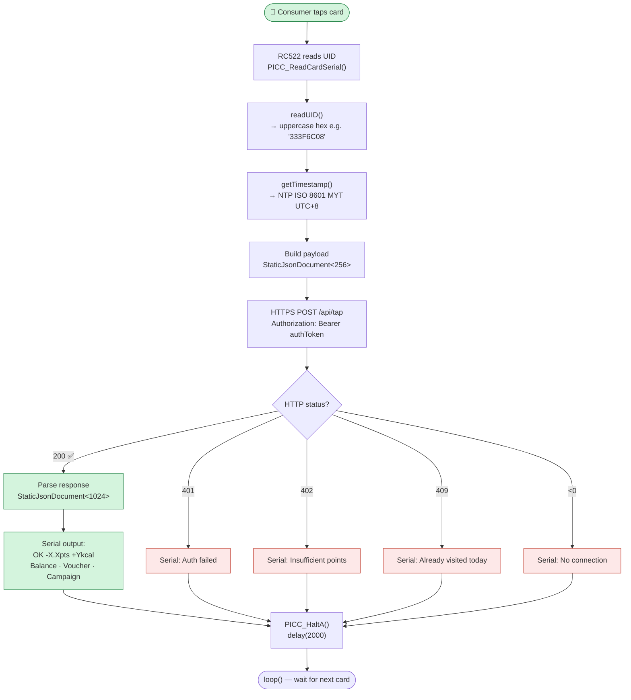

**Path B — Digital Directory Kiosk (Raspberry Pi)**

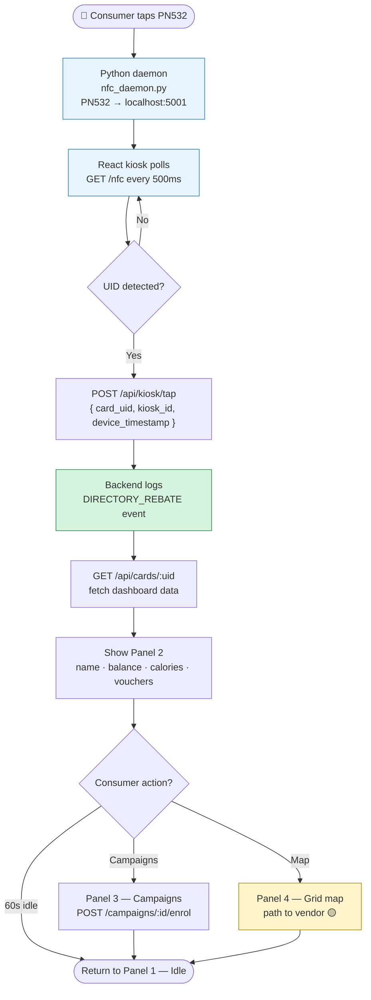

### Data Transit Protocol

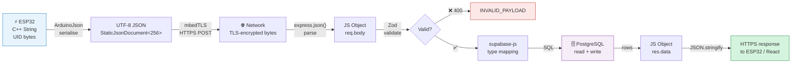

### Timestamp Protocol

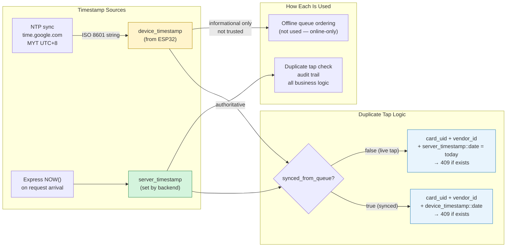

### Payment — Prototype Only

Top-up is UI-only — no payment gateway. `points_balance` is incremented directly via `POST /api/cards/:uid/topup`. A real payment gateway would insert only at this step — no schema changes needed anywhere else.

---

## Database

Platform: PostgreSQL on Supabase. Run in order: `schema.sql` → `migrations/001_add_auth_fields.sql` → `migrations/002_add_macros.sql` → `seed.sql`

### Tables (10)

| Table | Phase | Purpose |
|---|---|---|
| cards | 1 | NFC card master record — points, calories, auth |
| vendors | 1 | Vendor business profile and terminal mapping |
| food_items | 1 | Vendor menu — calories, price in points, macros |
| tap_events | 1 | Immutable event log (TAP_PURCHASE, DIRECTORY_REBATE) |
| points_log | 1 | Immutable financial audit trail of every points movement |
| campaigns | 2 | Campaign definitions — condition type, threshold, reward |
| campaign_progress | 2 | Per-card progress toward each campaign |
| vouchers | 2 | Issued vouchers — discount applied on qualifying tap |
| kiosks | 3 | Digital directory units with fixed grid positions |
| subsidy_claims | 3 | Finalised government subsidy claim records |

Plus view: `subsidy_summary` (live calculation, never stale)

### Full Schema SQL

```sql
-- PHASE 1 ────────────────────────────────────────────────────────────────────

CREATE TABLE cards (
    uid                 VARCHAR(20) PRIMARY KEY,
    owner_name          VARCHAR(100),
    owner_email         VARCHAR(255) UNIQUE,
    phone_number        VARCHAR(20),
    password_hash       VARCHAR(255),          -- bcrypt(10) — NEVER returned in API
    points_balance      DECIMAL(10,2) DEFAULT 0,
    calorie_limit       INTEGER DEFAULT 2000,
    role                VARCHAR(20) DEFAULT 'CONSUMER'
                        CHECK (role IN ('CONSUMER', 'VENDOR')),
    registered_at       TIMESTAMPTZ DEFAULT NOW(),
    is_active           BOOLEAN DEFAULT TRUE
);

CREATE TABLE vendors (
    vendor_id               UUID PRIMARY KEY DEFAULT gen_random_uuid(),
    owner_card_uid          VARCHAR(20) REFERENCES cards(uid) ON DELETE SET NULL,
    terminal_mac_address    VARCHAR(17) UNIQUE,
    business_name           VARCHAR(100) NOT NULL,
    ssm_registration_number VARCHAR(50) UNIQUE,
    phone_number            VARCHAR(20),
    category                VARCHAR(50),
    description             TEXT,
    grid_x                  INTEGER,
    grid_y                  INTEGER,
    is_active               BOOLEAN DEFAULT TRUE,
    registered_at           TIMESTAMPTZ DEFAULT NOW()
);

CREATE TABLE food_items (
    food_id             UUID PRIMARY KEY DEFAULT gen_random_uuid(),
    vendor_id           UUID REFERENCES vendors(vendor_id) ON DELETE CASCADE,
    name                VARCHAR(100) NOT NULL,
    photo_url           TEXT,
    calories            INTEGER NOT NULL,
    price_in_points     DECIMAL(10,2) NOT NULL,
    protein_g           NUMERIC(6,2) DEFAULT 0,
    carbs_g             NUMERIC(6,2) DEFAULT 0,
    fat_g               NUMERIC(6,2) DEFAULT 0,
    is_available        BOOLEAN DEFAULT TRUE,
    created_at          TIMESTAMPTZ DEFAULT NOW()
);

-- metadata JSONB:
--   TAP_PURCHASE:     { food_id, food_name, calories, base_cost, voucher_applied, discount_applied, final_cost }
--   DIRECTORY_REBATE: { kiosk_id, points_added }
CREATE TABLE tap_events (
    event_id            UUID PRIMARY KEY DEFAULT gen_random_uuid(),
    card_uid            VARCHAR(20) REFERENCES cards(uid) ON DELETE RESTRICT,
    vendor_id           UUID REFERENCES vendors(vendor_id) ON DELETE RESTRICT,
    event_type          VARCHAR(50) NOT NULL
                        CHECK (event_type IN ('TAP_PURCHASE', 'DIRECTORY_REBATE')),
    device_timestamp    TIMESTAMPTZ NOT NULL,
    server_timestamp    TIMESTAMPTZ DEFAULT NOW(),
    synced_from_queue   BOOLEAN DEFAULT FALSE,
    metadata            JSONB
);

CREATE TABLE points_log (
    log_id          UUID PRIMARY KEY DEFAULT gen_random_uuid(),
    card_uid        VARCHAR(20) REFERENCES cards(uid) ON DELETE RESTRICT,
    delta           DECIMAL(10,2) NOT NULL,
    reason          VARCHAR(50) NOT NULL
                    CHECK (reason IN ('TAP_PURCHASE', 'VOUCHER_DISCOUNT', 'TOPUP', 'CAMPAIGN_REWARD')),
    reference_id    UUID,
    created_at      TIMESTAMPTZ DEFAULT NOW()
);

-- PHASE 2 ────────────────────────────────────────────────────────────────────

CREATE TABLE campaigns (
    campaign_id             UUID PRIMARY KEY DEFAULT gen_random_uuid(),
    name                    VARCHAR(100) NOT NULL,
    description             TEXT,
    condition_type          VARCHAR(30) NOT NULL
                            CHECK (condition_type IN ('VISIT_STALLS', 'SPEND_POINTS', 'DIRECTORY_REBATE')),
    condition_threshold     DECIMAL(10,2) NOT NULL,
    reward_value            DECIMAL(10,2) NOT NULL,
    applicable_vendor_ids   JSONB,  -- NULL = all vendors
    is_active               BOOLEAN DEFAULT TRUE,
    starts_at               TIMESTAMPTZ,
    ends_at                 TIMESTAMPTZ,
    created_at              TIMESTAMPTZ DEFAULT NOW()
);

CREATE TABLE campaign_progress (
    progress_id     UUID PRIMARY KEY DEFAULT gen_random_uuid(),
    card_uid        VARCHAR(20) REFERENCES cards(uid) ON DELETE CASCADE,
    campaign_id     UUID REFERENCES campaigns(campaign_id) ON DELETE CASCADE,
    current_value   DECIMAL(10,2) DEFAULT 0,
    completed       BOOLEAN DEFAULT FALSE,
    completed_at    TIMESTAMPTZ,
    UNIQUE (card_uid, campaign_id)
);

CREATE TABLE vouchers (
    voucher_id              UUID PRIMARY KEY DEFAULT gen_random_uuid(),
    card_uid                VARCHAR(20) REFERENCES cards(uid) ON DELETE CASCADE,
    campaign_id             UUID REFERENCES campaigns(campaign_id) ON DELETE SET NULL,
    discount_value          DECIMAL(10,2) NOT NULL,
    applicable_vendor_ids   JSONB,
    status                  VARCHAR(20) DEFAULT 'ACTIVE'
                            CHECK (status IN ('ACTIVE', 'USED', 'EXPIRED')),
    issued_at               TIMESTAMPTZ DEFAULT NOW(),
    expires_at              TIMESTAMPTZ,
    used_at                 TIMESTAMPTZ,
    used_at_vendor_id       UUID REFERENCES vendors(vendor_id) ON DELETE SET NULL
);

-- PHASE 3 ────────────────────────────────────────────────────────────────────

CREATE TABLE kiosks (
    kiosk_id        UUID PRIMARY KEY DEFAULT gen_random_uuid(),
    label           VARCHAR(50) NOT NULL,
    grid_x          INTEGER NOT NULL,
    grid_y          INTEGER NOT NULL,
    is_active       BOOLEAN DEFAULT TRUE
);

CREATE TABLE subsidy_claims (
    claim_id            UUID PRIMARY KEY DEFAULT gen_random_uuid(),
    vendor_id           UUID REFERENCES vendors(vendor_id) ON DELETE RESTRICT,
    total_amount        DECIMAL(10,2) NOT NULL,
    claim_period_start  TIMESTAMPTZ NOT NULL,
    claim_period_end    TIMESTAMPTZ NOT NULL,
    status              VARCHAR(30) DEFAULT 'PENDING_AUDIT'
                        CHECK (status IN ('PENDING_AUDIT', 'APPROVED', 'PAID')),
    generated_at        TIMESTAMPTZ DEFAULT NOW()
);

-- INDEXES ─────────────────────────────────────────────────────────────────────
CREATE INDEX ON tap_events(card_uid, server_timestamp);
CREATE INDEX ON tap_events(vendor_id);
CREATE INDEX ON tap_events(device_timestamp);
CREATE INDEX ON campaign_progress(card_uid);
CREATE INDEX ON vouchers(card_uid, status);

-- VIEW ────────────────────────────────────────────────────────────────────────
-- For dashboard display only — do NOT use for claim generation (no date filter)
CREATE VIEW subsidy_summary AS
SELECT
    v.vendor_id, v.business_name, c.campaign_id, c.name AS campaign_name,
    c.reward_value AS subsidy_per_redemption,
    COUNT(vou.voucher_id) AS total_redemptions,
    (COUNT(vou.voucher_id) * c.reward_value) AS total_subsidy_owed
FROM vouchers vou
JOIN campaigns c ON vou.campaign_id = c.campaign_id
JOIN vendors v ON vou.used_at_vendor_id = v.vendor_id
WHERE vou.status = 'USED'
GROUP BY v.vendor_id, v.business_name, c.campaign_id, c.name, c.reward_value;
```

### Enum Reference

| Column | Values |
|---|---|
| `cards.role` | `CONSUMER` · `VENDOR` |
| `tap_events.event_type` | `TAP_PURCHASE` · `DIRECTORY_REBATE` |
| `points_log.reason` | `TAP_PURCHASE` · `VOUCHER_DISCOUNT` · `TOPUP` · `CAMPAIGN_REWARD` |
| `campaigns.condition_type` | `VISIT_STALLS` · `SPEND_POINTS` · `DIRECTORY_REBATE` |
| `vouchers.status` | `ACTIVE` · `USED` · `EXPIRED` |
| `subsidy_claims.status` | `PENDING_AUDIT` · `APPROVED` · `PAID` |

### State Machines

**Voucher lifecycle:**

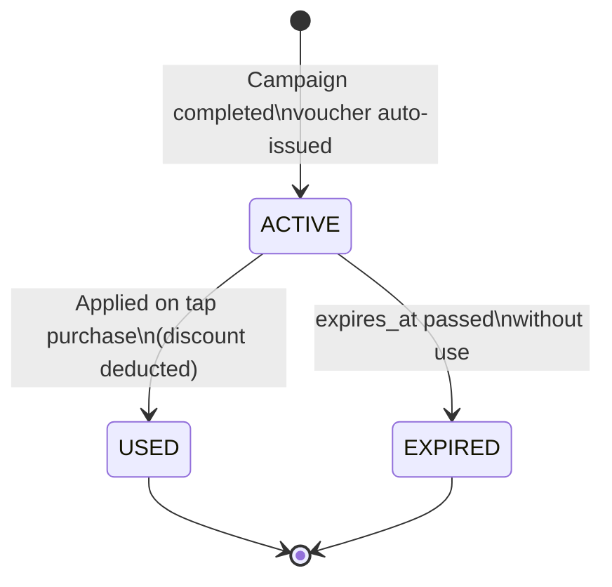

**Subsidy claim lifecycle:**

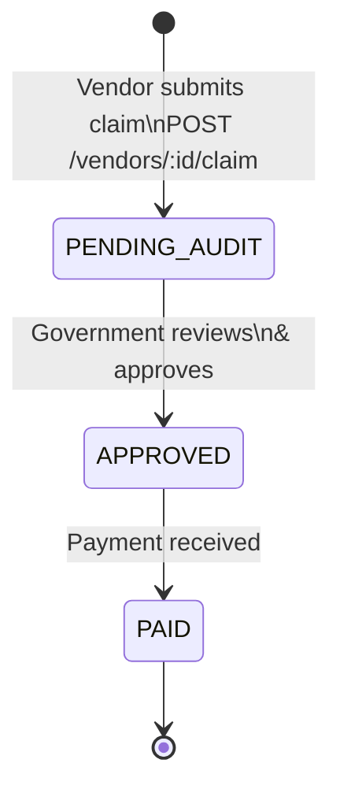

**Campaign conditions — how progress increments:**

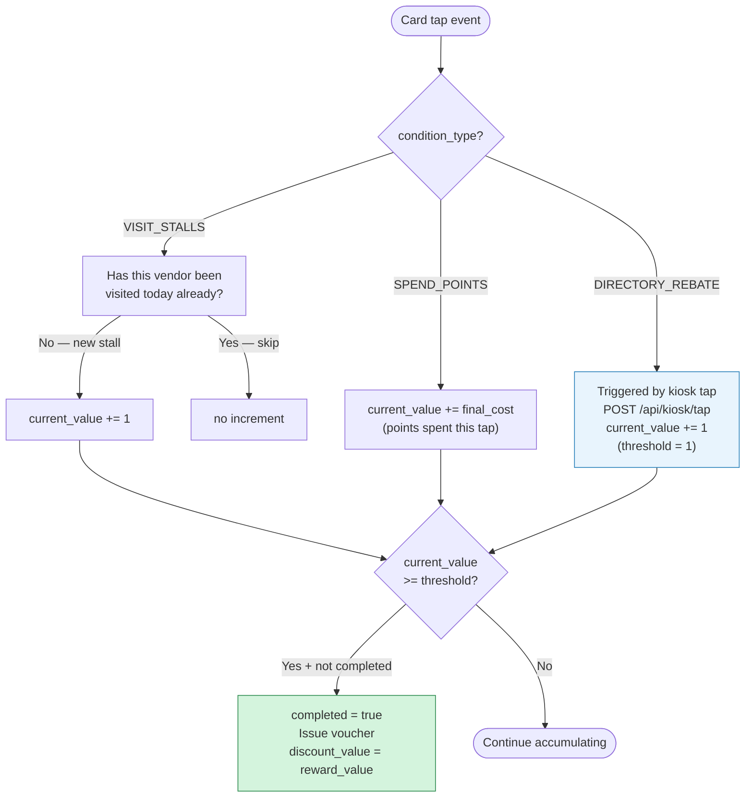

**Points flow — how points move through the system:**

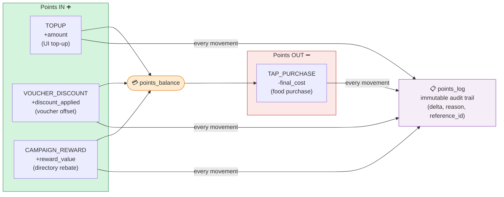

### Business Constraints (Enforced in API)

- `points_balance` must never go below 0 — check before deducting
- Duplicate tap: `card_uid + vendor_id + date` → 409 (server date for live, device date for synced)
- `final_cost = MAX(0, base_cost - discount_applied)` — never negative
- Voucher: `applicable_vendor_ids IS NULL` or contains current `vendor_id`
- `campaign_progress` UNIQUE `(card_uid, campaign_id)` — DB enforced
- `tap_events` and `subsidy_claims` use `ON DELETE RESTRICT`

---

## API

Base URL: `https://claudeproject-production-5b22.up.railway.app/api`

### Standard Response Shape
```json
{ "success": true,  "data": { } }
{ "success": false, "error": "ERROR_CODE", "message": "Human readable" }
```

### Error Codes

| Code | HTTP | Meaning |
|---|---|---|
| `INVALID_PAYLOAD` | 400 | Zod validation failed |
| `CARD_NOT_FOUND` | 404 | UID not in cards table |
| `CARD_INACTIVE` | 403 | `cards.is_active` is false |
| `CARD_ALREADY_REGISTERED` | 409 | UID already exists |
| `VENDOR_NOT_FOUND` | 404 | `vendor_id` not in vendors |
| `FOOD_NOT_FOUND` | 404 | `food_id` not in food_items |
| `DUPLICATE_TAP` | 409 | Same card + vendor on same calendar day |
| `INSUFFICIENT_POINTS` | 402 | Balance < final_cost |
| `VOUCHER_INVALID` | 400 | Voucher not ACTIVE or wrong vendor |
| `CAMPAIGN_NOT_FOUND` | 404 | campaign_id not found |
| `ALREADY_COMPLETED` | 409 | Campaign already completed by this card |
| `UNAUTHORIZED` | 401 | Missing / invalid Bearer token on `/api/tap` |
| `UNAUTHORIZED` | 403 | `x-card-uid` missing, wrong role, or not vendor owner |
| `INVALID_CREDENTIALS` | 401 | Wrong UID or password on login |
| `NO_PASSWORD_SET` | 401 | Card exists but `password_hash` is null |
| `NOT_A_VENDOR` | 403 | Card role is CONSUMER |
| `ACCOUNT_DISABLED` | 403 | `is_active` is false |
| `SSM_ALREADY_REGISTERED` | 409 | SSM number already in use |

### Authentication

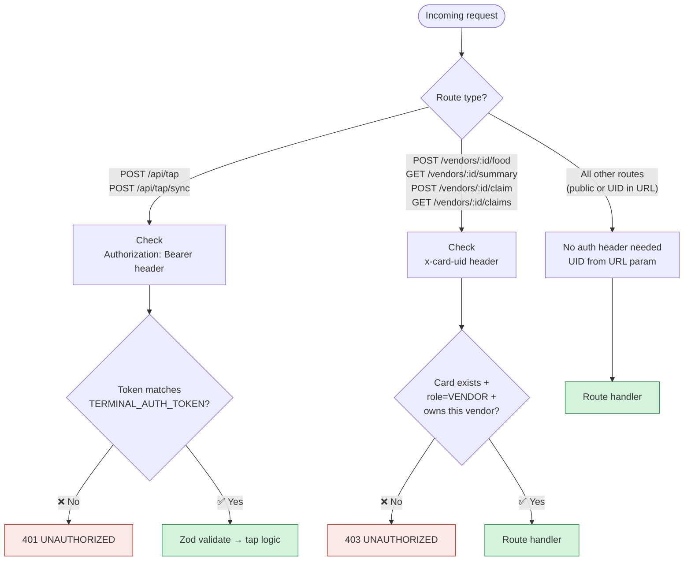

### Login Flows

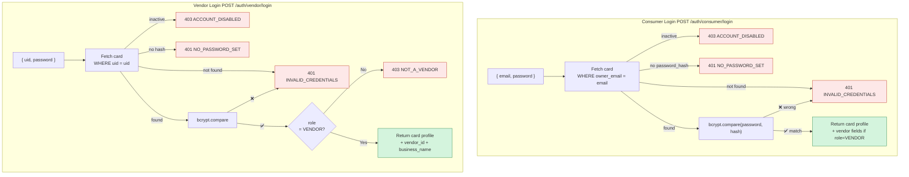

### All Routes

#### Auth
| Method | Route | Body / Notes |
|---|---|---|
| POST | `/auth/consumer/login` | `{ email, password }` → returns card profile |
| POST | `/auth/vendor/login` | `{ uid, password }` → requires role=VENDOR |

#### Cards
| Method | Route | Notes |
|---|---|---|
| POST | `/cards/register` | `{ uid, owner_name, owner_email, phone_number, password }` |
| GET | `/cards/:uid` | Full profile inc. calories_today, active_vouchers, vendor fields |
| GET | `/cards/:uid/history` | `?limit=50&offset=0` — paginated tap history |
| GET | `/cards/:uid/vouchers` | `?status=ACTIVE` optional filter |
| POST | `/cards/:uid/topup` | `{ amount }` — UI-only, no payment gateway |
| PATCH | `/cards/:uid/calorie-limit` | `{ calorie_limit }` |

#### Vendors
| Method | Route | Notes |
|---|---|---|
| GET | `/vendors` | All active vendors |
| POST | `/vendors/register` | `{ owner_card_uid, business_name, ssm_registration_number, phone_number, ... }` |
| GET | `/vendors/:id/food` | Public — all food items |
| POST | `/vendors/:id/food` | `x-card-uid` required · `{ name, calories, price_in_points, ... }` |
| GET | `/vendors/:id/summary` | `x-card-uid` required · all-time subsidy from view |
| POST | `/vendors/:id/claim` | `x-card-uid` required · `{ claim_period_start, claim_period_end }` |
| GET | `/vendors/:id/claims` | `x-card-uid` required · claim history |

#### Tap
| Method | Route | Notes |
|---|---|---|
| POST | `/tap` | Bearer token required · `{ card_uid, vendor_id, food_id, device_timestamp, synced_from_queue }` |
| POST | `/tap/sync` | Bearer token required · `{ terminal_mac, events[] }` |

**POST /api/tap atomic sequence:**

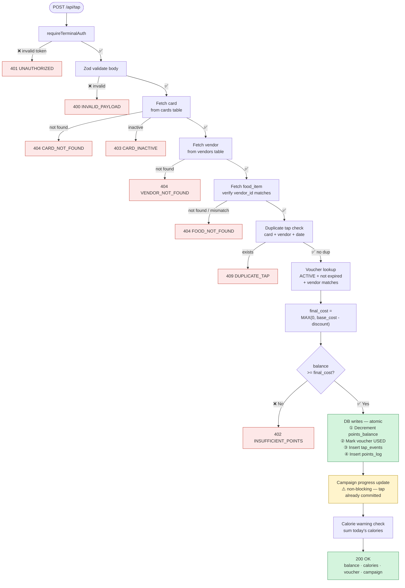

#### Campaigns / Kiosk
| Method | Route | Notes |
|---|---|---|
| GET | `/campaigns` | `?card_uid=` optional — includes progress |
| POST | `/campaigns/:id/enrol` | `{ card_uid }` |
| POST | `/kiosk/tap` | `{ card_uid, kiosk_id, device_timestamp }` — DIRECTORY_REBATE |

#### Map
| Method | Route | Notes |
|---|---|---|
| GET | `/map` | All vendors + kiosks with grid positions |

---

## Frontend

### Consumer Web App (apps/web)

**Stack:** React 19 · TypeScript · Vite · TailwindCSS · React Router · react-hot-toast · Recharts

**State:** `CardContext` via `useCard()` hook — persisted in `localStorage` as `linked_card_uid`. No Redux.

**Rules:**
- All API calls go through `src/lib/api.ts` — no inline `fetch` in components
- Timestamps parsed with `new Date()`, displayed in `Asia/Kuala_Lumpur` (UTC+8)
- Monetary values: `RM` prefix, 2 decimal places
- Points: `pts` suffix
- Skeleton loaders while fetching; handle loading / error / empty states

**Consumer pages:**

| Route | Features |
|---|---|
| `/` | Email + password login |
| `/register` | Consumer/Vendor toggle registration |
| `/dashboard` | Points balance, top-up modal, calorie bar, tap history |
| `/calories` | Daily macros, BMR calculator, calorie limit update |
| `/campaigns` | Programs with progress, enrol button, vouchers collected |
| `/vendors` | Search bar, menu with macros + photos |
| `/map` | Interactive grid map — vendor markers |
| `/nfc` | Card status, points, active promotions, recent taps |
| `/settings` | Profile view, sign out |

**Vendor pages (mode toggle — VENDOR role only):**

| Route | Features |
|---|---|
| `/vendor/dashboard` | Business name, total subsidies, quick action nav |
| `/vendor/information` | Stall grid position, food items + macros + photos, add food form |
| `/vendor/campaigns` | Campaign list + enrol |
| `/vendor/claim` | Date range picker, submit claim, claim history with status badges |
| `/vendor/summary` | All-time subsidy breakdown per campaign |

### Kiosk UI (apps/kiosk) — Planned

Runs locally on Raspberry Pi. Primary input is NFC tap. Fullscreen panel switching. Auto-return to idle after 60 seconds.

Polls `GET http://localhost:5001/nfc` every 500ms (Python daemon).

| Panel | Status | Content |
|---|---|---|
| 1 — Idle | 🟡 | "Tap your card to begin" |
| 2 — Card Summary | 🟡 | Name, balance, calories, vouchers |
| 3 — Campaigns | 🟡 | List + enrol + directory rebate status |
| 4 — Vendor Map | 🟡 | Grid + kiosk position + path to vendor |

---

## Firmware

### PlatformIO Config (`platformio.ini`)
```ini
[env:esp32dev]
platform = espressif32
board = esp32dev
framework = arduino
monitor_speed = 115200
lib_deps =
  miguelbalboa/MFRC522@^1.4.10
  bblanchon/ArduinoJson@^6.21.5
```

### Hardware Connections

| RC522 Pin | ESP32 GPIO |
|---|---|
| SS (SDA) | 21 |
| MOSI | 23 |
| MISO | 19 |
| SCK | 18 |
| RST | 22 |
| VCC | 3.3V |
| GND | GND |

### NVS Keys (written by `provision.cpp.txt`)

| Key | Value |
|---|---|
| `wifi_ssid` | WiFi network name |
| `wifi_pass` | WiFi password |
| `vendor_id` | UUID from `vendors` table |
| `food_id` | UUID from `food_items` table |
| `api_url` | Railway backend URL |
| `auth_token` | Secret — must match `TERMINAL_AUTH_TOKEN` on Railway |

### Core Loop (`main.cpp`)

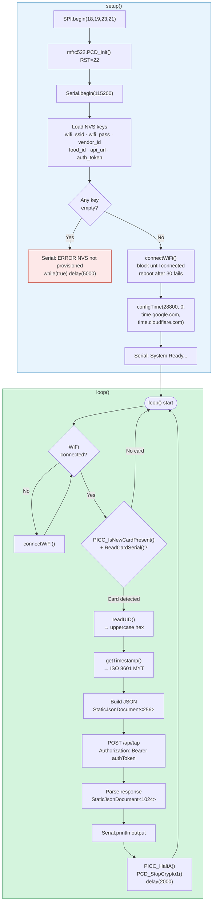

### Serial Monitor States

```
"System Ready..."                          — boot complete
"Connecting to WiFi..." / "WiFi connected" — startup WiFi
"WiFi lost — reconnecting..."              — loop WiFi restore
"Card detected: [UID]"                     — RF tap detected
"OK  -X.Xpts  +Ykcal"                     — 200 success
"Balance: X.Xpts"                          — remaining points
"Voucher applied!  -X.Xpts saved"         — voucher deducted
"New voucher earned!"                      — campaign completed
"Campaign complete: [name]"               — campaign name
"Warning: Calorie limit reached!"         — calorie warning
"Auth failed — invalid terminal token"    — 401
"Insufficient points"                      — 402
"Already visited today"                    — 409 DUPLICATE_TAP
"No connection — tap rejected"            — network error
```

### Provisioning Workflow

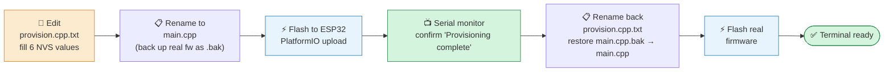

### Python NFC Daemon (Raspberry Pi)

File: `daemon/nfc_daemon.py` — reads PN532, exposes UID on localhost:5001. Never calls cloud API directly.

```
GET /nfc
  Returns: { "uid": "04:A3:2F:B1", "timestamp": "ISO8601" }
       or: { "uid": null }

Behaviour:
  Poll PN532 every 200ms
  Cache UID 2 seconds after detection then clear
```

Libraries: Flask · adafruit-circuitpython-pn532 · datetime

---

## Concerns and Mitigations

| Concern | Mitigation |
|---|---|
| Datatype incompatibility | Zod validates at Express. ArduinoJson types correctly. TIMESTAMPTZ in PostgreSQL |
| Fake tap injection | `requireTerminalAuth` — Bearer token on `/api/tap` rejects unauthorised requests with 401 |
| Delayed response | ESP32 direct HTTPS (no UART bridge). StaticJsonDocument<256> payload keeps request small |
| Unclear storage | `points_log` = financial audit. `tap_events` = operational log. `subsidy_summary` = reporting |
| ESP32 heap | `StaticJsonDocument` fixed size. Payload under 256 bytes. Response buffer 1024 bytes |
| RF dropout | Online-only — tap rejected to Serial if WiFi unavailable. No silent data loss |
| Timestamp tampering | `server_timestamp` set by Express `NOW()` — client cannot supply it |
| Stale subsidy totals | `subsidy_summary` is a live view — always recalculated |
| Subsidy claim accuracy | Claim queries `vouchers.used_at` directly — not the all-time view |

---

## Decisions Log

| Decision | Rationale |
|---|---|
| Express retained (not direct Supabase) | Service role key must stay server-side — firmware is extractable |
| ESP32 DevKit v1 single chip | Hardware TLS built-in — no separate WiFi bridge needed |
| RC522 over PN532 | Available hardware — SPI, MFRC522 library, same UID-read capability |
| Online-only firmware | Simplifies firmware; no LittleFS queue, no RTC; Serial output replaces OLED |
| Bearer token auth on /api/tap | Prevents arbitrary POST requests from non-terminals |
| NTP over DS3231 RTC | RC522 swap removed RTC wiring; NTP sufficient for online-only design |
| TAP_EVENTS normalised event store | Decouples physical tap from business logic |
| points_log separate table | Financial audit trail separate from operational tap log |
| food_items replaces calories_per_serving | Multiple items per vendor, each with own calories and price |
| Hardcoded FOOD_ID per terminal | No UI for item selection on hardware — one default per terminal |
| Voucher reduces tap cost | Points deducted on every tap — voucher reduces the deduction at purchase |
| Campaign progress per card per campaign | Multiple simultaneous campaigns without interference |
| subsidy_summary as live view | Never stale for display. Claims query vouchers.used_at for period accuracy |
| Duplicate check uses device_timestamp for synced | server_timestamp is always "today" for synced events |
| x-card-uid header for vendor auth | Prototype guard — replace with Supabase Auth for production |
| Phase 1 / 2 / 3 build order | Core tap must be stable before campaigns; campaigns before map |
| Payment gateway excluded | Top-up is UI only — payment inserts here only, no schema changes needed |

---

## Environment Variables

```bash
# backend/.env (Railway)
SUPABASE_URL=https://xxxx.supabase.co
SUPABASE_SERVICE_ROLE_KEY=eyJ...
TERMINAL_AUTH_TOKEN=<random hex — matches ESP32 NVS auth_token>
PORT=3000

# apps/web/.env (Vercel)
VITE_API_URL=https://claudeproject-production-5b22.up.railway.app

# apps/kiosk/.env (Raspberry Pi local)
VITE_API_URL=http://localhost:3000
VITE_NFC_DAEMON_URL=http://localhost:5001
VITE_KIOSK_ID=<uuid of this kiosk unit>
```

---

*TECHNICAL.md — v2.3 | Cross-ref: MASTER_v2_refined.md (visual) · README.md (setup)*
