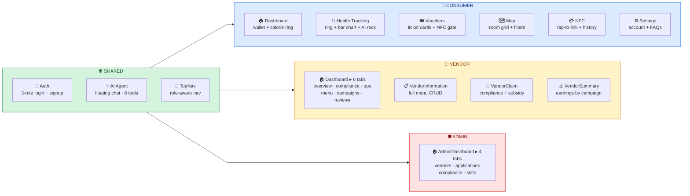
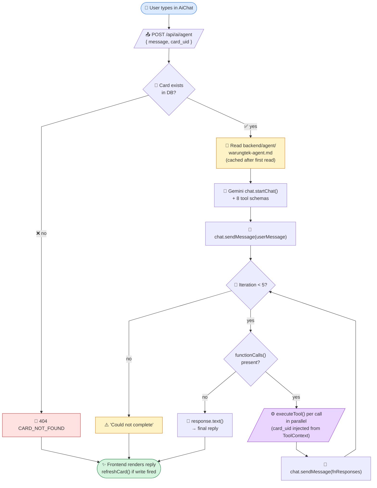
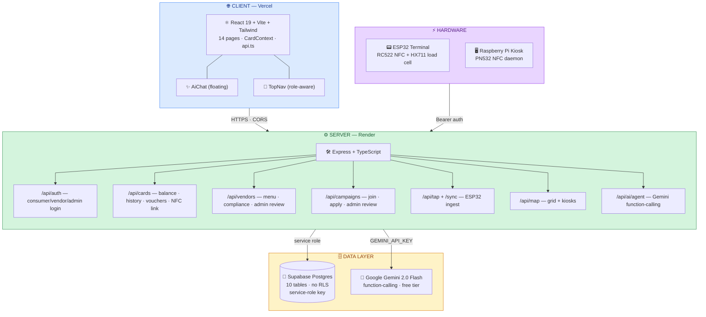
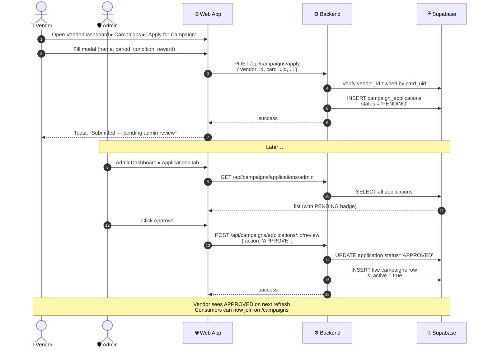
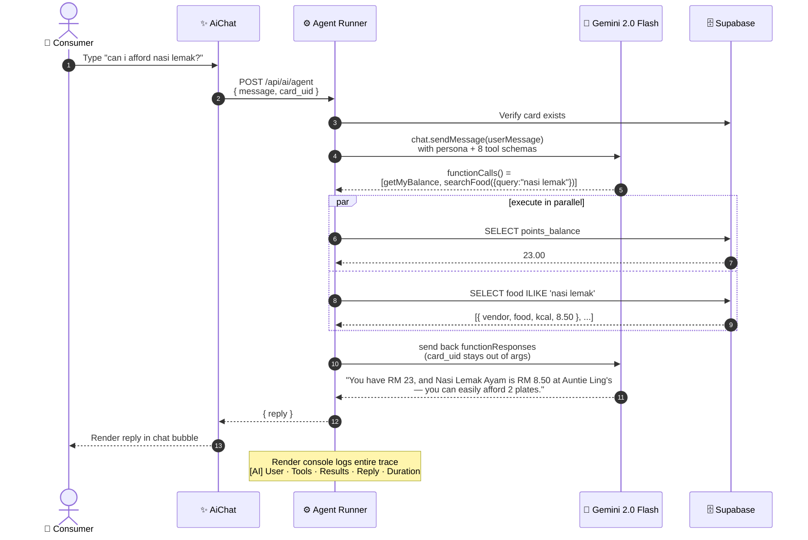
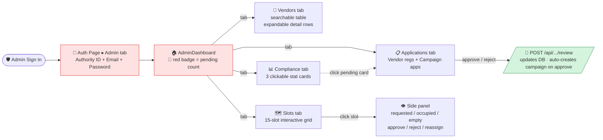
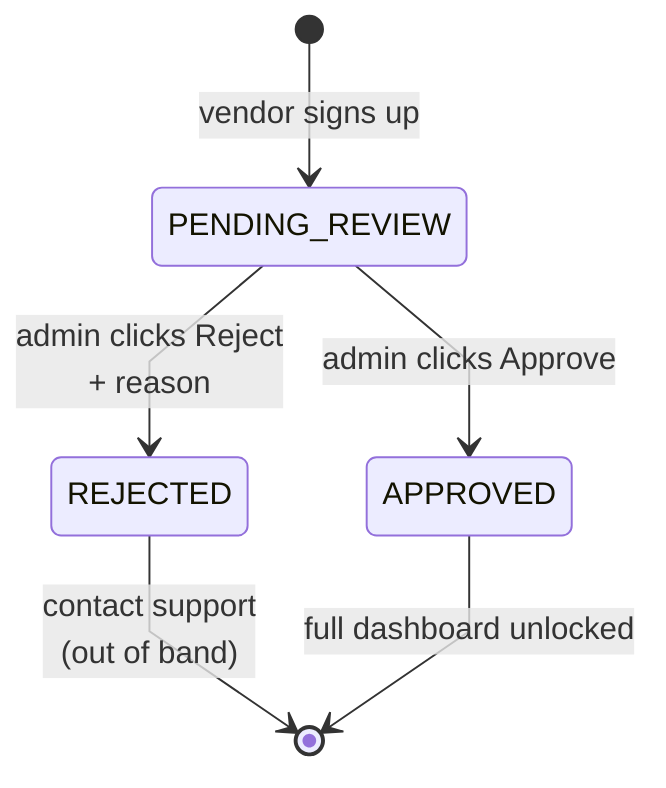
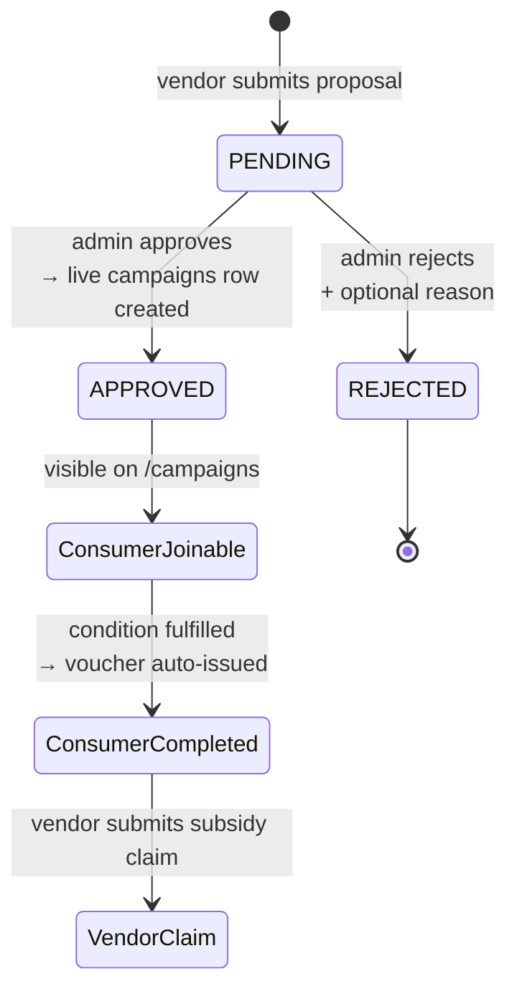

# WarungTek — Website Feature Documentation

**Companion to** [`MASTER_v2_refined.md`](MASTER_v2_refined.md) — that file is the full project overview; this one covers **what was actually built on the web** (pages, features, flows, stack).

Last updated: May 2026 · Live at [nightmarket-web.vercel.app](https://nightmarket-web.vercel.app)

---

## 1. At a Glance

| Role | Pages | Primary Job |
|---|---|---|
| **Consumer** | Auth, Dashboard, Health Tracking, Vouchers, Map, NFC, Settings, Vendors, Campaigns | Tap NFC card to pay, track calories, earn vouchers |
| **Vendor** | Auth, VendorDashboard (6 tabs), VendorInformation, VendorClaim, VendorSummary | Manage stall, menu, compliance, subsidy claims |
| **Admin** | Auth, AdminDashboard (4 tabs) | Approve vendors + campaigns, manage slots, monitor compliance |

14 React pages · 33 API endpoints · 1 shared TopNav · 1 floating AI chat

### Role × Feature map



---

## 2. Tech Stack

### Frontend (`apps/web/`)
- **React 19** + **TypeScript** + **Vite**
- **React Router v7** — client-side routing (SPA, `vercel.json` rewrites all to `index.html`)
- **Tailwind CSS v3** — utility styling
- **Motion (Framer Motion v12)** — page/component animations
- **lucide-react** — icon system
- **recharts v3** — bar + area charts (Health Tracking, Vendor Dashboard, Admin)
- **react-hot-toast** — notifications
- **Deployed on:** Vercel (auto-deploy on `main` push)

### Backend (`backend/`)
- **Node.js + Express + TypeScript** (tsx for dev, compiled to `dist/` for prod)
- **Zod** — request body validation middleware
- **express-async-errors** — async error handling
- **bcryptjs** — password hashing
- **@supabase/supabase-js** — DB client (uses service role key, bypasses RLS)
- **@google/generative-ai** — Gemini 2.0 Flash for AI agent
- **Deployed on:** Render (free tier, ~30s cold start)
- **Cold-start mitigation:** Frontend pings `/api/health` on mount; banner appears if >4s

### Database (Supabase Postgres)
10 tables: `cards`, `vendors`, `food_items`, `tap_events`, `campaigns`, `campaign_progress`, `campaign_applications`, `vouchers`, `subsidy_claims`, `compliance_records`, `kiosks`, `points_log`

### AI Layer
- **Provider:** Google Gemini 2.0 Flash (free tier) — function-calling agent at `/api/ai/agent`
- **Persona file:** `backend/agent/warungtek-agent.md` (editable markdown)
- **Tools:** 8 total (6 read + 2 write) — see Section 7

### Auxiliary
- **ESP32 vendor terminal firmware** — RC522 NFC + HX711 load cell + bearer auth (firmware/)
- **Python NFC daemon** — PN532 reader on Raspberry Pi for the kiosk (daemon/)
- **Face recognition pipeline** — Arducam + ML pipeline for kiosk identity check (daemon/face/, paused)

---

## 3. Authentication & Roles

### Three roles, three login flows
All on **one page** (`Auth.tsx`) with a role pill selector at the top:

| Role | Login fields | Signup tab |
|---|---|---|
| **Consumer** | Email + Password | Yes (Full Name, Email, Phone optional, Password) |
| **Vendor** | Email + Password | Yes (adds Business Name + SSM Number) |
| **Admin** | Authority ID + Email + Password | No (admin accounts created via API by superadmin) |

### Card UID
- Auto-generated as `USER-XXXXXXXX` at registration (no physical NFC card needed upfront)
- User links their physical NFC card later from `/nfc` (Web NFC API tap-to-read on Android Chrome, or manual UID entry as fallback)
- Card UID becomes their canonical identifier — used for all API calls via `card.uid`

### Session
- Stored in `localStorage` (`linked_card_uid`)
- Restored on app mount via `CardContext.restoreSession()`
- `CardContext` is the single source of truth for the logged-in user, refreshed via `getCard()`

---

## 4. Consumer Features

### 4.1 Dashboard (`/dashboard`)
- Orange gradient hero with welcome + name
- **Wallet Balance card** — big RM amount, "Top Up" button, "Explore" button
- **Calorie Summary card** — kcal remaining, gradient progress bar, status pill (Healthy / Moderate / High)
- **Top-Up modal** — 3-step flow:
  1. Pick amount (RM 10/20/50/100)
  2. Confirm with current/new balance preview
  3. Success state — calls `POST /api/cards/:uid/topup`
- **Voucher Panel** — loyalty card (pts balance + earned/redeemed inline + vouchers count) + horizontal scroll of voucher tickets
- **Recent Transactions** — tap history from `getCardHistory()` with status icons

### 4.2 Health Tracking (`/calories`)
- **Animated SVG progress ring** — gradient stroke (green/orange/red based on intake ratio)
- **Counter animation** — kcal eaten counts up on mount
- **Status badge + contextual message** ("You are nearing your daily limit. Watch your next snacks!")
- **"Find low-calorie vendors" button** → navigates to `/map?filter=low-calorie&max_calories=<remaining>`
- **Top Calorie Sources bar chart** (recharts) — vendor breakdown from tap history
- **Smart Recommendations** — food items from all vendors filtered to fit remaining calorie budget
- **Settings gear → Health Preferences modal** — calorie limit slider (1200–4000), dietary restriction multi-toggle (6 options), confirm modal before saving

### 4.3 Vouchers (`/vouchers`)
- **Stats row** — Active vouchers count + Card Status (Linked / Not Linked)
- **Tabs:** Active / Used / Expired
- **Ticket-design cards** — perforated dashed border aesthetic, gradient header (alternating blue/orange), discount amount, expiry, vendor count
- **"Use Voucher" flow with NFC gate:**
  - If card UID starts with `USER-` → modal: "Link your NFC card first" → redirects to `/nfc`
  - If physical card linked → QR code modal with voucher code

### 4.4 Map (`/map`)
- **Header + zoom controls** (zoom in/out actually expands grid dimensions, not just CSS transform)
- **Scrollable grid canvas** — orange dotted background, two horizontal zone bands ("Zone A — Food Court", "Zone B — Beverages")
- **Vendor markers** — colored circles by category (orange=Meals, green=Snacks, blue=Drinks), letter avatar, animated bounce when selected
- **Kiosk markers** — blue squares with "K" label
- **Selected vendor overlay card** — name, category, food preview, "Navigate Here" button
- **Navigation path animation** — SVG line drawn from bottom-left user position to vendor
- **Bluetooth permission modal** — placeholder for indoor positioning
- **Search + filter chips** — All / Meals / Snacks / Drinks / Low-calorie (with threshold pill)
- **Vendor directory grid** — cards below map with color strip headers

### 4.5 NFC Card (`/nfc`)
- **Link Your NFC Card section** (only shown if `USER-` UID):
  - **Web NFC tap flow** (Android Chrome only) — 3 animated pulse rings around a Wifi icon, reads `serialNumber` via `NDEFReader`
  - **Manual UID entry** — fallback for iOS/desktop
  - **State machine:** idle → scanning → detected → linking → success → page reload
- **Card Status card** — dark gradient card visual with UID, balance, "Physical Card" / "Temp ID" badge, NFC daemon status indicator
- **Recent Taps list** — tap history with refresh button

### 4.6 Settings (`/settings`)
- **Account Settings** — name, email, phone, role (display-only)
- **Password & Privacy** — change-password placeholder + privacy note
- **Bluetooth & NFC Card** — links to `/nfc` for card management
- **FAQs accordion** — 6 expandable Q&A items

### 4.7 Vendors (`/vendors`) + Campaigns (`/campaigns`)
- Legacy pages — still functional, browsing all vendors and joining campaigns. Most discovery now happens via Map + AI chat.

---

## 5. Vendor Features

### 5.1 Auth — Application Status Gates
After vendor signup, `VendorDashboard` first checks `card.application_status`:
- **PENDING_REVIEW** → green checkmark screen "Application Submitted, awaiting admin review"
- **REJECTED** → red alert with `rejection_reason` from DB + Contact Support button
- **APPROVED** → full 6-tab dashboard

### 5.2 VendorDashboard (`/vendor/dashboard`) — 6 tabs

#### Overview
- 4 KPI cards: Subsidy total · Menu items · Compliance records · Status
- Subsidy-by-campaign area chart (recharts)
- Quick-action nav buttons to other tabs

#### Compliance
- Compliance Records CRUD — Add (type/period/date/amount/ref) + Delete
- Link to `/vendor/claim` for subsidy claims & government portal links

#### Operations
- **Daily SOP checklist** — 5 items, "Mark all" shortcut, submits to `localStorage` (auto-detects if already done today)
- **Approved Location card** — shows `card.grid_x`/`card.grid_y` with orange grid visualization
- **Request Slot Change modal** — 15-slot interactive grid, occupied/available states (currently frontend-only toast, no backend write yet)

#### Menu
- Real food items grid from `getVendorFood()`
- **Add Item modal** — name, price (RM), calories, optional macros (protein/carbs/fat)
- "Advanced Editor" button → VendorInformation for full per-item editing (weight-based pricing, photo upload, etc.)

#### Campaigns
- **Campaign Applications list** — submitted by vendor, awaiting admin review
- **"Apply for Campaign" modal** — name, description, period (start/end), condition type (Spend RM / Visit stalls), threshold, point deduction, reward voucher value
- **Live preview card** — shows how the voucher will look as user types
- Status badges: PENDING (yellow) / APPROVED (green) / REJECTED (red, with reason)
- On approval, admin auto-creates a live campaign in the `campaigns` table

#### Reviews
- Placeholder — populates once consumers leave ratings

### 5.3 VendorInformation (`/vendor/information`)
- Full menu CRUD with pricing-mode toggle:
  - **Fixed price** — `price_in_points` + `calories`
  - **Per-gram** — `price_per_100g` + `calories_per_100g` (uses load cell weight at tap time)
- Photo upload (placeholder, no real upload yet)

### 5.4 VendorClaim (`/vendor/claim`)
- **← Back to Dashboard** button at top
- **Government Portal Links** — LHDN e-Filing, MyTax, MyTNB, RMCD MySST
- **My Records** — full compliance CRUD grouped by type
- **Subsidy Claim** (collapsible) — date range picker → submits claim via `POST /api/vendors/:id/claim` based on used vouchers

### 5.5 VendorSummary (`/vendor/summary`)
- Subsidy breakdown by campaign — from `subsidy_summary` view

---

## 6. Admin Features

### AdminDashboard (`/admin`) — 4 tabs

#### Vendors
- Searchable table of active vendors
- Expandable rows: stall info, grid position, SSM number, menu count

#### Applications (red badge shows pending count)
- **Vendor Registrations section** — `GET /api/vendors/admin/pending`
  - Approve → updates `vendors.application_status = 'APPROVED'`
  - Reject → modal with optional reason
- **Campaign Applications section** — `GET /api/campaigns/applications/admin`
  - Approve → creates live record in `campaigns` table, sets `is_active = true`
  - Reject → modal with reason
- **← Back to Compliance** button at top

#### Compliance
- 3 clickable stat cards (Active vendors / Pending applications / Pending campaigns)
- Clicking "Pending …" cards navigates to Applications tab
- Active Vendor Overview list

#### Slots
- **Interactive 15-slot grid** — occupied (green) / available (white) / requested (yellow)
- **Side panel** switches based on selected slot:
  - Requested → Approve / Reject buttons
  - Occupied → shows vendor name, SSM, category
  - Available → empty state
- Vendors mapped to slots by matching `grid_x`/`grid_y`

---

## 7. AI Agent

Floating ✦ button (orange gradient) bottom-right, present on all logged-in pages.

### Function-calling loop architecture



### 8 Tools

| Type | Tool | Purpose |
|---|---|---|
| Read | `getMyBalance` | Wallet balance in RM |
| Read | `getMyCaloriesToday` | kcal eaten today vs limit + status |
| Read | `getMyHistory({days?})` | Recent tap purchases (default 3 days, max 30) |
| Read | `getMyCampaigns` | Active campaigns with progress |
| Read | `searchFood({query, max_calories?})` | Menu search across all vendors |
| Read | `getVendor({name})` | Specific vendor's menu |
| Write | `joinCampaign({campaign_name})` | Enrol user in campaign by name |
| Write | `setMyCalorieGoal({kcal})` | Update daily calorie limit (1200–4000) |

### Security
- `card_uid` passed via runner's `ToolContext`, **never exposed to Gemini's argument schema**
- Backend verifies card exists before invoking the agent
- Persona instructs the LLM to never echo card UIDs
- 5-iteration safety cap prevents infinite tool loops

### Debug
Every request logs to Render console:
```
[AI] User abc123: "how many points do I have?"
[AI] Tools (iter 1): getMyBalance({})
[AI] ↳ getMyBalance: {"balance_rm":23}
[AI] Reply (1234ms): "You have RM 23 — enough for 2 plates of Nasi Lemak."
```

---

## 8. Architecture Overview



---

## 9. Data Flow Examples

### A. Consumer taps NFC at a vendor stall

```mermaid
sequenceDiagram
    autonumber
    actor C as 👤 Consumer
    participant E as 📟 ESP32 Terminal
    participant B as ⚙️ Backend
    participant DB as 🗄️ Supabase
    participant W as 🌐 Web App
    C->>E: Tap NFC card on terminal,<br/>place food on load cell
    E->>E: RC522 reads UID,<br/>HX711 reads weight
    E->>B: POST /api/tap (Bearer)<br/>{ card_uid, weight_g, food_id }
    B->>DB: SELECT food_items
    DB-->>B: row with price_per_100g (or fixed)
    B->>B: Compute base_cost from weight<br/>(if per-gram pricing)
    B->>DB: INSERT tap_event,<br/>UPDATE cards.points_balance
    B->>DB: Check campaign_progress rules
    DB-->>B: progress updated; voucher issued if completed
    B-->>E: { points_balance, voucher_issued?, campaign_completed? }
    E->>E: OLED + buzzer feedback
    Note over W,B: Next page load → CardContext.refreshCard()<br/>pulls fresh balance + vouchers
```

### B. Vendor submits a campaign proposal → admin approves



### C. Consumer asks AI: "Can I afford nasi lemak?"



---

## 10. User Journey Maps

### Consumer first-time journey

```mermaid
%%{init: {"flowchart": {"curve": "linear"}} }%%
flowchart LR
    Start(["🌐 Open WarungTek"])
    Start --> Auth["🔐 Auth Page<br/>Consumer tab → Sign Up"]
    Auth -->|fill name/email/phone/pw| Reg[/"📝 POST /api/cards/register<br/>backend auto-generates USER-XXXXX UID"/]
    Reg --> BTPop["📡 Bluetooth permission popup<br/>(placeholder)"]
    BTPop --> Success["✅ Success screen<br/>NFC card illustration"]
    Success --> Dash["🏠 Dashboard<br/>wallet 0 RM, no taps yet"]
    Dash -.->|"go to kiosk in real life"| Kiosk[/"🖥️ Collect physical NFC card"/]
    Kiosk -.-> NFCPage["💳 /nfc page<br/>tap card on phone (Web NFC)<br/>or enter UID manually"]
    NFCPage --> Link[/"🔗 PATCH /api/cards/:uid/link<br/>swap USER- UID for physical"/]
    Link --> Linked["✅ Card linked,<br/>vouchers now usable"]
    Linked --> TopUp[/"💰 Top Up<br/>RM 10/20/50/100"/]
    TopUp --> Browse["🗺️ Browse vendors via Map"]
    Browse -->|"tap at stall"| Tap[/"📟 ESP32 tap<br/>balance deducts, calories tally"/]
    Tap --> Join["🎯 Join campaign<br/>fulfil condition → auto voucher"]

    style Reg fill:#dbeafe,stroke:#3b82f6
    style Link fill:#dbeafe,stroke:#3b82f6
    style TopUp fill:#dbeafe,stroke:#3b82f6
    style Tap fill:#dbeafe,stroke:#3b82f6
    style Success fill:#d4f4dd,stroke:#2d8a4f
    style Linked fill:#d4f4dd,stroke:#2d8a4f
```



### Vendor first-time journey

```mermaid
%%{init: {"flowchart": {"curve": "linear"}} }%%
flowchart LR
    Start(["🏪 Vendor Sign Up"]) --> Auth["🔐 Auth Page<br/>Vendor tab"]
    Auth -->|"name, email, business name,<br/>SSM number, password"| Reg[/"📝 registerCard + registerVendor<br/>two backend calls"/]
    Reg --> Pending["⏳ VendorDashboard<br/>'Application Submitted'<br/>PENDING_REVIEW state"]
    Pending -.->|"admin approves<br/>(separate session)"| Approved["✅ Refresh →<br/>full 6-tab dashboard"]
    Approved --> Menu["🍽️ Menu tab<br/>add items: fixed or per-gram"]
    Menu --> CampApply["🎯 Campaigns tab<br/>Apply for Campaign"]
    CampApply -.->|"admin approves"| CampLive["📢 Campaign goes live<br/>consumers can join"]
    Approved --> SOP["✅ Operations tab<br/>Daily SOP checklist"]
    Approved --> Comp["📄 Compliance tab<br/>log LHDN/TNB/SST"]
    CampLive -.->|"consumers tap & complete"| Voucher["🎟️ Vouchers used at stall"]
    Voucher --> Claim["📤 VendorClaim<br/>submit subsidy claim<br/>(date range)"]

    style Reg fill:#fef3c7,stroke:#d97706
    style Pending fill:#fef3c7,stroke:#d97706
    style Approved fill:#d4f4dd,stroke:#2d8a4f
    style CampLive fill:#d4f4dd,stroke:#2d8a4f
    style Claim fill:#fef3c7,stroke:#d97706
```



### Admin journey



---

### Vendor application lifecycle (state machine)



### Campaign application lifecycle



---

## 11. Key Implementation Notes

### Navigation
- **Single global nav:** `TopNav` (fixed top, role-aware links)
- Consumer center links: Home · Health Tracking · Vouchers · Map · Settings
- Vendor right-side links: Dashboard · Settings (before language switcher)
- Admin right-side links: Admin Console · Settings
- Internal navigation handled by in-page tabs (VendorDashboard has 6, AdminDashboard has 4)

### Routing
- React Router v7 with `BrowserRouter`
- `vercel.json` has `"rewrites": [{ "source": "/(.*)", "destination": "/index.html" }]` to fix 404 on refresh

### State management
- No Redux/Zustand — single `CardContext` covers logged-in user data
- All mutations go through API → call `refreshCard()` to pull fresh state
- Per-page state lives in `useState`

### Error handling
- Backend: `express-async-errors` + central `errorHandler` middleware
- All responses follow `{ success, data?, error?, message? }` shape
- Frontend `request()` wrapper throws `Error(json.message ?? json.error)` so toast shows the human-readable message

### Migration history
1. `001_add_auth_fields` — password hash on cards
2. `002_add_macros` — protein/carbs/fat on food items
3. `003_add_weight_support` — calories_per_100g + weight_g in taps
4. `004_add_weight_pricing` — price_per_100g (load cell pricing)
5. `005_add_compliance_records` — vendor government submissions
6. `006_warungtek_phase1` — admin role + vendor application_status workflow
7. `006_add_face_recognition` — face_encodings on cards (kiosk pipeline, paused)
8. `007_campaign_applications` — vendor-submitted campaign proposals for admin approval

---

## 12. What's Not Yet Built

| Feature | Status |
|---|---|
| Real photo uploads (food items, identity) | UI placeholders only |
| Bluetooth indoor positioning | Permission gate only, no actual BLE |
| Slot change requests persisted to DB | Frontend toast only |
| Customer reviews & ratings | Placeholder in VendorDashboard Reviews tab |
| Multi-language (MS / ZH) | TopNav UI switcher only, no i18n logic |
| Push notifications | Bell icon shows "no notifications yet" |
| Face recognition login | Pipeline built (daemon/face/), paused at Pi deployment |

---

## 13. Related Documentation

- [`MASTER_v2_refined.md`](MASTER_v2_refined.md) — full project overview & build progress
- [`README.md`](README.md) — local dev setup
- `backend/agent/warungtek-agent.md` — AI agent persona + tool guidance
- `database/migrations/` — SQL schema evolution
- `design-export/` — Figma Make code export (gitignored, design reference only)
