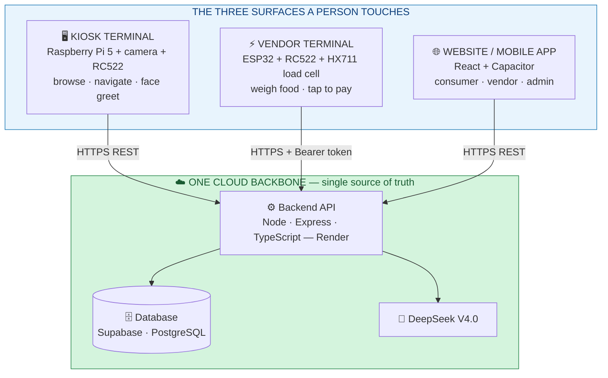
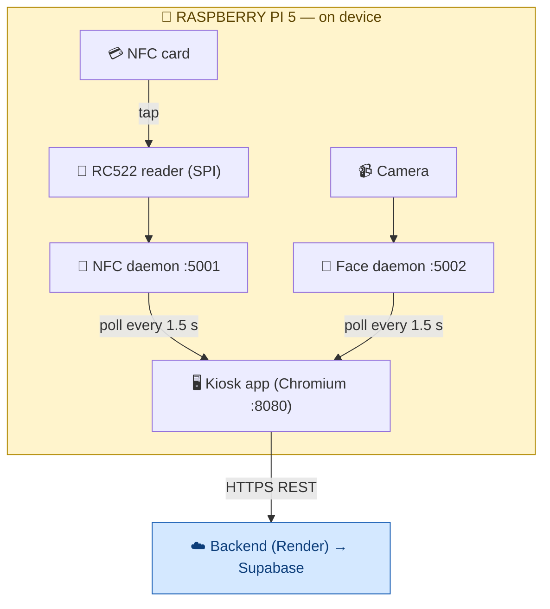
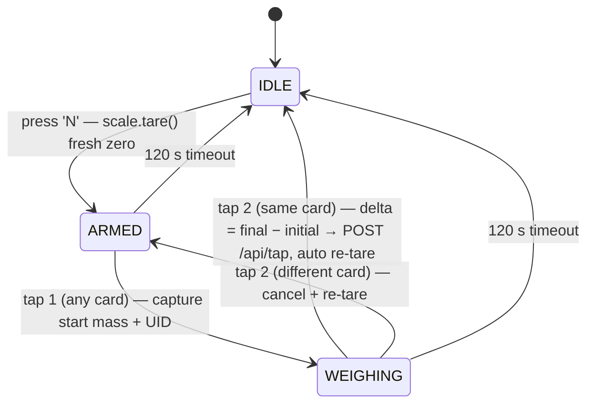
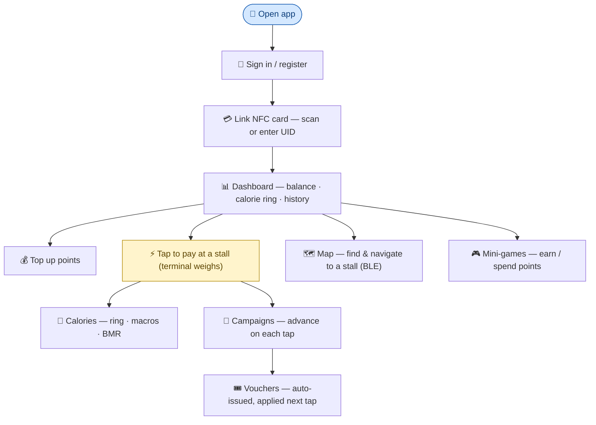
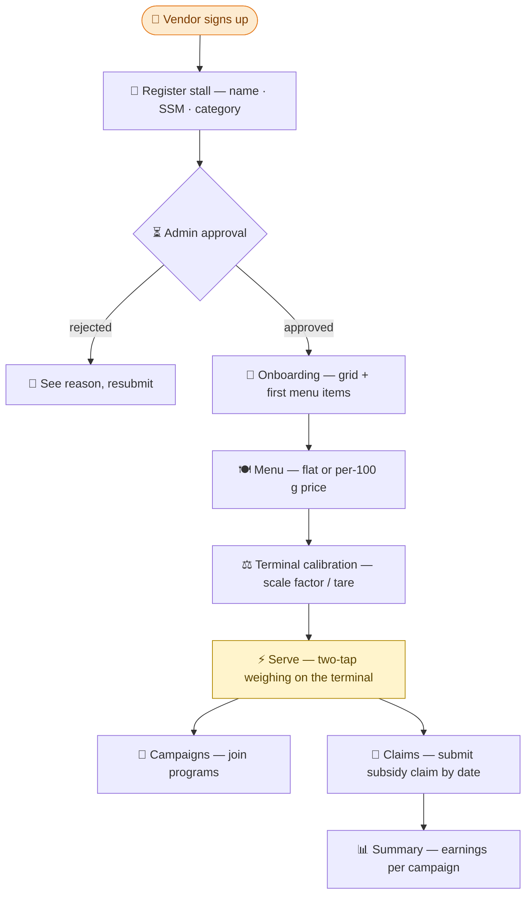
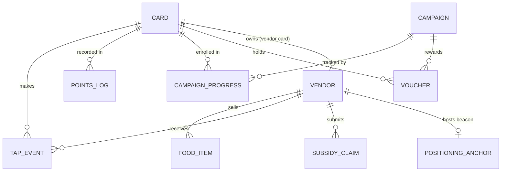
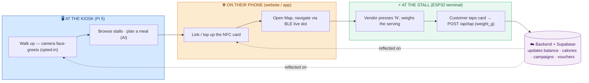

# WarungTek — Whole Project Explanation

> One document, the whole system, end to end: the **kiosk terminal** a shopper walks up to, the
> **vendor terminal** that weighs and charges for food, and the **website** that ties consumers,
> vendors, and admins together — all sitting on top of one cloud backend.
>
> This file is a single-page conclusion of the project. For setup commands see
> [README.md](README.md); for the deep technical story see [master.md](master.md) and the
> per-feature docs under [docs/](docs/).

---

## 1. What WarungTek is

A night market normally runs on **cash, paper loyalty stamps, and word-of-mouth directions**.
WarungTek (formerly "NightMarket") replaces all three with **one tap-to-pay NFC card and one
cloud backend**:

- a **shopper** carries a single NFC card, pays by tapping at any stall, and automatically sees
  their points, spending, calories, campaign progress, and vouchers — no app sign-up needed to
  start;
- a **vendor** runs a low-cost ESP32 terminal that weighs food on a load cell and charges **by
  the gram**, lists their menu online, joins campaigns, and claims government subsidies;
- an **authority admin** approves who trades, assigns where they sit on the market grid, and
  monitors compliance;
- and the market itself becomes **navigable** — a kiosk and the phone help a shopper find and
  walk to a stall, and a camera at the kiosk can greet returning customers by face.

**Guiding principle:** the cloud is the single source of truth, and every device — phone,
kiosk, terminal — is a *thin client* that reads and writes through one API. There is **no live
payment gateway**; a prepaid top-up adjusts the points balance directly.

---

## 2. The big picture — three surfaces, one backend



The kiosk, terminal, and website **never touch the database directly**. Each one talks only to
the Express API on Render, which holds the only Supabase key. No two devices talk to each other
— they meet in the cloud. That single rule is what keeps a point spent at a stall visible on the
phone seconds later, and lets a face login at the kiosk use the same card the phone linked.

| Role | Surface | What they do |
|---|---|---|
| 🧑 **Consumer** | Website / mobile app + kiosk | Link & top up an NFC card, tap to pay, track calories, join campaigns, redeem vouchers, navigate, play mini-games |
| 🏪 **Vendor** | Website (mode toggle) + onboarding app + ESP32 terminal | Register a stall, manage a weight-priced menu, calibrate the terminal, join campaigns, submit subsidy claims |
| 🛡️ **Admin** | Website (`/admin`) | Approve vendor & campaign applications, assign stall grid slots, monitor compliance |
| 👀 **Guest** | Website + kiosk | Browse stalls and the map without signing in |

---

## 3. The Kiosk Terminal — `apps/kiosk` (Raspberry Pi 5)

The customer-facing **digital directory** that stands at the market entrance. A 7" touch screen
driven by a Raspberry Pi 5 running a React app in kiosk-mode Chromium.

### 3.1 What it does

| Feature | Description |
|---|---|
| **Stall directory** | Browse all active stalls with food categories, dietary filters, distance, and vouchers |
| **Smart navigation** | Visual grid map (A1–C3 zones) with an animated path from the kiosk to the chosen stall |
| **NFC card wallet** | Tap the RC522 reader → balance, vouchers, calorie tracker appear; **+5 pts** awarded per kiosk visit |
| **Face recognition** | A camera auto-recognises returning, opted-in customers and personalises the UI **without a card tap** |
| **Dual navigator** | Guests see a standard header; recognised users get an orange UserBar (name, points, calories, active campaigns) |
| **Multi-language** | English / Bahasa Malaysia / 中文 toggle |
| **Emergency call** | One-tap red button → modal with the person-in-charge phone number |

### 3.2 How the Pi pieces fit together

The kiosk's React app cannot touch hardware directly, so two small **Python (Flask) daemons**
expose the camera and the card reader over `localhost` HTTP on the Pi:



- **`daemon/nfc_daemon.py`** (`:5001`) — reads RC522 RFID tags over SPI, holds the last UID for
  ~3 s so the React app can poll `GET /nfc` and pick it up.
- **`daemon/face/face_daemon.py`** (`:5002`) — runs a **RetinaFace + ArcFace (InsightFace)**
  pipeline. It matches a live face against locally enrolled embeddings and exposes
  `GET /face/recognized`.

**Privacy by design:** the face *embeddings* (512-d math fingerprints) live only on the Pi in a
local `faces.db`; **no face image ever leaves the device**. A background sync service pulls
*enrolment photos* of consented users (`face_consent = true`) from the backend every few minutes
to keep the local database fresh — that is the only face-related network call.

### 3.3 The two recognition flows

- **NFC tap** → reader detects card → daemon holds UID → app loads the card profile from the
  cloud → logs the visit and awards **+5 pts** → login animation opens the wallet with the real
  balance and vouchers.
- **Face match** → camera frame passes a blur/brightness quality check → embedding matched
  on-device → confirmed only after **3 of 5 frames** agree → app loads the profile and shows a
  modal that branches on whether the person already holds a physical card ("tap to earn 5 pts")
  or not ("visit the counter to get a card"). A `FACE_LOGIN` event is logged (no points).

### 3.4 Kiosk hardware & stack

- **Stack:** React 19 · TypeScript · Vite (Rolldown) · Tailwind CSS 4 · lucide-react.
- **RC522 wiring (SPI):** SDA→GPIO8, SCK→GPIO11, MOSI→GPIO10, MISO→GPIO9, RST→GPIO25, 3.3V (never 5V), GND.
- **Deploy:** build on the laptop, `scp dist/*` to the Pi, relaunch kiosk-mode Chromium; the Pi
  serves the built `dist/` via a Python `http.server` on `:8080`.

> Endpoints the kiosk uses: `GET /api/cards/:uid` (profile + balance + calories),
> `GET /api/cards/:uid/vouchers`, `POST /api/kiosk/tap` (+5 pts), `POST /api/face/login`,
> `GET /api/vendors`, `GET /api/kiosk/foods`, `GET /api/campaigns`, `GET /api/map`.

---

## 4. The Vendor Terminal — `firmware/vendor-terminal-arduino` (ESP32)

The point-of-sale device that sits at each stall. A low-cost **ESP32** running Arduino C++ with
an **RC522** RFID reader and an **HX711** load cell — it weighs the food and charges by weight.

### 4.1 Weight-based pricing with a two-tap flow

A vendor can price food **per 100 g**. The terminal never needs to know the empty-bowl weight in
advance: it brackets a serving between **two taps of the same card** and bills the delta.



1. Vendor presses **`N`** → scale re-zeroes (`tare`), state = **ARMED**.
2. Customer's **first tap** captures the starting mass and remembers the UID → **WEIGHING**.
3. Vendor scoops food on; the customer's **second tap (same card)** captures the final mass.
4. `delta = final − initial` grams is sent to the backend; the scale auto re-tares back to IDLE.

A *different* card mid-session cancels and re-arms; 120 s of silence resets to IDLE.

### 4.2 Trustworthy readings (cheap load cells drift)

- **Rolling stability window** — 8 samples 300 ms apart; a weight only counts as "stable" when
  the spread stays under **15 g for 4 consecutive checks** (~1.2 s settle).
- **Drift containment without per-unit reflashing:** a fresh re-tare on every `N`, an automatic
  re-tare after every sale, and an on-site **`'C'` calibration** against a known mass that
  rescales `scale_factor` and persists it to **NVS** (survives reboot, no reflash).
- A `MIN_SERVING_G` (20 g) sanity check warns on implausibly small deltas.

`grams = raw_value / scale_factor` (HX711 model). HX711 wiring: **DOUT→GPIO4, SCK→GPIO5**, 3.3 V, GND.

### 4.3 From grams to a charge (done in the backend)

The weighed mass rides in the tap request; pricing math lives server-side in `processTap()`:

```
calories   = round( weight_g / 100 × food.calories_per_100g )
base_cost  = round( weight_g / 100 × food.price_per_100g , 2 )
final_cost = max( 0 , base_cost − voucher_discount )
```

A weight-based item that arrives with no `weight_g` is rejected with `WEIGHT_REQUIRED`;
flat-priced items ignore weight entirely.

### 4.4 Provisioning, auth & offline posture

- **Provision once:** `provision/provision.ino` writes WiFi SSID/pass, API URL, auth token,
  `vendor_id`, `food_id`, and the initial `scale_factor` into NVS. The main
  `vendor-terminal.ino` reads them — you only provision once per device.
- **Auth:** the ESP32 sends `Authorization: Bearer <TERMINAL_AUTH_TOKEN>`, validated server-side
  by `requireTerminalAuth`.
- **UID normalisation:** the ESP32 emits colon-free UIDs (`831A5308`) while the kiosk daemon
  emits colon-hex (`83:1A:53:08`); the backend resolves a card by `uid` → `nfc_uid` →
  colon-normalised prefix.
- **Offline:** the shipped firmware sends taps only while WiFi is up (retries WiFi every 30 s). A
  batch replay endpoint `POST /api/tap/sync` **exists and is tested** on the backend, reserved
  for a future queued-terminal variant (the shipped sketch does not yet enqueue/replay).

> Libraries: MFRC522, ArduinoJson v6, HX711. Built-in to the ESP32 package: SPI, WiFi,
> HTTPClient, Preferences, BLEDevice/BLEUtils/BLEAdvertising.

---

## 5. The Website / Mobile App — `apps/web` (+ `apps/vendor`)

One React 19 codebase serves **all three human roles**, switching mode for the signed-in user.
It builds for the browser and, via **Capacitor**, as a native mobile app. Hosted on Vercel.

### 5.1 Consumer experience



- **Card & wallet:** link a card by UID, top up points (no gateway), see balance and history.
- **Calories & health:** a daily ring against a personal limit, macro breakdown, and a BMR
  helper — every weighed purchase contributes calories.
- **Campaigns & vouchers:** admins/vendors run programs ("visit N stalls", "spend N points");
  taps advance progress automatically and completing one issues a voucher applied on the next tap.
- **Indoor map navigation (BLE):** fixed ESP32 beacons advertise over Bluetooth; the phone
  listens, converts signal strength to distance, and **trilaterates a live "you are here" dot**
  with a route to a chosen stall — Web Bluetooth on supported Android, a smoother native path in
  the Capacitor build. Anchors come from `GET /api/map`; the math then runs fully on-device.
- **AI assistant:** a floating chat (DeepSeek V4.0) answers questions and recommends meals
  within a calorie budget; the same advisor powers the kiosk meal planner.
- **Mini-games:** a games hub (Flappy / Stack / etc.) tied to points via `/api/game`.

> Pages: `Auth`, `NfcConnect`, `Dashboard`, `Calories`, `Campaigns`, `Vouchers`, `Vendors`,
> `Catalogue`, `Map`, `Settings`, `GamesHub`/`FlappyGame`/`StackGame`/`MiniGame`.

### 5.2 Vendor experience



A vendor registers a stall (with SSM business number), manages a weight-priced menu, views
earnings by campaign, and submits subsidy claims by date range. A separate **onboarding app
(`apps/vendor`)** covers first-time registration, menu setup, and recording the terminal's
calibration values (a vendor-facing reference record — the firmware itself reads `scale_factor`
from NVS, not the backend).

> In-app vendor mode: `VendorDashboard`, `VendorInformation`, `VendorClaim`, `VendorSummary`.
> Onboarding app pages: `Register`, `Onboarding`, `Menu`, `Calibration`, `VendorCampaigns`,
> `Claim`, `Summary`, `Settings`.

### 5.3 Admin experience

The admin console at **`/admin`** is the authority's control panel:

| Tab | Action |
|---|---|
| **Vendors** | Approve / reject vendor applications (rejection reason recorded) |
| **Applications** | Review campaign applications |
| **Slots** | Assign a vendor to a grid cell (`setVendorPosition` updates the market map) |
| **Compliance** | Monitor vendor documents |

> Backed by `AdminDashboard.tsx` — actions `reviewVendor`, `reviewCampaignApplication`,
> `setVendorPosition`.

---

## 6. The cloud backbone — Backend + Database

### 6.1 Backend API (`backend/` — Express on Render)

Node.js · Express · TypeScript · Zod (validation) · bcryptjs. It holds the only Supabase service
key and exposes one REST surface mounted in [`backend/src/index.ts`](backend/src/index.ts):

| Router | Purpose |
|---|---|
| `/api/auth` | Sign in / register, role checks |
| `/api/cards` | Card profile, balance, calories, vouchers, `has_physical_card` |
| `/api/vendors` | Stall list and vendor records |
| `/api/tap` (+ `/api/tap/sync`) | The core purchase tap: deduct points, log event, add calories, advance campaigns; batch replay reserved |
| `/api/campaigns` (+ `/api/kiosk/tap`, `/api/kiosk/foods`) | Campaign progress, vouchers, kiosk directory tap |
| `/api/map` | Vendors, kiosks, and BLE `anchors[]` for positioning |
| `/api/face` (`/photos`, `/login`) | Consented enrolment photos (pull) + face-login event |
| `/api/ai` | DeepSeek chat + meal advisor |
| `/api/game` | Mini-game scores |

### 6.2 Data model (`database/` — Supabase PostgreSQL)

Only Supabase holds durable transactional state; everything on a device is config or a rebuildable
cache. Core tables: `cards`, `vendors`, `food_items`, `tap_events`, `points_log`, `campaigns`,
`campaign_progress`, `vouchers`, `kiosks`, `subsidy_claims` (plus migration-added
`positioning_anchors`, `compliance_records`, face-recognition fields, weight pricing, and
`game_scores`).



Schema and migrations live in [`database/`](database/) (`schema.sql` + `migrations/001`–`011`).

---

## 7. How it all connects — one customer, every surface

The point of the design: a single visit flows across all three surfaces and stays consistent,
because they share one backend.



Points spent at the terminal show up on the phone immediately; a face login at the kiosk uses
the same card record the phone linked. **Hub-and-spoke, no device-to-device coupling** — the
terminal writes taps, the admin writes approvals, the face daemon writes only its own local
cache, and Supabase serialises the rest.

### Honest consistency notes

- **No cross-device write conflicts by design** — different surfaces own different rows.
- **Idempotency** is not yet enforced in the shipped firmware (no `txn_id`); a 1.5 s post-tap
  cooldown + online-only send keeps duplicates unlikely. A queued variant would need server-side
  de-duplication before enabling `/api/tap/sync` in production.
- **Render cold starts** — the free tier sleeps; the first call after a quiet spell takes
  ~20–30 s. The web app shows a "Connecting…" banner and the kiosk retries, so it self-heals.

---

## 8. Full tech stack

| Layer | Technology | Hosting |
|---|---|---|
| Website / mobile app (`apps/web`, `apps/vendor`) | React 19 · TypeScript · Vite · Tailwind · React Router · Recharts · Capacitor | Vercel |
| Kiosk app (`apps/kiosk`) | React 19 · TypeScript · Vite · Tailwind 4 | Local on the Pi 5 |
| Backend API (`backend/`) | Node.js · Express · TypeScript · Zod · bcryptjs | Render |
| Database (`database/`) | PostgreSQL | Supabase |
| Vendor terminal (`firmware/`) | ESP32 · Arduino C++ · MFRC522 · HX711 · BLE · WiFi/HTTPS | On-device |
| Kiosk daemons (`daemon/`) | Python · Flask · `mfrc522` · InsightFace · OpenCV | On-device (Pi 5) |
| Positioning beacons (`firmware/positioning-beacon`) | ESP32 BLE · Web Bluetooth / `@capacitor-community/bluetooth-le` · trilateration | On-device |
| AI | DeepSeek V4.0 | Via backend |

---

## 9. Repository map & where to go deeper

```
claude_project/
├── apps/
│   ├── web/       # Consumer + Vendor + Admin app (React, Capacitor mobile)
│   ├── vendor/    # Vendor onboarding app (register, menu, calibration, claims)
│   └── kiosk/     # Raspberry Pi 5 directory kiosk (React + Vite)
├── backend/       # Express API (auth, cards, vendors, tap, campaigns, map, ai, face, game)
├── daemon/
│   ├── nfc_daemon.py        # Kiosk RC522 reader (SPI → GET /nfc, :5001)
│   └── face/                # On-device face-recognition pipeline + sync service (:5002)
├── firmware/
│   ├── vendor-terminal-arduino/  # Shipped ESP32 firmware (RC522 + HX711 + BLE)
│   ├── positioning-beacon/       # ESP32 BLE positioning beacon
│   └── ble-scanner/              # BLE scanner test sketch
├── database/      # schema.sql, seed.sql, migrations/001–011
├── docs/          # deep dives (face, map, load cell, NFC, backend sync)
├── README.md      # the setup brief
├── master.md      # high-level overview + user-journey diagrams
└── WholeProjectExplanation.md   # ← you are here (single-page conclusion)
```

| You want… | Read |
|---|---|
| The high-level story + all user journeys | [master.md](master.md) |
| Setup / quick start | [README.md](README.md) |
| How data syncs across kiosk / terminal / phone | [docs/backend-sync-dataflow.md](docs/backend-sync-dataflow.md) |
| Face recognition (kiosk) | [docs/features/face-recognition.md](docs/features/face-recognition.md) → [daemon/face/README.md](daemon/face/README.md) |
| Indoor map navigation (BLE) | [docs/features/map-navigation.md](docs/features/map-navigation.md) → [docs/positioning-data-flow.md](docs/positioning-data-flow.md) |
| Vendor load-cell weighing & calibration | [docs/features/load-cell-calibration.md](docs/features/load-cell-calibration.md) |
| NFC card reading (terminal · kiosk · phone) | [docs/features/nfc-reading.md](docs/features/nfc-reading.md) |
| Kiosk app specifics | [apps/kiosk/README.md](apps/kiosk/README.md) |

---

*React 19 · TypeScript · Express · PostgreSQL (Supabase) · Render · Vercel · ESP32 · Raspberry Pi 5 · DeepSeek V4.0*
