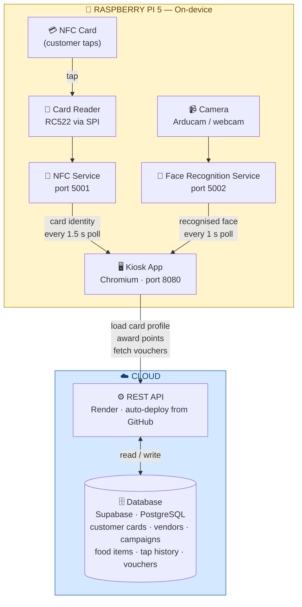
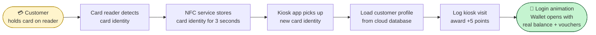
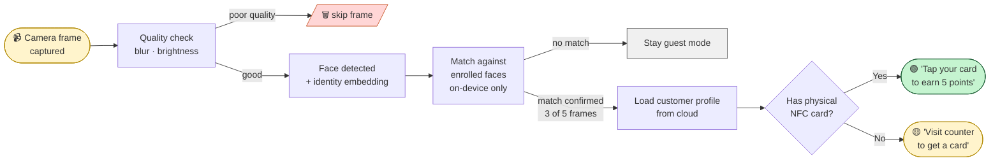

# WarungTek Kiosk

The customer-facing digital directory terminal for the WarungTek night market platform. Touch-screen app that runs on a Raspberry Pi 5 at the market entrance — guides visitors to stalls, manages NFC card wallets, recognises returning customers via their face, and tracks active campaign participation.

---

## What it does

| Feature | Description |
|---|---|
| **Stall directory** | Browse all active stalls with food categories, dietary filters, distance, and vouchers |
| **Smart navigation** | Visual grid map (A1–C3 zones) with animated path from kiosk to selected stall |
| **NFC card wallet** | Tap RC522 reader → see balance, vouchers, calorie tracker; +5 pts per kiosk tap |
| **Face recognition** | Auto-recognise returning customers via webcam; show personalised UserBar without requiring card tap |
| **Dual navigator** | Guest sees standard header; recognised users see a personalised top bar (name, points, calories, active campaigns) |
| **Multi-language** | English / Bahasa Malaysia / 中文 toggle |
| **Emergency call** | One-tap red button → modal with PIC phone number |

---

## Tech Stack

### Frontend (this directory)
- **React 19** + **TypeScript 5**
- **Vite 8** (Rolldown-powered, sub-3s production builds)
- **Tailwind CSS 4** with custom theme tokens
- **lucide-react** for icons
- **react-hot-toast** for notifications

### Backend (../../backend/)
- **Node.js** + **Express** + **TypeScript**
- **Supabase** (PostgreSQL + Auth)
- Deployed on **Render** at `https://warungtek-backend.onrender.com`
- Endpoints used by kiosk:
  - `GET /api/cards/:uid` — card profile + balance + calorie info
  - `GET /api/cards/:uid/vouchers` — active vouchers
  - `POST /api/kiosk/tap` — log directory tap, award +5 pts
  - `GET /api/vendors` — stall list
  - `GET /api/kiosk/foods` — menu items per vendor

### Daemons (../../daemon/)
- **`nfc_daemon.py`** — Flask HTTP service on `:5001`, reads RC522 RFID tags via SPI
- **`face/face_daemon.py`** — Flask HTTP service on `:5002`, runs RetinaFace + ArcFace via insightface for face recognition

---

## Hardware

| Component | Purpose | Connection |
|---|---|---|
| **Raspberry Pi 5** | Kiosk host running labwc Wayland compositor | — |
| **7" touch display** | Customer UI | HDMI + USB |
| **RC522 RFID reader** | Reads NFC cards | SPI (GPIO 8/9/10/11/25) |
| **Arducam (planned)** | Face capture camera | CSI ribbon cable |
| **Laptop webcam** (current) | Prototype face capture during development | USB (over WiFi to Pi) |

### RC522 SPI wiring
```
SDA (SS)  → GPIO 8   (Pin 24)
SCK       → GPIO 11  (Pin 23)
MOSI      → GPIO 10  (Pin 19)
MISO      → GPIO 9   (Pin 21)
RST       → GPIO 25  (Pin 22)
3.3V      → Pin 1   (NEVER 5V)
GND       → Pin 6
```

---

## Tools used (dev environment)

- **Node 20+** + **npm** — build/dev
- **Python 3.12+** — daemon runtimes
- **`mfrc522` + `rpi-lgpio`** — Pi 5 RC522 GPIO library
- **`insightface`, `mediapipe`, `opencv-python`, `onnxruntime`** — face recognition pipeline
- **systemd** — services on Pi (`nfc-daemon.service`, `kiosk-web.service`)
- **scp / ssh** — deployment from laptop to Pi
- **Render** — backend host (auto-deploys from `main` branch)
- **Supabase Studio** — DB schema + manual inserts

---

## High-level Data Flow



---

### NFC tap flow



### Face recognition flow



---

## Source Layout

```
apps/kiosk/
├── src/
│   ├── App.tsx                    Main app — state, polling, routing between overlays
│   ├── main.tsx                   React entry point
│   ├── app/
│   │   ├── data.ts                Stall/MenuItem types, MOCK_STALLS, CATEGORIES, VOUCHERS
│   │   ├── translations.ts        en/ms/zh strings
│   │   └── components/
│   │       ├── Header.tsx         WarungTek logo + search + icon row
│   │       ├── UserBar.tsx        Orange strip below Header (user mode only)
│   │       ├── Intro.tsx          Category pill row
│   │       ├── FilterPanel.tsx    Left sidebar filters
│   │       ├── StallGrid.tsx      Stall card grid
│   │       ├── StallCard.tsx      Individual stall card
│   │       ├── StallDetails.tsx   Modal — menu + nutrition + voucher
│   │       ├── SmartNav.tsx       Map overlay with animated path
│   │       ├── WalletPanel.tsx    Balance + vouchers + loyalty
│   │       ├── HelpAndEmergency.tsx Help drawer + emergency call modal
│   │       ├── SettingsModal.tsx  Calorie target, preferences, logout
│   │       └── FaceRecognizedModal.tsx Pops up on face match (with/without card branches)
│   ├── lib/
│   │   └── transforms.ts          Backend Vendor → Figma Stall mapping
│   └── styles/
│       ├── index.css              Entry — imports the three below
│       ├── tailwind.css           Tailwind directives
│       ├── theme.css              CSS variables (colours, radii)
│       └── fonts.css              Font imports
├── .env                           Backend address, NFC service address, Face service address, Kiosk identity
└── package.json
```

---

## Build & Deploy

### Local dev (laptop)
```powershell
cd apps/kiosk
npm install
npm run dev          # → http://localhost:5173
```

### Production build → Pi
```powershell
# Laptop
cd apps/kiosk
npm run build
scp -r dist\* hokahheng11@hokahheng11.local:/home/hokahheng11/kiosk-web/
```

```bash
# Pi SSH — restart browser to pick up new build
pkill -f chromium
DISPLAY=:0 chromium --kiosk --noerrdialogs --disable-infobars http://localhost:8080 &
```

The Pi serves the built `dist/` via a simple Python `http.server` on port 8080 (`kiosk-web.service`).

### Environment variables (`.env`)
| Variable | Default value | What it points to |
|---|---|---|
| Backend API address | `https://warungtek-backend.onrender.com` | Cloud REST API on Render |
| NFC service address | `http://localhost:5001` | Card reader service running on the Pi |
| Face recognition service address | `http://localhost:5002` | Face service on Pi (change to laptop LAN IP for cross-device prototype testing) |
| Kiosk terminal identity | `d0000001-0001-0001-0001-000000000001` | This terminal's ID in the database |

---

## What was built

| Phase | What changed | Status |
|---|---|---|
| **NFC integration** | RC522 SPI rewrite, CORS, daemon as systemd service | ✅ |
| **Figma UI swap** | Replaced dark panel-based UI with WarungTek light theme; 11 new components | ✅ |
| **Backend wiring** | `transforms.ts` maps real Supabase vendors to UI Stall type; vouchers + tap log live | ✅ |
| **Dual top navigator** | UserBar slides in for recognised users with name/points/calories/campaigns | ✅ |
| **Face recognition** | InsightFace pipeline + Flask daemon + React polling + modal branches | ✅ |
| **Backend CORS fix** | `localhost:8080` added to allowlist for Pi-hosted kiosk | ✅ |
| **API extension** | `has_physical_card` exposed by `GET /api/cards/:uid` | ✅ |
| **Cleanup** | 19 dead files removed across two passes (old panels + template assets + KioskContext) | ✅ |

---

## Known constraints / future work

- **Render cold starts** — free tier sleeps after inactivity; first card tap after a quiet period takes 20–30s. Fix: paid tier or self-host.
- **Face thresholds are laptop-tuned** — detection sensitivity, minimum face size, and blur tolerance are all relaxed for a laptop webcam at desk distance. Restore to stricter production values when Arducam arrives at fixed arm's-length distance.
- **NFC card write cycle** — not yet implemented. Plan exists for writing updated points balance back to the card's memory chip after each tap, so cards work offline.
- **Face embeddings are local** — the mathematical face fingerprints live only on the Pi in a local database, never synced to cloud (privacy by design). A background sync service downloads enrollment photos every 5 minutes to keep the local database fresh.

---

## Related services

- **Backend**: [`../../backend/`](../../backend/) — Express API
- **Admin web**: [`../web/`](../web/) — Vendor management portal
- **Vendor terminal**: [`../vendor/`](../vendor/) — POS app for stalls
- **NFC daemon**: [`../../daemon/nfc_daemon.py`](../../daemon/nfc_daemon.py)
- **Face daemon**: [`../../daemon/face/`](../../daemon/face/)
