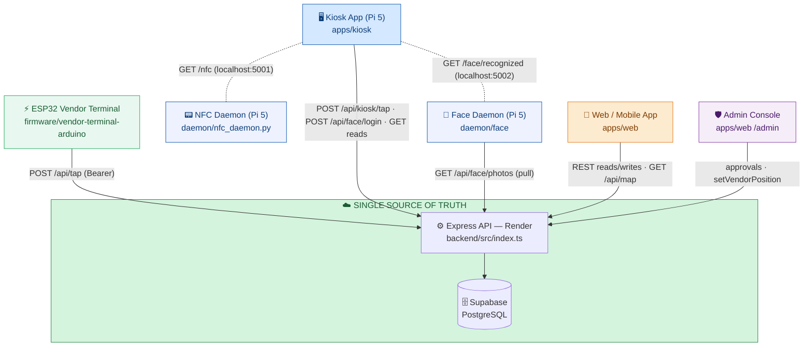
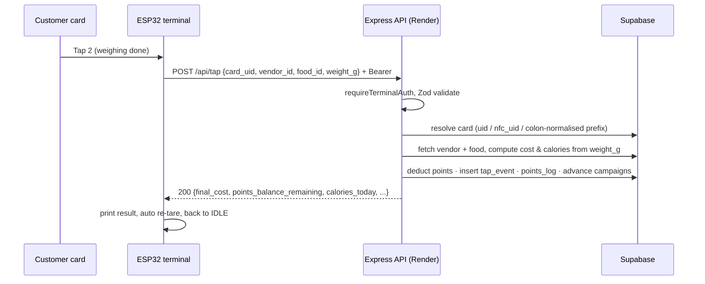
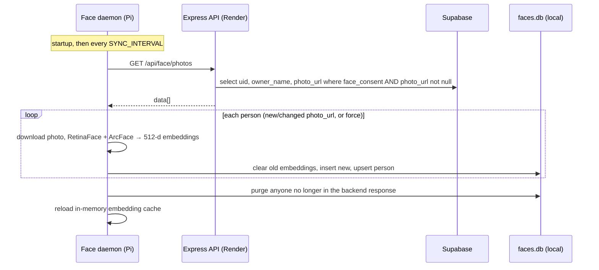

# Backend Sync — Data Flow Across Multiple Terminals

> How every device in WarungTek stays consistent. The rule is simple: **Supabase (behind the
> Render API) is the single source of truth, and every terminal is a thin spoke that reads from
> and writes to it.** No two devices talk to each other directly — they talk to the backend.

This document tabulates each flow: which terminal, which direction, which endpoint, what
payload, how often it fires, and what happens when the network is down.

---

## 1. The hub-and-spoke picture

The two dotted links are **local-only** (Pi `localhost`): the kiosk React app cannot touch
hardware, so small Python daemons expose the camera and the RC522 reader over HTTP on the Pi
itself. Everything else is HTTPS to Render.

---

## 2. Data-flow table (the core reference)

| # | Terminal | Flow | Direction | Endpoint | Payload (key fields) | Trigger / frequency | Offline behaviour |
|---|---|---|---|---|---|---|---|
| 1 | ESP32 vendor terminal | Purchase tap | device → cloud | `POST /api/tap` (Bearer token) | `card_uid`, `vendor_id`, `food_id`, `device_timestamp`, `weight_g`, `synced_from_queue` | On the customer's second card tap (weighing complete) | Sent only when WiFi is up; the loop retries WiFi in the background every 30 s. A queued/offline tap store is **backend-ready** (see #2) but not in the shipped firmware. |
| 2 | ESP32 vendor terminal | Batch offline sync | device → cloud | `POST /api/tap/sync` (Bearer token) | `terminal_mac`, `events[]` (`card_uid`, `food_id`, `device_timestamp`, `weight_g`) | On reconnect, to drain a local queue | **Endpoint exists and is tested**; the shipped Arduino firmware does not yet enqueue/replay, so this path is reserved for the queued-terminal variant. |
| 3 | Kiosk app | Read tapped card UID | kiosk → local daemon | `GET /nfc` (`localhost:5001`) | — (returns `{uid, timestamp}`) | Poll every 1.5 s | Pure local read; if the daemon is down the kiosk simply sees no card. |
| 4 | Kiosk app | Read recognised face | kiosk → local daemon | `GET /face/recognized` (`localhost:5002`) | — (returns `{uid, owner_name, confidence}`) | Poll every 1.5 s | Local read; absence just means "no face yet". |
| 5 | Kiosk app | Confirm face login | kiosk → cloud | `POST /api/face/login` | `card_uid`, `kiosk_id`, `confidence`, `device_timestamp` | When a face is confirmed and matched to a card | Logs a `FACE_LOGIN` tap event (no points). Fails soft — UI still personalises from the local match. |
| 6 | Kiosk app | Directory rebate tap | kiosk → cloud | `POST /api/kiosk/tap` | `card_uid`, `kiosk_id` | When a shopper taps the directory for a visit reward | Standard request; retried on next interaction. |
| 7 | Kiosk app | Load stalls / campaigns / map | kiosk → cloud | `GET /api/vendors`, `/api/campaigns`, `/api/map` | — | On load / refresh | Read-only; cached in React state for the session. |
| 8 | Face daemon | Pull enrolment photos | daemon → cloud | `GET /api/face/photos` | — (returns consented `uid`, `owner_name`, `photo_url`) | On startup, then every `SYNC_INTERVAL_SECONDS` | If the backend is unreachable the daemon keeps its existing local `faces.db` and logs a warning — never crashes. `force=True` re-enrols everyone. |
| 9 | Phone / web app | Auth, card, top-up, calories, campaigns, vouchers | phone ↔ cloud | `/api/auth`, `/api/cards/*`, `/api/campaigns/*` | per-endpoint JSON | On user action | Standard online app; requests fail with a toast and can be retried. |
| 10 | Phone / web app | Map anchors for BLE | phone → cloud | `GET /api/map` | — (returns vendors, kiosks, `anchors[]`) | Once when the Map page opens | Anchor map cached; positioning math then runs fully on-device. |
| 11 | Admin console | Approvals & slot assignment | admin → cloud | vendor review, campaign review, `setVendorPosition` | `vendor_id`, action, reason, grid `x/y` | On admin action | Online-only; writes land directly in Supabase. |

> **Authentication summary.** The ESP32 uses a shared `Authorization: Bearer <TERMINAL_AUTH_TOKEN>`
> validated by `requireTerminalAuth`. The web/kiosk apps act on a signed-in card (`uid`) with
> role checks server-side. The face daemon's `GET /api/face/photos` returns only cards that set
> `face_consent = true`.

---

## 3. What each device persists vs. what is the truth

Only Supabase holds durable transactional state. Everything on a device is either **config** or
a **derived cache** that can be rebuilt from the backend.

| Device | Local store | Kind | Rebuilt by |
|---|---|---|---|
| ESP32 terminal | NVS: `wifi_ssid/pass`, `vendor_id`, `food_id`, `api_url`, `auth_token`, `scale_factor` | Config (set at provisioning / `'C'` calibration) | Re-provision; never holds transaction state |
| Face daemon | `daemon/face/faces.db` (512-d embeddings) | Derived cache of Supabase photos | `sync_from_backend()` re-downloads + re-enrols |
| Kiosk app | React state, env (`VITE_KIOSK_ID`) | Ephemeral session | Reloaded from API on refresh |
| Phone app | `localStorage` (`uid`, `app_mode`) | Session pointer | Re-fetched from API on load |

---

## 4. Two representative sequences

### 4.1 A purchase tap (ESP32 → backend → DB)

### 4.2 Face-photo sync (face daemon ← backend)

---

## 5. Consistency notes (honest)

- **No cross-device conflicts by design.** Devices never write the same row concurrently from
  conflicting local state — the terminal writes taps, the admin writes approvals, the daemon
  only writes its own local cache. Supabase serialises the rest.
- **UID normalisation is server-side.** The ESP32 sends UIDs with no colons (e.g. `831A5308`)
  while the kiosk daemon emits colon-hex (e.g. `83:1A:53:08`). `processTap()` resolves a card by
  `uid`, then `nfc_uid`, then a colon-normalised prefix match
  ([`backend/src/routes/tap.ts`](../backend/src/routes/tap.ts)).
- **Idempotency is not yet enforced** in the shipped firmware path (no `txn_id`); the 1.5 s
  post-tap cooldown plus the online-only send keep duplicates unlikely. A queued variant would
  need server-side de-duplication before enabling `/api/tap/sync` in production.
- **Cold starts.** Render free-tier instances sleep; the web app shows a "Connecting to server…"
  banner and the kiosk retries, so a cold backend self-heals on the first call.

---

## 6. Source references

| Concern | File |
|---|---|
| Route mounts | [`backend/src/index.ts`](../backend/src/index.ts) |
| Tap + batch sync | [`backend/src/routes/tap.ts`](../backend/src/routes/tap.ts) |
| Face photos + face login | [`backend/src/routes/face.ts`](../backend/src/routes/face.ts) |
| Map anchors | [`backend/src/routes/map.ts`](../backend/src/routes/map.ts) |
| Kiosk directory tap | [`backend/src/routes/campaigns.ts`](../backend/src/routes/campaigns.ts) |
| Face sync service | [`daemon/face/sync_service.py`](../daemon/face/sync_service.py) |
| Kiosk NFC reader | [`daemon/nfc_daemon.py`](../daemon/nfc_daemon.py) |
| Kiosk polling loop | [`apps/kiosk/src/App.tsx`](../apps/kiosk/src/App.tsx) |
| ESP32 tap sender | [`firmware/vendor-terminal-arduino/vendor-terminal/vendor-terminal.ino`](../firmware/vendor-terminal-arduino/vendor-terminal/vendor-terminal.ino) |
