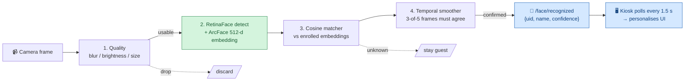
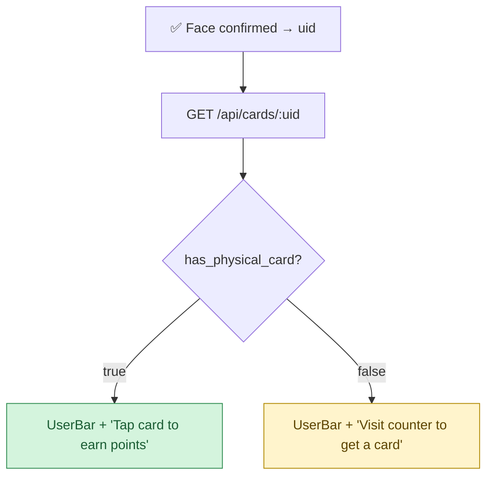

# Face Recognition (Kiosk) — Overview

> **Objective:** greet a returning, opted-in customer at the kiosk **without a card tap**. A
> camera on the Raspberry Pi recognises their face in about a second, the kiosk slides into a
> personalised user mode, and only the resulting `uid` ever leaves the device — the face image
> and the math stay on the Pi.

> This is the **concise overview**. The authoritative, full-detail document (thresholds, every
> pipeline module, timing budget, tuning) is **[daemon/face/README.md](../../daemon/face/README.md)**.

---

## 1. How it works (in plain terms)

A Python daemon on the Pi runs two threads: a fast capture thread that keeps the video smooth,
and a slower detection thread that actually recognises faces. Each candidate frame passes through
a short pipeline that rejects bad frames early and only confirms an identity once several frames
agree.

1. **Quality pre-filter** drops blurry, dark, or too-far frames (cheap, ~1 ms).
2. **RetinaFace + ArcFace** (InsightFace) detect the closest face and produce a 512-dimension
   embedding in one call (~450 ms on the Pi — the bottleneck).
3. **Cosine matcher** compares the embedding to all enrolled embeddings ("max similarity per
   person"); a tiered threshold yields confirmed / possible / unknown.
4. **Temporal smoother** requires 3-of-5 recent frames to agree before confirming — this is what
   eliminates single-frame false positives.

A confirmed match is published on `GET /face/recognized` (TTL ~10 s); the kiosk polls it and,
once a card is matched, branches on whether the customer already has a physical card.

---

## 2. Privacy boundary

The face image, the 512-d embedding, and the local `faces.db` **never leave the Pi**. The only
thing that crosses the network is the `uid`, and only **after** a local match — exactly the same
data shape an NFC tap would send. Enrolment photos are pulled *from* the backend for opted-in
customers (`face_consent = true`) and turned into embeddings locally; see
[backend sync data flow](../backend-sync-dataflow.md).

---

## 3. Code references

| Concern | Location |
|---|---|
| Daemon (capture + detection threads, HTTP API) | [`daemon/face/face_daemon.py`](../../daemon/face/face_daemon.py) |
| Pipeline stages (quality, detector, matcher, smoother, augment…) | [`daemon/face/pipeline/`](../../daemon/face/pipeline/) |
| Local embedding store | [`daemon/face/faces_db.py`](../../daemon/face/faces_db.py) |
| Photo sync from backend | [`daemon/face/sync_service.py`](../../daemon/face/sync_service.py) |
| Tuning constants | [`daemon/face/config.py`](../../daemon/face/config.py) |
| Backend: consented photos + face login | [`backend/src/routes/face.ts`](../../backend/src/routes/face.ts) |
| Kiosk polling + UserBar trigger | [`apps/kiosk/src/App.tsx`](../../apps/kiosk/src/App.tsx) |
| DB columns (`photo_url`, `face_consent`, …) | [`database/migrations/006_add_face_recognition.sql`](../../database/migrations/006_add_face_recognition.sql) |

**Full deep dive:** [daemon/face/README.md](../../daemon/face/README.md).
