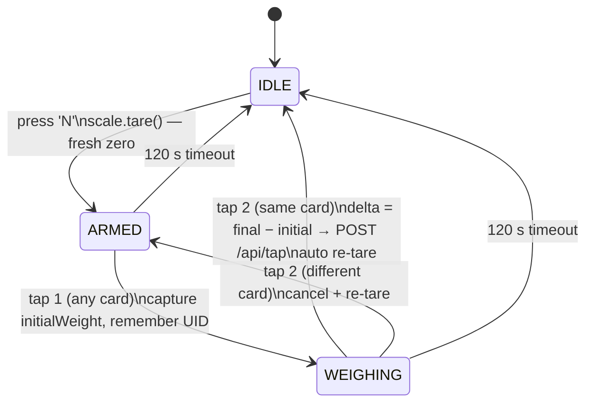
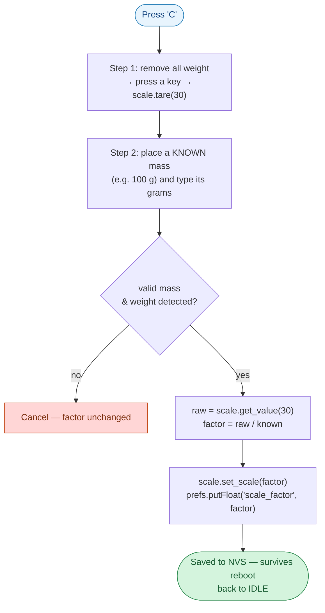
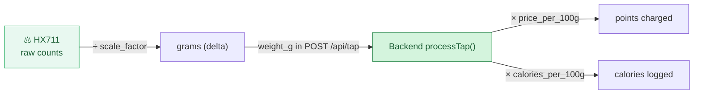

# Vendor Load Cell — Weighing & Calibration

> **Objective:** let a vendor sell food **by weight** instead of a flat price. The ESP32 vendor
> terminal carries a load cell; when a customer taps to pay, the terminal measures how many
> grams were served and the backend charges per 100 g. Because cheap load cells drift, the
> terminal can also be **re-calibrated on site against a known mass** without re-flashing.

All firmware references below point at the shipped sketch
[`firmware/vendor-terminal-arduino/vendor-terminal/vendor-terminal.ino`](../../firmware/vendor-terminal-arduino/vendor-terminal/vendor-terminal.ino).

---

## 1. What it does

A vendor scoops food onto a bowl/plate on the scale; the difference in mass before and after is
the billable serving. The terminal never needs to "know" the empty-bowl weight in advance — it
captures a starting reading and an ending reading bracketed by **two taps of the same card**,
and the delta is the grams sold. That mass is sent to the backend as `weight_g`, which turns it
into points and calories using the food item's per-100 g figures.

Hardware: an **HX711** 24-bit ADC reading a strain-gauge load cell, wired to the ESP32 on
`DOUT = GPIO4`, `SCK = GPIO5`.

---

## 2. The two-tap weighing flow

The terminal is a small state machine. A serial key `N` opens a session (and re-zeroes the
scale); the customer's first tap captures the start mass, and a second tap of the **same** card
captures the final mass.



- **`IDLE`** — nothing happening. A card tap here just reminds the vendor to press `N`.
- **`ARMED`** — scale freshly zeroed, waiting for the opening tap.
- **`WEIGHING`** — start mass captured; the vendor adds food; the closing tap of the same card
  computes `delta = final − initial`.
- A **different** card mid-session cancels and re-arms; a 120 s silence resets to `IDLE`.

Relevant code: the state machine and tap handling live in `handleCardTap()`
([vendor-terminal.ino L342](../../firmware/vendor-terminal-arduino/vendor-terminal/vendor-terminal.ino#L342)),
and the session keys `N`/`C` are read in `loop()`
([L468](../../firmware/vendor-terminal-arduino/vendor-terminal/vendor-terminal.ino#L468)).

---

## 3. Getting a trustworthy reading (stability + drift control)

A raw load-cell reading jitters and drifts with temperature and time. Two mechanisms keep the
billed grams honest:

**Rolling stability window.** Readings feed a small ring buffer (`WeightTracker`,
[L89](../../firmware/vendor-terminal-arduino/vendor-terminal/vendor-terminal.ino#L89)): 8 samples
at 300 ms apart. The weight counts as *stable* only when the spread across the window stays under
15 g for 4 consecutive checks (~1.2 s of settling). `readStableWeight()`
([L177](../../firmware/vendor-terminal-arduino/vendor-terminal/vendor-terminal.ino#L177)) returns
the windowed average once it has filled.

**Drift containment, so N terminals stay accurate without per-unit reflashing:**

| Mechanism | When | Effect |
|---|---|---|
| Per-session re-tare | every `N` press | each customer starts from a fresh zero |
| Post-transaction auto re-tare | after tap 2 | resets accumulated drift after each sale |
| On-site `'C'` calibration | when readings look wrong | rescales against a known mass, persisted to NVS |

A `MIN_SERVING_G` (20 g) sanity check warns if a computed delta is implausibly small.

---

## 4. On-site calibration (`'C'`) — no reflash

Pressing `C` runs `calibrateScale()`
([L301](../../firmware/vendor-terminal-arduino/vendor-terminal/vendor-terminal.ino#L301)). The HX711
library models the conversion as `grams = raw_value / scale_factor`, so calibration just needs
one known mass to solve for `scale_factor`.



The new `scale_factor` is written to NVS under the same key used at provisioning, so it survives
power cycles and there is **no need to re-flash** the device to recalibrate it in the field.

---

## 5. Where calibration values live

There are two places a "calibration" appears — keep them distinct:

| Surface | Stores | Model | Used by |
|---|---|---|---|
| **ESP32 NVS** (`scale_factor`) | the operative factor on the device | `grams = raw / scale_factor` (HX711) | The running firmware — set at provisioning or by `'C'` |
| **Vendor web page** ([`apps/vendor/src/pages/Calibration.tsx`](../../apps/vendor/src/pages/Calibration.tsx)) | a per-vendor `scale_factor` + `tare_offset` record in the backend | `weight_g = (ADC − tare_offset) × scale_factor` | A vendor-facing record / reference; saved via `saveCalibration()` |

The shipped firmware reads its factor from **NVS**, not from the backend record — the web page is
a place for a vendor to note and store calibration values. Provisioning of all NVS config
(including the initial `scale_factor`) is done by
[`firmware/vendor-terminal-arduino/provision/provision.ino`](../../firmware/vendor-terminal-arduino/provision/provision.ino).

---

## 6. From grams to a charge (backend)

The weighed mass rides along in the tap request and the backend does the pricing math in
`processTap()` ([`backend/src/routes/tap.ts`](../../backend/src/routes/tap.ts)):

```
calories   = round( weight_g / 100 × food.calories_per_100g )
base_cost  = round( weight_g / 100 × food.price_per_100g , 2 )
final_cost = max( 0 , base_cost − voucher_discount )
```

If a food item is weight-based (`price_per_100g` set, `price_in_points` null) and the terminal
sends no `weight_g`, the backend rejects the tap with `WEIGHT_REQUIRED`. Flat-priced items ignore
weight entirely. Weight columns were added in
[`database/migrations/003_add_weight_support.sql`](../../database/migrations/003_add_weight_support.sql)
and [`004_add_weight_pricing.sql`](../../database/migrations/004_add_weight_pricing.sql).



---

## 7. Hardware & pin reference

| HX711 pin | ESP32 pin |
|---|---|
| DOUT | GPIO 4 |
| SCK | GPIO 5 |
| VCC | 3.3 V |
| GND | GND |

Tuning constants (top of the sketch): `MIN_SERVING_G = 20`, `STABILITY_THRESHOLD_G = 15`,
`STABILITY_SAMPLES = 8`, `STABILITY_INTERVAL_MS = 300`, `STABLE_HOLD_REQUIRED = 4`,
`STATE_TIMEOUT_MS = 120000`.

---

## 8. Code references

| Concern | Location |
|---|---|
| Two-tap state machine / tap handling | [`vendor-terminal.ino` `handleCardTap()` (L342)](../../firmware/vendor-terminal-arduino/vendor-terminal/vendor-terminal.ino#L342) |
| Stability window | [`WeightTracker` (L89)](../../firmware/vendor-terminal-arduino/vendor-terminal/vendor-terminal.ino#L89) |
| Stable averaged read | [`readStableWeight()` (L177)](../../firmware/vendor-terminal-arduino/vendor-terminal/vendor-terminal.ino#L177) |
| On-site calibration | [`calibrateScale()` (L301)](../../firmware/vendor-terminal-arduino/vendor-terminal/vendor-terminal.ino#L301) |
| Session keys `N` / `C` | [`loop()` (L468)](../../firmware/vendor-terminal-arduino/vendor-terminal/vendor-terminal.ino#L468) |
| Tap sender (weight_g) | [`postTap()` (L206)](../../firmware/vendor-terminal-arduino/vendor-terminal/vendor-terminal.ino#L206) |
| NVS provisioning | [`provision/provision.ino`](../../firmware/vendor-terminal-arduino/provision/provision.ino) |
| Vendor calibration page | [`apps/vendor/src/pages/Calibration.tsx`](../../apps/vendor/src/pages/Calibration.tsx) |
| Backend weight → cost/calories | [`backend/src/routes/tap.ts`](../../backend/src/routes/tap.ts) |

Related: [NFC reading](nfc-reading.md) (how the taps that bracket weighing are read) ·
[backend sync data flow](../backend-sync-dataflow.md).
