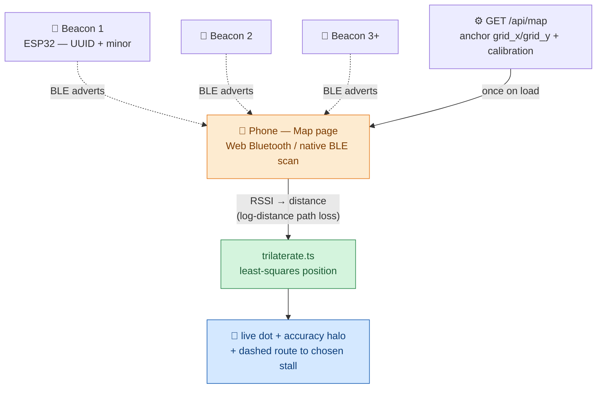

# Indoor Map Navigation (BLE) — Overview

> **Objective:** show a shopper a live "you are here" dot on the market map and draw a route to a
> stall they pick — **without installing an app**. Fixed ESP32 beacons broadcast over Bluetooth;
> the phone listens, turns signal strength into distance, and works out its own position.

> This is the **concise overview**. The authoritative, full-detail document (the exact math,
> calibration, per-hop data, constraints, setup checklist) is
> **[docs/positioning-data-flow.md](../positioning-data-flow.md)**.

---

## 1. The model — phone = scanner, stalls = beacons

A website cannot turn a phone into a beacon, but it *can* let the phone **listen**. So the stalls
carry the beacons and the phone does the listening and the math. The phone is the only device
that can hear every nearby beacon at once, which is exactly what trilateration needs.



1. Each fixed **beacon** continuously advertises the venue service UUID plus a one-byte anchor id
   (`beacon_minor`). Beacons can be standalone ([`firmware/positioning-beacon`](../../firmware/positioning-beacon/src/main.cpp))
   or co-located on a vendor terminal (the ESP32 terminal also advertises).
2. The **backend** serves the anchor map once — each anchor's grid position and its RSSI/path-loss
   calibration — from `GET /api/map`.
3. The **phone** scans for the venue UUID, smooths each beacon's RSSI (EMA), converts RSSI to a
   distance, and trilaterates a grid position with an accuracy estimate (the halo). A
   nearest-beacon "You're at: <stall>" readout works even with a single beacon in range.
4. The **Map page** renders the live dot in the same grid space as the stalls and draws the route
   to the selected stall.

```
distance_m = 10 ^ ((rssi_at_1m − rssi) / (10 · path_loss_n))
```

---

## 2. Scanning paths — and what is actually in use

> ⚠️ **Only the Web Bluetooth path is in use today.** Positioning runs in **Android Chrome with
> the experimental Web Bluetooth flag** enabled. The **Capacitor native BLE path is wired into
> the code but is not built or shipped**, so its branch never executes in practice — it is a
> **candidate for deletion** (see [§3](#3-unused-capacitor-native-path--candidate-for-removal)).

| Build | Scanner | Permission | Status |
|---|---|---|---|
| **Browser (Android Chrome)** | Web Bluetooth `requestLEScan` | one in-page prompt + browser BT prompt | ✅ **In use** — needs the experimental web-platform flag |
| Capacitor native app | `@capacitor-community/bluetooth-le` | single OS prompt, no flag | 🗑️ **Not in use** — wired but unshipped (see §3) |

`useLivePosition.ts` feature-detects and *would* pick the native path when running inside the
Capacitor app, but in practice only the browser build is deployed, so that branch is dead. On
iOS/Safari (no Web Bluetooth) the page falls back to a **static route from the entrance** —
nothing breaks.

---

## 3. Unused Capacitor native path — candidate for removal

The native BLE scanning path was built for a Capacitor Android/iOS app that is **not currently
shipped**. Until that app build is revived, the following are dead code and can be deleted
without affecting the live (Android-Chrome-flag) experience:

| To remove | Where |
|---|---|
| The native scan module itself | [`apps/web/src/lib/nativeScan.ts`](../../apps/web/src/lib/nativeScan.ts) (whole file) |
| Its import + the `isNativeBle()` branch | [`apps/web/src/lib/useLivePosition.ts`](../../apps/web/src/lib/useLivePosition.ts) (import on L14, plus the native start/stop calls) |
| The Capacitor BLE dependency | `@capacitor-community/bluetooth-le` in `apps/web/package.json` (and `@capacitor/core` if nothing else uses it) |

> **Before deleting:** confirm nothing else in the app relies on the Capacitor runtime (e.g. a
> native NFC or camera plugin). If a native app build is planned later, keep this path instead.
> This is a documentation flag only — no code has been changed.

---

## 3. Code references

| Concern | Location |
|---|---|
| ESP32 positioning beacon | [`firmware/positioning-beacon/src/main.cpp`](../../firmware/positioning-beacon/src/main.cpp) |
| BLE scanner test sketch | [`firmware/ble-scanner/src/main.cpp`](../../firmware/ble-scanner/src/main.cpp) |
| Backend anchors in `/api/map` | [`backend/src/routes/map.ts`](../../backend/src/routes/map.ts) |
| RSSI→distance + trilateration (pure, tested) | [`apps/web/src/lib/trilaterate.ts`](../../apps/web/src/lib/trilaterate.ts) |
| Web Bluetooth scan + EMA + feature-detect | [`apps/web/src/lib/useLivePosition.ts`](../../apps/web/src/lib/useLivePosition.ts) |
| Native BLE scan (Capacitor) | [`apps/web/src/lib/nativeScan.ts`](../../apps/web/src/lib/nativeScan.ts) |
| Map page (dot, route, permission, fallback) | [`apps/web/src/pages/Map.tsx`](../../apps/web/src/pages/Map.tsx) |
| `positioning_anchors` table + vendor link | [`database/migrations/008_add_positioning_anchors.sql`](../../database/migrations/008_add_positioning_anchors.sql) · [`010_link_anchors_to_vendors.sql`](../../database/migrations/010_link_anchors_to_vendors.sql) |

**Full deep dive:** [docs/positioning-data-flow.md](../positioning-data-flow.md) ·
**Test checklist:** [docs/ble-positioning-test-checklist.md](../ble-positioning-test-checklist.md).
