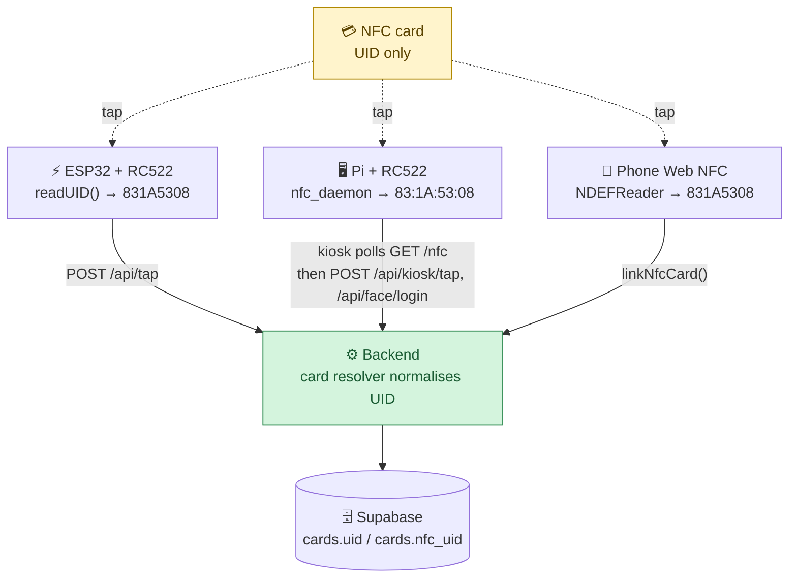
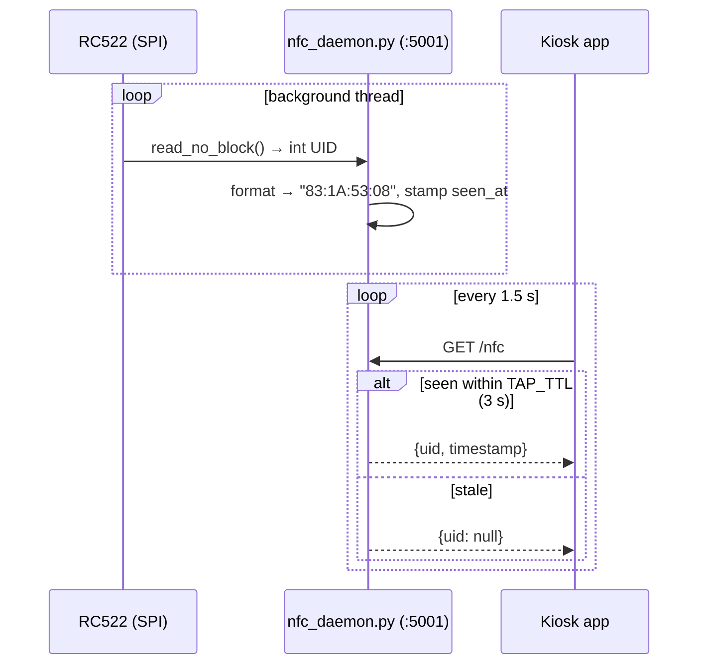
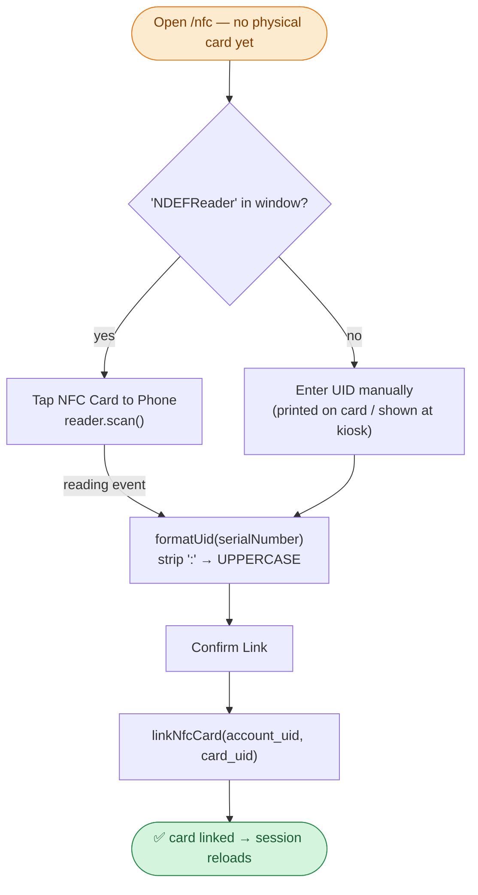
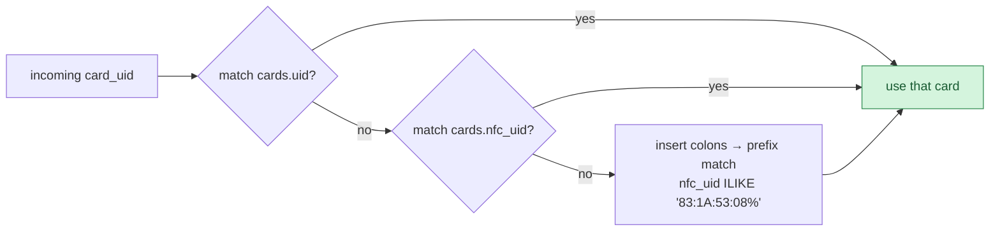

# NFC Card Reading — Three Surfaces

> **Objective:** the WarungTek NFC card is the customer's identity and wallet. The card itself
> stores **only its UID** — everything else lives in the database — so "reading the card" just
> means getting that UID to the backend. Three different devices read the same card for three
> different purposes, and the backend reconciles their slightly different UID formats.

| Surface | Hardware / API | Purpose |
|---|---|---|
| ⚡ ESP32 vendor terminal | RC522 over SPI | Tap-to-pay at a stall (drives the weighing flow) |
| 🖥️ Pi kiosk | RC522 over SPI (Python daemon) | Identify a shopper at the directory kiosk |
| 📱 Phone | Web NFC (`NDEFReader`) | Link a physical card to an account |



---

## 1. ESP32 vendor terminal — RC522 over SPI

The stall terminal uses an **MFRC522** reader on the ESP32's hardware SPI bus. In the main loop,
when a new card is present the firmware reads its UID, converts the bytes to **uppercase hex with
no separators** (e.g. `831A5308`), and that UID drives the two-tap weighing flow before being
sent in `POST /api/tap`.

```cpp
// readUID() — vendor-terminal.ino
for (byte i = 0; i < mfrc522.uid.size; i++) {
    if (mfrc522.uid.uidByte[i] < 0x10) uid += "0";
    uid += String(mfrc522.uid.uidByte[i], HEX);
}
uid.toUpperCase();   // → "831A5308"
```

| RC522 pin | ESP32 pin |
|---|---|
| SS (SDA) | GPIO 21 |
| MOSI | GPIO 23 |
| MISO | GPIO 19 |
| SCK | GPIO 18 |
| RST | GPIO 22 |

A 1.5 s halt after each read (`PICC_HaltA` + `delay(1500)`) debounces the card so one physical
tap is one logical tap. Code: `readUID()`
([L148](../../firmware/vendor-terminal-arduino/vendor-terminal/vendor-terminal.ino#L148)), SPI init
in `setup()` ([L417](../../firmware/vendor-terminal-arduino/vendor-terminal/vendor-terminal.ino#L417)),
read in `loop()` ([L499](../../firmware/vendor-terminal-arduino/vendor-terminal/vendor-terminal.ino#L499)).
The full tap → weighing logic is documented in [load-cell calibration](load-cell-calibration.md).

---

## 2. Pi kiosk — RC522 over SPI via a Python daemon

The kiosk's React app cannot touch SPI hardware, so a small Flask daemon
([`daemon/nfc_daemon.py`](../../daemon/nfc_daemon.py)) owns the RC522 and exposes the last-seen UID
over local HTTP.



- Library: `mfrc522` (`SimpleMFRC522`) on `spidev`.
- UID format: **colon-hex, uppercase** (e.g. `83:1A:53:08`) via `_uid_int_to_string()`.
- A tapped UID stays "visible" for `TAP_TTL = 3 s`, then `/nfc` returns `null` again.
- CORS is open so the kiosk app on `localhost:8080` can poll without preflight.

| RC522 pin | Pi 5 GPIO (BCM) | Header pin |
|---|---|---|
| SDA (SS) | GPIO 8 | 24 |
| SCK | GPIO 11 | 23 |
| MOSI | GPIO 10 | 19 |
| MISO | GPIO 9 | 21 |
| RST | GPIO 25 | 22 |
| 3.3V / GND | — | 1 / 6 |

The kiosk uses the UID to fetch the card, award a directory rebate (`POST /api/kiosk/tap`), and —
together with face recognition — confirm a login (`POST /api/face/login`).

---

## 3. Phone — Web NFC (link a card to an account)

On a supported phone (Android Chrome), the web app reads a card directly with the **Web NFC API**
to link a freshly collected physical card to the signed-in account. There is always a
**manual-UID fallback** for unsupported browsers.



- `formatUid()` strips colons and uppercases, so the phone produces the same shape as the ESP32
  (`831A5308`).
- After linking, the same page also **polls the local kiosk daemon** (`localhost:5001`) to show
  live tap confirmations when the user is at a kiosk with a physical card.
- Code: [`apps/web/src/pages/NfcConnect.tsx`](../../apps/web/src/pages/NfcConnect.tsx)
  (`startWebNfcScan`, `formatUid`, `confirmLink`).

---

## 4. UID normalisation — how the formats reconcile

The three readers emit the same card slightly differently, and a kiosk-written card may carry an
extra BCC byte. The backend is the single place that reconciles them, in `processTap()`:

| Source | Example UID |
|---|---|
| ESP32 (RC522) | `831A5308` (uppercase, no colons) |
| Phone (Web NFC) | `831A5308` (colons stripped) |
| Kiosk daemon (RC522) | `83:1A:53:08` (colon-hex, may include BCC) |



This three-step resolver lets a card registered through any surface be charged from any other.
Code: [`backend/src/routes/tap.ts`](../../backend/src/routes/tap.ts) (`processTap`, card lookup)
and the card-linking endpoint in [`backend/src/routes/cards.ts`](../../backend/src/routes/cards.ts).

---

## 5. Security & privacy notes

- The card holds **only a UID** — no balance, no personal data — so a lost card exposes nothing
  on its own; all value is server-side.
- The vendor terminal authenticates every tap with a Bearer token
  (`Authorization: Bearer <TERMINAL_AUTH_TOKEN>`); the kiosk and phone act on a signed-in card.
- The terminal **never writes back to the card** — it only reads the UID.

---

## 6. Code references

| Surface | File |
|---|---|
| ESP32 RC522 read | [`vendor-terminal.ino` `readUID()` (L148)](../../firmware/vendor-terminal-arduino/vendor-terminal/vendor-terminal.ino#L148) |
| RC522 wiring test | [`firmware/vendor-terminal-arduino/rc522-test/rc522-test.ino`](../../firmware/vendor-terminal-arduino/rc522-test/rc522-test.ino) |
| Kiosk NFC daemon | [`daemon/nfc_daemon.py`](../../daemon/nfc_daemon.py) |
| Phone Web NFC + linking | [`apps/web/src/pages/NfcConnect.tsx`](../../apps/web/src/pages/NfcConnect.tsx) |
| Backend UID resolver | [`backend/src/routes/tap.ts`](../../backend/src/routes/tap.ts) |
| Card link endpoint | [`backend/src/routes/cards.ts`](../../backend/src/routes/cards.ts) |

Related: [load-cell calibration](load-cell-calibration.md) ·
[backend sync data flow](../backend-sync-dataflow.md).
