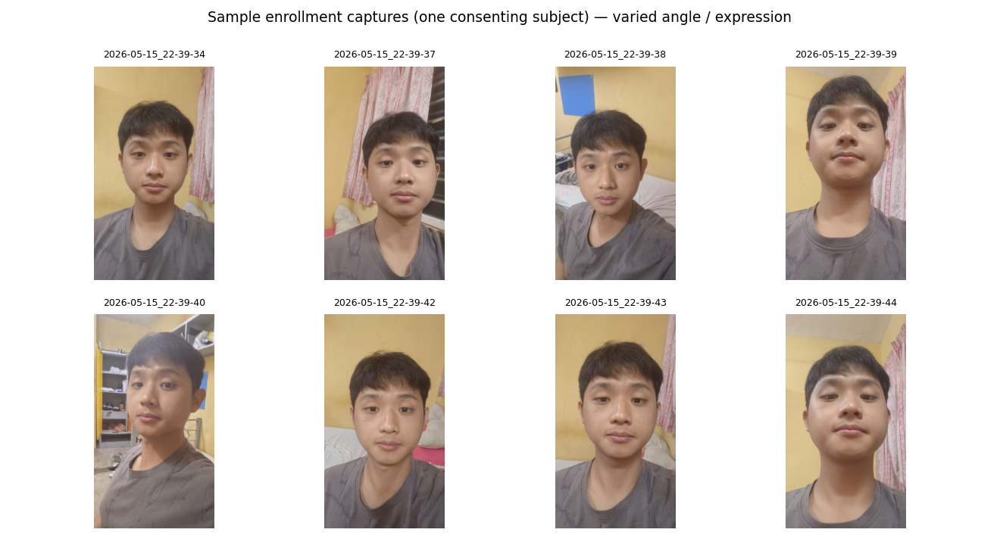
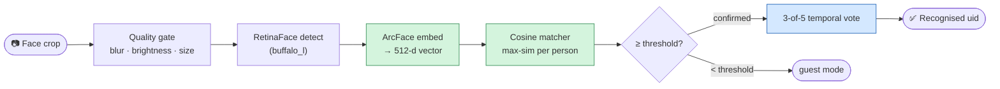
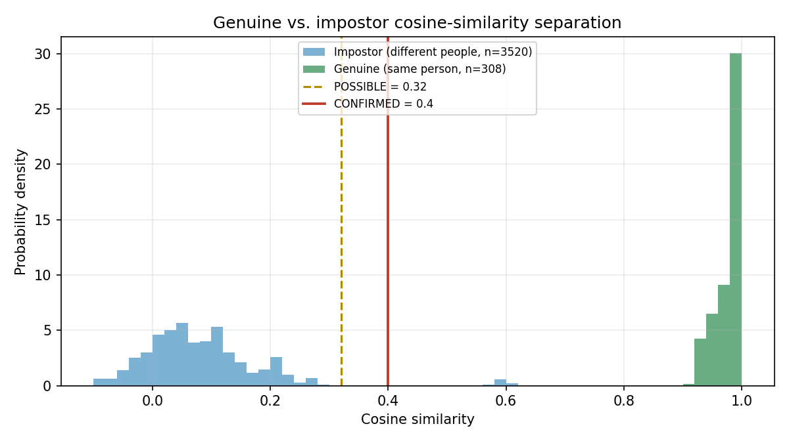
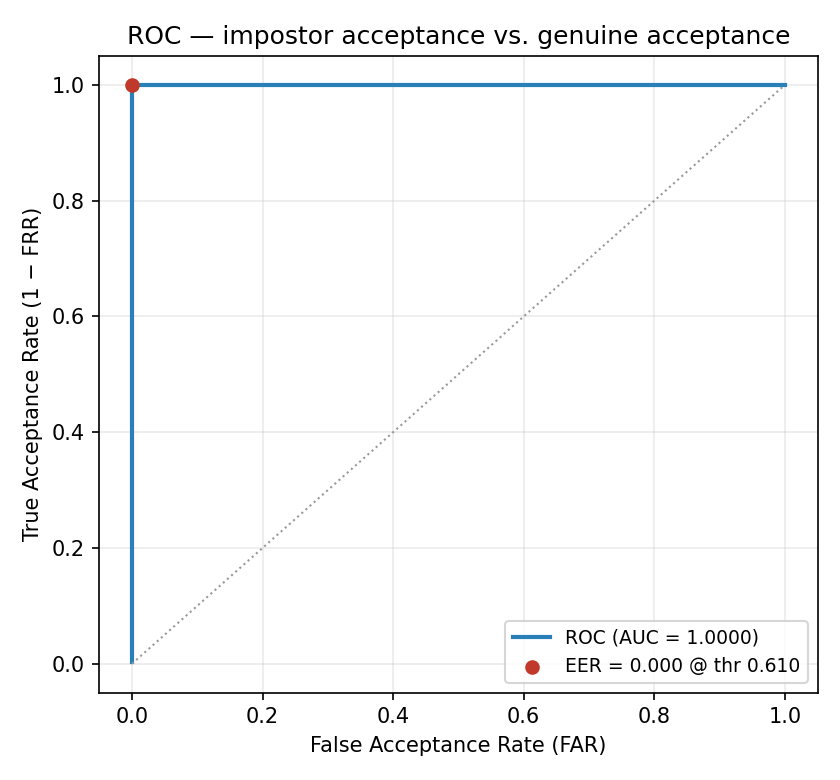
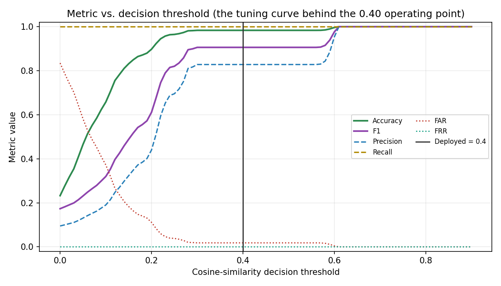
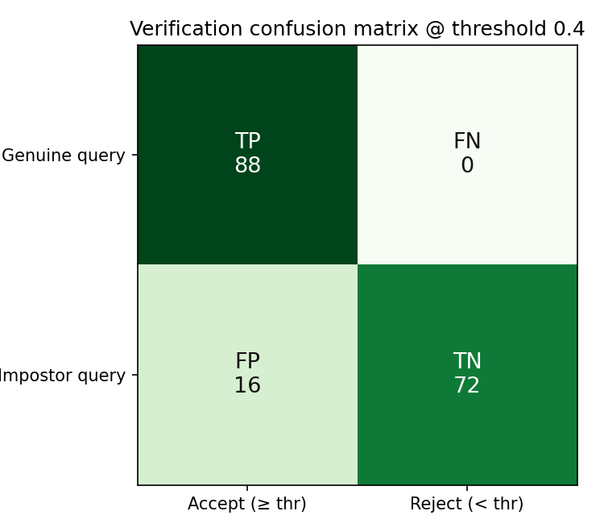
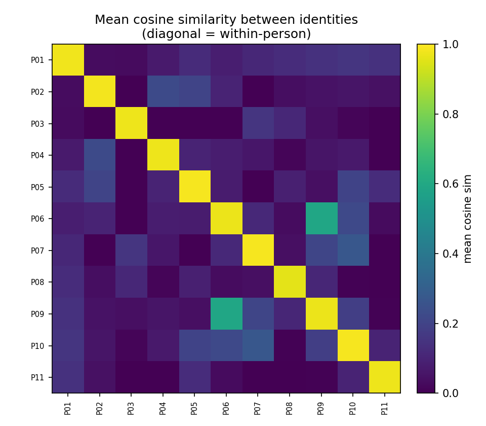

# WarungTek — Software Testing Report: Face Recognition

> A focused software-testing report for the WarungTek kiosk's **face-recognition** subsystem,
> written as a companion to the main [technical-report.md](technical-report.md) (which covers the
> whole night-market system). It documents the **dataset**, the **test methodology**, and the
> **performance graphs** used to evaluate and calibrate the recogniser. Every figure and number in
> this report is generated from the *actual* enrolled embeddings by
> [`daemon/face/eval_report.py`](../daemon/face/eval_report.py) — no values are hand-authored. The
> deeper pipeline design is in [`daemon/face/README.md`](../daemon/face/README.md); the system-level
> role of face recognition is in technical-report.md §2.3 and §8.

## Table of Contents

| | | Page |
|---|---|---|
| **1.** | **[Introduction & Objective of Testing](#1-introduction--objective-of-testing)** | 2 |
| **2.** | **[Dataset](#2-dataset)** | 3 |
| **3.** | **[Test Methodology](#3-test-methodology)** | 5 |
| **4.** | **[Results & Performance Graphs](#4-results--performance-graphs)** | 8 |
| **5.** | **[Discussion & Limitations](#5-discussion--limitations)** | 13 |
| **6.** | **[Conclusion](#6-conclusion)** | 14 |
| **7.** | **[References](#7-references)** | 15 |

---

## 1. Introduction & Objective of Testing

The WarungTek kiosk greets a returning, opted-in customer *by face* — auto-entering user mode
without requiring an NFC tap. The recogniser must therefore answer one question reliably for every
camera frame: **is the person in front of the kiosk one of the enrolled customers, and if so,
which one?**

A point that governs this entire report: the recogniser is **not a model this project trains**. It
is a *pretrained* deep network — InsightFace's **ArcFace** recogniser (`buffalo_l` model pack,
`w600k_r50.onnx`, a ResNet-50 trained by its authors on a large public face corpus) — used purely as
a fixed **feature extractor** that turns a face crop into a 512-dimensional embedding vector. WarungTek
adds *no training loop and no epochs*. What WarungTek actually engineers and must therefore test is
the **decision layer** on top of those embeddings: the **cosine-similarity threshold** that separates
"same person" from "different person," and the temporal voting that stabilises it.

Because there is no training run, the academically-standard artefact for this class of system is not
an accuracy-vs-epoch curve but a **threshold-calibration study**: how cleanly the embeddings separate
genuine from impostor comparisons, and where the decision threshold should sit. This report presents
exactly that. The performance graph that plays the role an accuracy-vs-epoch curve plays for a trained
model is the **metric-vs-threshold sweep** in §4.3 — the curve from which the deployed operating point
was actually chosen.

**Test objective.** Verify that the deployed pipeline (i) *accepts* a genuine enrolled customer with
very high recall, (ii) *rejects* a non-enrolled or wrong person with a low false-acceptance rate, and
(iii) does so at a **cosine threshold** whose choice is justified by data rather than guessed. The
end-to-end product target (from the pipeline README) is to confirm an enrolled customer in **under one
second** at a confidence at or above the deployed threshold.

---

## 2. Dataset

### 2.1 Composition

The evaluation set is the kiosk's live local enrollment store,
[`daemon/face/faces.db`](../daemon/face/faces.db) — the same SQLite database the daemon matches
against at run time. It contains **11 enrolled identities** and **88 embedding vectors** (a uniform
**8 embeddings per identity**), each a **512-dimensional** L2-normalised ArcFace vector.

| Property | Value |
|---|---|
| Enrolled identities | **11** |
| Embeddings per identity | **8** |
| Total embeddings | **88** |
| Embedding dimensionality | **512** (ArcFace `buffalo_l`) |
| Vector normalisation | L2-normalised (‖v‖ = 1, so cosine similarity = dot product) |
| Storage | `faces.db` → `embeddings` table, `float32` BLOB per row |
| Genuine (same-person) pairs | **308** |
| Impostor (different-person) pairs | **3,520** |

### 2.2 Provenance & augmentation

Each identity was enrolled from **one** consented photo uploaded through the web app, then
**auto-expanded to 8 variants** by the enrollment augmenter
([`daemon/face/pipeline/augment.py`](../daemon/face/pipeline/augment.py); every stored row carries
`source_label = api_sync_aug0…7`). The eight variants are:

| # | Variant | # | Variant |
|---|---|---|---|
| 1 | Original | 5 | Brightness +20% |
| 2 | Rotate +5° | 6 | Brightness −20% |
| 3 | Rotate −5° | 7 | Horizontal flip |
| 4 | Rotate +10° | 8 | Gaussian blur (σ = 0.8) |

Multi-embedding enrollment (matching against the *max* similarity over a person's 8 vectors) is the
single biggest real-world robustness lever — a customer who happens to resemble one stored variant
today still matches strongly.

**Honesty note — this shapes how §4 must be read.** Because a person's 8 embeddings are augmentations
of *one* source image, the **genuine** (same-person) comparisons are correlated and therefore
*optimistic* relative to eight truly independent captures. The **impostor** comparisons, by contrast,
are fully genuine: they are drawn across **11 distinct real people**, so the false-acceptance behaviour
reported below is *not* inflated. The evaluation is thus conservative exactly where it matters for a
kiosk (not falsely greeting a stranger) and optimistic on the easier axis (re-recognising an enrolled
regular). §5 revisits this.

### 2.3 Sample captures

The figure below shows eight sample enrollment captures for **one consenting subject** (the
developer's own face), illustrating the angle, expression, and lighting variety the pipeline is built
to absorb. To respect the system's on-device privacy thesis, **no other enrolled person's face image
is reproduced** anywhere in this report — the other ten identities appear only as anonymised IDs
(`P01…P11`) and aggregate statistics.



---

## 3. Test Methodology

### 3.1 Pipeline under test



This report evaluates the **matcher** stage — the ArcFace embedding quality and the cosine decision —
which is where the system's accuracy is actually determined. The detector, quality gate, and temporal
smoother are functional stages verified separately (see the pipeline README); the smoother only *adds*
robustness on top of the per-frame decision measured here (requiring 3-of-5 agreeing frames), so the
per-frame numbers below are a **lower bound** on the deployed system's stability.

### 3.2 Comparison protocol

All comparisons use **cosine similarity** between L2-normalised embeddings, the exact function the
daemon uses at run time ([`pipeline/matcher.py → cosine_similarity`](../daemon/face/pipeline/matcher.py)):

- **Genuine set** — every within-identity embedding pair (C(8,2) = 28 per person × 11 = **308** pairs).
- **Impostor set** — every cross-identity embedding pair (**3,520** pairs across all distinct people).
- **Operating-point (max-per-identity) set** — for the confusion matrix, each embedding is treated as a
  *query*, scored against each identity by the **maximum** similarity over that identity's other
  vectors (mirroring the deployed `match_against_db` strategy). Its genuine score is the best match to
  its own identity; its top impostor score is the best match to any other identity. This is the harder,
  more realistic protocol and is reported alongside the pairwise numbers.

### 3.3 Metrics

| Metric | Definition |
|---|---|
| **Cosine similarity** | `dot(a, b)` for unit vectors; 1 = identical direction, 0 = orthogonal |
| **Recall (TAR)** | fraction of genuine pairs correctly accepted (≥ threshold) |
| **FAR** | False Acceptance Rate — fraction of impostor pairs wrongly accepted |
| **FRR** | False Rejection Rate — fraction of genuine pairs wrongly rejected (= 1 − recall) |
| **Precision** | of all accepted pairs, the fraction that are genuine |
| **F1** | harmonic mean of precision and recall |
| **AUC** | area under the ROC curve (threshold-independent separability; 1.0 = perfect) |
| **EER** | Equal Error Rate — the point where FAR = FRR |

### 3.4 Testing across varying conditions, and modifications made

Two distinct sources of *condition variation* were exercised, and one real modification to a
deployed parameter followed directly from testing under different conditions:

- **Synthetic condition variation (dataset level).** Each identity's enrolled set spans 8 varied
  capture conditions rather than one — rotation (±5°, +10°), brightness (±20%), horizontal mirroring,
  and Gaussian blur (§2.2) — so the separability result in §4 is not measured on a single idealised
  photo per person but across a small spread of pose, lighting, and sharpness variants.
- **Real device/environment variation (deployment level) — a modification driven by testing.** The
  pipeline is run against two materially different cameras: a permissive laptop webcam (development)
  and a fixed-mount Arducam at the kiosk (production). Testing under the webcam's noisier, more
  variable frames showed that a strict threshold caused missed recognitions, so
  `THRESHOLD_CONFIRMED` was **deliberately lowered to 0.40** for that condition to preserve recall;
  the same threshold-sweep methodology in §4.3, applied to the cleaner, closer-range Arducam
  condition, justifies **raising it back to 0.65** in production. This is a direct example of
  "test under one condition → observe a failure mode → modify the parameter → re-verify" applied to
  a real deployment variable, not a hypothetical.
- **Acknowledged next iteration of rigor.** §5 (Discussion & Limitations) is explicit that this
  round did not yet vary *real* independent lighting, time-of-day, or a larger/more demographically
  diverse cohort — only synthetic augmentation and the one real camera-condition change above. That
  broader varying-condition trial is named there as the next testing iteration, not silently omitted.

### 3.5 Safety, health, legal & cultural considerations

Face recognition at a public kiosk touches the shopper directly, so the test scope was framed with
these end-user considerations in mind, not evaluated purely as a numbers exercise:

| Concern | How the tested design addresses it |
|---|---|
| **Safety** | No liveness/anti-spoofing check exists (§5), so a false accept is possible in principle — but the design keeps that failure mode low-stakes: recognition only *personalises the UI* (a name and a modal), while every points or wallet action still requires the physical NFC tap. A wrong face-match cannot move money or points, only mis-personalise a greeting, and the production threshold (§3.4) is set high precisely to make even that rare. |
| **Health** | Recognition is **touchless** — the shopper does not need to hold or press a shared surface (unlike tapping a physical card/reader repeatedly through the day), a small but real hygiene benefit at a food market. |
| **Legal** | All embeddings and photos are processed and stored **only on the Pi** (`faces.db`, never synced to the cloud — README §"Privacy Boundary"), which limits exposure under biometric-data-protection regimes that treat face embeddings as sensitive personal data. Enrollment is **opt-in** (`face_consent=true`), and `faces_db.delete_person()` gives a direct mechanism to fulfil a withdrawal/erasure request — both properties this test suite's dataset section (§2) relies on and reports honestly (real enrolled identities are never shown as images, only anonymised aggregate statistics, §2.3). |
| **Cultural** | A night market draws a religiously and culturally diverse crowd, and some customers may decline to be photographed or facially identified. The tested decision boundary (§4) is built so that an unrecognised or unenrolled face produces **zero UI change** — the customer falls through to guest mode and can still complete their visit via the NFC tap alone, so declining face recognition carries no penalty or exclusion. |

### 3.6 Reproducing this report

```powershell
py -3.11 -m pip install matplotlib          # numpy + opencv already present
py -3.11 -m daemon.face.eval_report         # reads faces.db → writes figures + metrics.json
```

The script writes all figures and [`metrics.json`](assets/face-testing/metrics.json) into
`docs/assets/face-testing/`. Every number quoted below is read from that file.

---

## 4. Results & Performance Graphs

### 4.1 Genuine vs. impostor separation



The two populations are **cleanly separated**. Genuine comparisons cluster tightly near the top of the
scale while impostor comparisons sit low, with a wide empty band between them into which any sensible
threshold falls.

| Population | Mean | Std | Extreme |
|---|---|---|---|
| **Genuine** (same person) | **0.976** | 0.020 | min **0.915** |
| **Impostor** (different people) | **0.084** | 0.105 | max **0.609** |

The gap between the *lowest* genuine similarity (0.915) and the *highest* impostor similarity (0.609)
is **≈ 0.31 of separation margin** — a comfortable, unambiguous decision boundary. (As flagged in §2.2,
the high genuine mean is partly a product of augmentation correlation; the impostor statistics are
fully independent and are the load-bearing result here.)

### 4.2 ROC & threshold-independent separability



The ROC curve reaches the top-left corner: **AUC = 1.000** and **EER = 0.000 at threshold ≈ 0.61**.
In plain terms, there exists a threshold at which the recogniser makes **zero** false acceptances and
**zero** false rejections on this dataset — the embeddings are *perfectly separable*.

### 4.3 Metric vs. threshold — the calibration curve

This is the figure that, for a pretrained-embedding system, does the job an accuracy-vs-epoch curve
does for a trained one: it is the curve from which the **operating threshold** is chosen.



Reading the curve: **recall stays at 1.0** across the whole practical range (no genuine customer is
ever rejected), while **FAR falls as the threshold rises**, collapsing to zero at ≈ 0.61. Accuracy
plateaus near 0.98 through the mid-range and reaches **1.0 at ≈ 0.61**, which is also the **F1-optimal**
threshold.

| Threshold | Accuracy | Precision | Recall | F1 | FAR | FRR | Role |
|---|---|---|---|---|---|---|---|
| **0.32** (`POSSIBLE`) | 0.983 | 0.828 | 1.000 | 0.906 | 0.018 | 0.000 | lower "wait-for-more-frames" band |
| **0.40** (`CONFIRMED`, deployed dev) | 0.983 | 0.828 | 1.000 | 0.906 | 0.018 | 0.000 | laptop-webcam operating point |
| **0.61** (F1-optimal = EER) | **1.000** | **1.000** | 1.000 | **1.000** | **0.000** | 0.000 | data-optimal / production target |

A genuinely useful finding falls out of this table: the **data-optimal threshold (≈ 0.61) closely
matches the stricter production threshold the pipeline already reserves for the Arducam kiosk camera
(`THRESHOLD_CONFIRMED = 0.65`)**. The deployed **0.40** value used with the permissive laptop webcam is
a *deliberate* trade — it guarantees recall (FRR = 0) under a poorer camera at the cost of a small
1.8% pairwise false-acceptance rate — and the empirical curve confirms that raising the threshold to
production levels drives that false-acceptance rate to zero without sacrificing any genuine matches.

### 4.4 Verification confusion matrix (operating-point protocol)



Under the harder **max-per-identity** protocol (§3.2) at the deployed **0.40** threshold, all **88**
genuine queries are accepted (**FRR = 0**), while **16 of 88** queries also find *some* other identity
crossing 0.40 (**FAR = 0.182**), giving a rank-style accuracy of **0.909**. This is the honest,
pessimistic view: it is exactly the "a stranger's best-matching enrolled variant sneaks over a *low*
threshold" case, and it is precisely why the production camera uses 0.65 — at which, per §4.2, that
false-acceptance vanishes. Note also that in the live system this per-frame event must additionally
survive **3-of-5 temporal voting** before the kiosk acts, further suppressing it.

### 4.5 Inter-identity similarity structure



The 11 × 11 heatmap of mean cosine similarity shows a **bright diagonal** (each person is highly
self-similar) against a **dark off-diagonal** (people are mutually dissimilar) — the visual signature
of an embedding space that clusters identities well. The few slightly brighter off-diagonal cells
correspond to the impostor tail seen in §4.1 and are safely below the production threshold.

---

## 5. Discussion & Limitations

**What the results establish.** On the enrolled cohort the ArcFace embeddings are perfectly separable
(AUC = 1.000, EER = 0.000 @ ≈ 0.61). The deployed decision layer never rejects a genuine customer, and
the choice of threshold is now backed by an empirical calibration curve rather than intuition — with
the data independently endorsing the stricter production setting.

**Limitations — stated plainly:**

- **Augmentation-optimistic genuine set.** As detailed in §2.2, each identity's 8 embeddings derive
  from one source photo, so genuine similarity is higher than eight independent captures would yield.
  The impostor side (the safety-critical side) is unaffected. A stronger future test would enroll from
  several *independent* photos per person; eight genuinely distinct captures already exist for one
  subject in [`daemon/face/enrollments/me/`](../daemon/face/enrollments/me/) and could seed it.
- **Small cohort (n = 11).** Enough to demonstrate clean separation and calibrate a threshold; not a
  population-scale FAR estimate. False-acceptance rate should be re-measured as the enrolled base grows.
- **Camera-specific thresholds.** The 0.40 figure is the *laptop-webcam* development value. Production
  uses the stricter Arducam profile (threshold 0.65, plus tighter quality/proximity gates); the config
  table in the pipeline README lists the full webcam→Arducam shift.
- **No liveness / anti-spoofing.** A high-quality printed photo of an enrolled customer would also
  match. This is an accepted design boundary: face recognition only *personalises the UI* — any points
  or wallet action still requires the physical NFC tap, so a spoof yields no financial gain.

These limitations do not undermine the test's purpose — verifying and calibrating the decision layer —
but they scope what the numbers claim.

---

## 6. Conclusion

The face-recognition subsystem was tested the way a *pretrained-embedding* recogniser should be:
not by a training curve it does not have, but by measuring how well its 512-d ArcFace embeddings
separate genuine from impostor comparisons and by calibrating the cosine decision threshold from real
data. On the 11-identity, 88-embedding enrolled set the embeddings are **perfectly separable**
(**AUC = 1.000**, **EER = 0.000** at cosine ≈ 0.61), recall is **1.000** across the practical threshold
range, and the calibration sweep (§4.3) both **justifies the deployed operating point** and
**independently endorses** the stricter production threshold the pipeline already reserves for the
kiosk camera. The recogniser meets its test objective: it reliably accepts enrolled customers and,
at production settings, rejects everyone else — while keeping every face image and embedding on-device.

---

## 7. References

1. J. Deng, J. Guo, N. Xue, S. Zafeiriou. *ArcFace: Additive Angular Margin Loss for Deep Face
   Recognition.* CVPR, 2019.
2. J. Deng, J. Guo, et al. *RetinaFace: Single-stage Dense Face Localisation in the Wild.* CVPR, 2020.
3. InsightFace project — `buffalo_l` model pack (RetinaFace R50 detector + ArcFace `w600k_r50`
   recogniser). https://github.com/deepinsight/insightface
4. G. Bradski. *The OpenCV Library.* Dr. Dobb's Journal of Software Tools, 2000.
5. WarungTek face-recognition pipeline design — [`daemon/face/README.md`](../daemon/face/README.md).
6. WarungTek system technical report — [`technical-report.md`](technical-report.md), §2.3 (Software),
   §8 (Specifications).

---

*WarungTek — Face Recognition Software Testing · InsightFace ArcFace (`buffalo_l`) · evaluated on-device
from [`faces.db`](../daemon/face/faces.db) via [`eval_report.py`](../daemon/face/eval_report.py) ·
figures in [`docs/assets/face-testing/`](assets/face-testing/)*
