# WarungTek — Technical Report

> A diagram-led technical reference for the WarungTek smart-night-market system, structured as a
> full proposal report: introduction, methodology (design, hardware, software), bill of materials,
> cost, test, results, specifications, conclusion, and references. This report is self-contained —
> everything needed to read it is below. It also names several companion markdown documents that
> live elsewhere in the project repository, for readers who happen to have repo access; if you
> don't, every such mention below states in one sentence what that document actually contains, so
> nothing here depends on opening it. Two repo-only companions worth knowing about up front:
> `master.md` is the plain-language project overview (objective, stack, and how each kind of user
> moves through the system), and `system-design-critical-thinking.md` is a decision log of the
> doubts and trade-offs raised while building WarungTek, paired with how each was resolved.

## Table of Contents

| | | Page |
|---|---|---|
| **1.** | **[Introduction](#1-introduction)** | |
| | [1.1 Background](#11-background) | 2 |
| | [1.2 Problem Statements](#12-problem-statements) | 2 |
| | [1.3 Project Objectives](#13-project-objectives) | 2 |
| **2.** | **[Methodology](#2-methodology)** | |
| | [2.1 Design Approach](#21-design-approach) | 3 |
| | [2.2 Hardware](#22-hardware) | 8 |
| | [2.3 Software](#23-software) | 10 |
| **3.** | **[Timetable](#3-timetable)** | 17 |
| **4.** | **[Bill of Materials](#4-bill-of-materials)** | 18 |
| **5.** | **[Cost](#5-cost)** | 19 |
| **6.** | **[Test](#6-test)** | 19 |
| **7.** | **[Results](#7-results)** | 20 |
| **8.** | **[Specifications of the Product Prototype](#8-specifications-of-the-product-prototype)** | 20 |
| **9.** | **[Conclusion](#9-conclusion)** | 22 |
| **10.** | **[Reference](#10-reference)** | 23 |

---

## 1. Introduction

### 1.1 Background

WarungTek is a unified platform for a Malaysian night market that replaces cash, paper loyalty
stamps, and word-of-mouth directions with **one NFC card, one cloud backend, and a small fleet of
low-cost edge devices**. A consumer taps a single card at any stall to pay with points; the system
simultaneously records the purchase, the calories (derived from the weighed serving mass), campaign
progress, and any voucher. Vendors run an inexpensive **ESP32 terminal** that weighs food on a load
cell and bills by the gram. A **Raspberry Pi 5 kiosk** helps shoppers find stalls and can greet
returning, opted-in customers by face — with **all biometric processing on-device**. Fixed **ESP32
BLE beacons** let a phone trilaterate its own position for indoor navigation.

### 1.2 Problem Statements

A night market runs on three frictions, each independently solvable, but solving them in *separate*
systems would fragment the customer record. **Cash handling** is the first: vendors and shoppers
both carry physical cash, and pricing variable-weight food by eye is error-prone and slow. **Paper
loyalty and subsidy tracking** is the second: loyalty stamps and subsidy claims are unauditable and
easy to lose or falsify. **Navigation** is the third: a market is a maze of stalls with no
consistent signage, so shoppers cannot easily find a specific vendor or plan a route indoors.

### 1.3 Project Objectives

| Objective | Concrete requirement |
|-----------|----------------------|
| Cash-free, low-friction pay | One NFC card; tap to pay; no app sign-up required to start |
| Fair pricing for variable portions | Weigh the serving and charge per 100 g |
| Automatic health & loyalty tracking | Calories and campaign progress accrue from the same tap |
| Returning-customer recognition | Greet opted-in customers without a tap, **without uploading faces** |
| Indoor navigation | "You are here" + route to a stall, ideally **no app install** |
| Auditability & authority oversight | Immutable event/points logs; an admin console for approvals and subsidies |
| Low edge cost | Commodity ESP32 + Raspberry Pi; logic centralised so devices stay dumb |

---

## 2. Methodology

### 2.1 Design Approach

The design thesis is deliberately conservative: **the cloud is the single source of truth and every
device is a thin client**. No edge device holds a database credential — the Express API on Render
holds the only Supabase service key, so **every read and write funnels through one process**: the
place where points are deducted, calories summed, campaigns advanced, and vouchers issued. This
keeps business logic in one auditable place and the edge cheap and replaceable.

#### Block Diagram / System Architecture

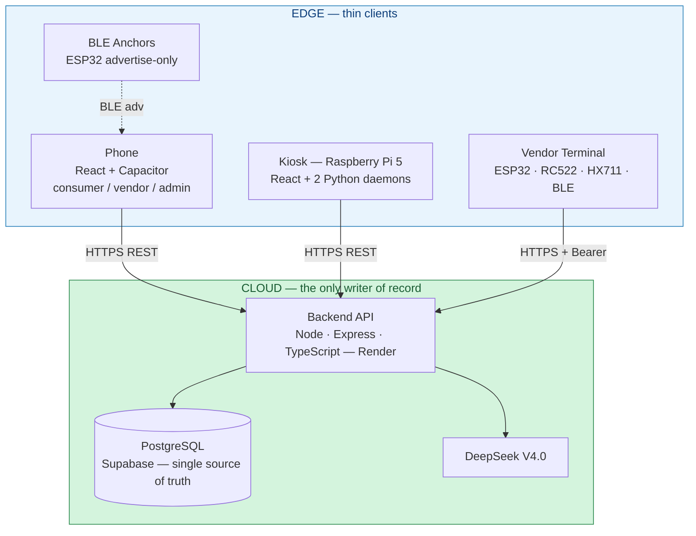

#### Surfaces at a glance

| Surface | Tech | Talks to | Role |
|---------|------|----------|------|
| Web / mobile app | React 19 · TypeScript · Vite · Tailwind · Capacitor | Backend (HTTPS); BLE beacons (scan) | Consumer + Vendor + Admin portal |
| Kiosk (Pi 5) | React · Vite + Python (Flask) daemons | Backend (HTTPS); local daemons (HTTP) | Directory, face greeting, NFC tap |
| Vendor terminal | ESP32 · Arduino C++ | Backend (HTTPS + Bearer) | Weigh + tap-to-pay; BLE anchor |
| BLE anchors | ESP32 · Arduino C++ | — (advertise only) | Indoor positioning reference points |
| Backend | Node · Express · TypeScript · Zod | Supabase; DeepSeek | All business logic |
| Database | PostgreSQL (Supabase) | — | System of record |

#### User interaction flows

To justify that the architecture above actually supports each role's needs, four representative
flows trace how a consumer, an admin, a vendor, and a single customer crossing every surface in one
visit each move through the system.

**Consumer journey**

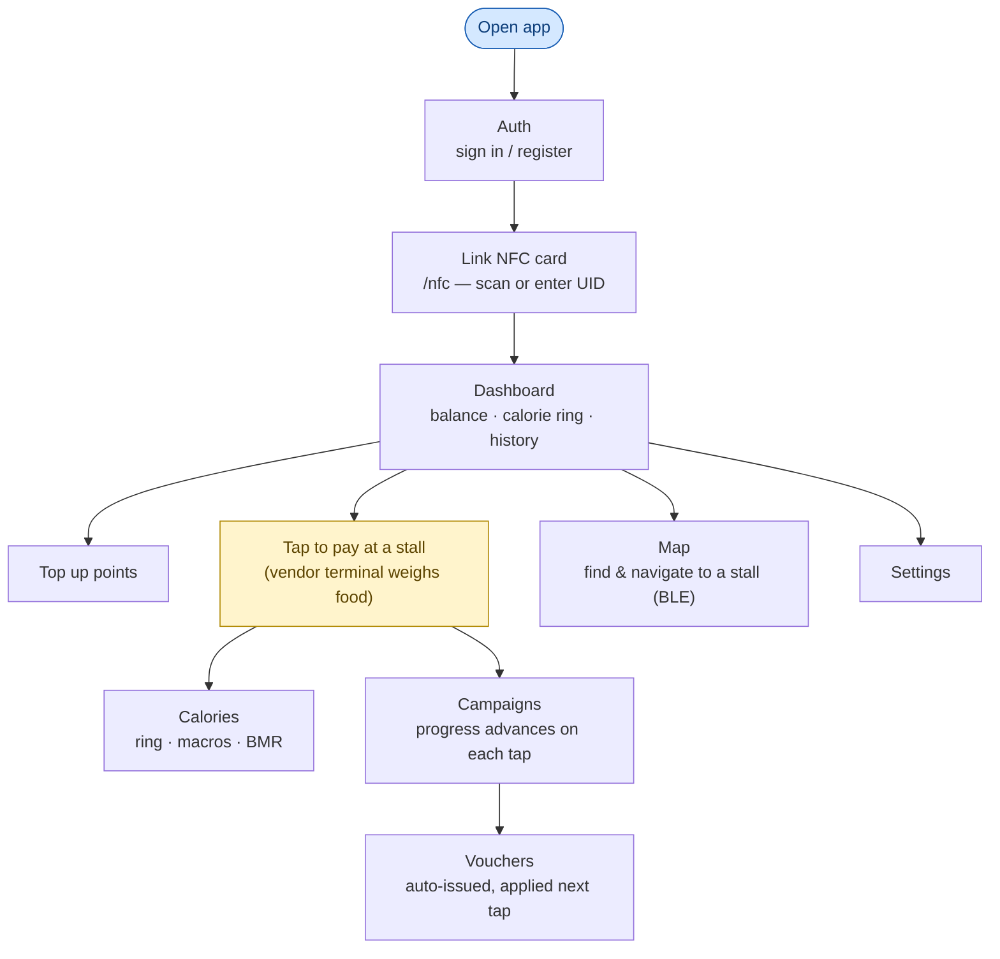

Pages: [`Auth`](../apps/web/src/pages/Auth.tsx) · [`NfcConnect`](../apps/web/src/pages/NfcConnect.tsx) ·
[`Dashboard`](../apps/web/src/pages/Dashboard.tsx) · [`Calories`](../apps/web/src/pages/Calories.tsx) ·
[`Campaigns`](../apps/web/src/pages/Campaigns.tsx) · [`Vouchers`](../apps/web/src/pages/Vouchers.tsx) ·
[`Vendors`](../apps/web/src/pages/Vendors.tsx) · [`Map`](../apps/web/src/pages/Map.tsx) ·
[`Settings`](../apps/web/src/pages/Settings.tsx).

**Admin journey**

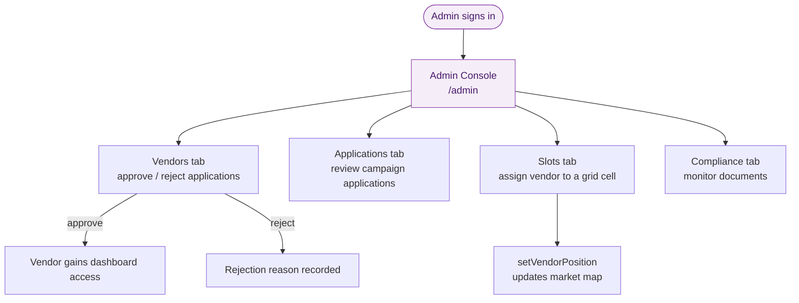

Backed by [`AdminDashboard.tsx`](../apps/web/src/pages/AdminDashboard.tsx) — tabs `vendors`,
`applications`, `compliance`, `slots`; actions `reviewVendor`, `reviewCampaignApplication`,
`setVendorPosition`.

**Vendor journey**

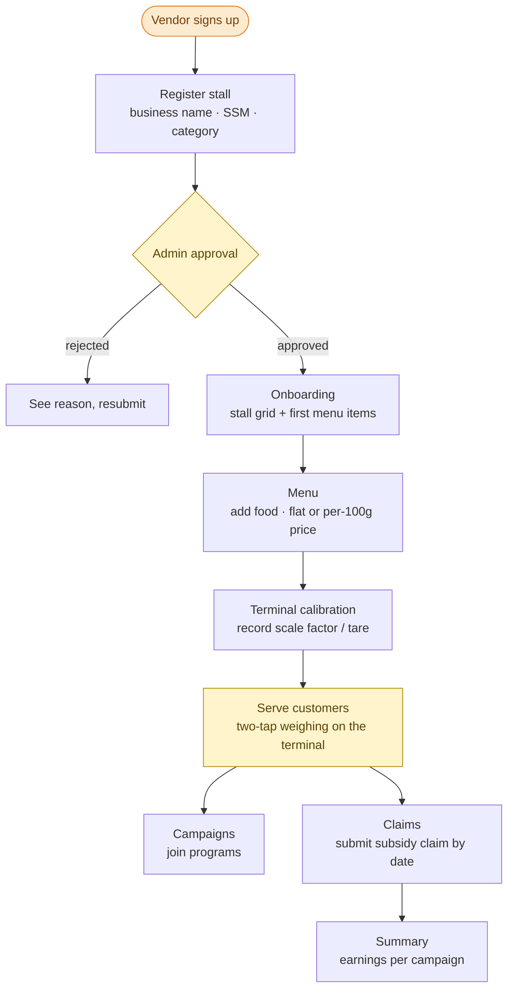

Pages: onboarding app [`apps/vendor`](../apps/vendor/README.md) incl.
[`Onboarding`](../apps/vendor/src/pages/Onboarding.tsx), [`Menu`](../apps/vendor/src/pages/Menu.tsx),
[`Calibration`](../apps/vendor/src/pages/Calibration.tsx); plus in-app vendor mode
[`VendorDashboard`](../apps/web/src/pages/VendorDashboard.tsx),
[`VendorInformation`](../apps/web/src/pages/VendorInformation.tsx),
[`VendorClaim`](../apps/web/src/pages/VendorClaim.tsx),
[`VendorSummary`](../apps/web/src/pages/VendorSummary.tsx). The "Ops" step is the two-tap weighing
sequence detailed under Software, §2.3.

**Cross-surface journey — kiosk → website → vendor terminal**

A single customer's path through the whole system in one visit:

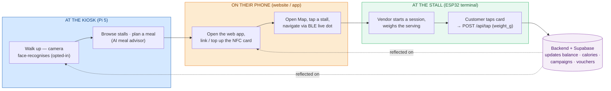

The kiosk, phone, and terminal share one backend, so points spent at the terminal show up on the
phone immediately, and a face login at the kiosk uses the same card record the phone linked.
Step-by-step technical traces of `K1`, `T1→T2`, and `W2` are in the Flowchart/Pseudocode
subsection of §2.3. A repo-only companion, `backend-sync-dataflow.md`, tabulates this in full —
every terminal's endpoint, payload, polling interval, and offline behaviour, on the principle that
no two devices ever talk to each other directly, only through the backend.

### 2.2 Hardware

The prototype's hardware spans three roles: a **vendor terminal** (ESP32 + RFID reader + load
cell, also a BLE anchor), a **kiosk** (Raspberry Pi 5 driving a webcam and an RFID reader through
two local daemons), and standalone **BLE anchors** (ESP32, advertise-only) for indoor positioning.
Two standalone PlatformIO diagnostic firmware envs — `rc522-test` (RFID wiring isolation test) and
`uid-read` (read a card's UID with no WiFi/HX711/BLE) — are used for on-site hardware bring-up and
triage rather than billing. NFC reading behaves slightly differently across the three surfaces
that read the same card — the ESP32 terminal, the kiosk daemon, and the phone — because each reads
the UID through different hardware/API and gets a slightly different string back (e.g. the ESP32's
`831A5308` versus the kiosk's colon-hex `83:1A:53:08`), which the backend has to reconcile (see
§2.3, Source Code). The repo-only companion `features/nfc-reading.md` lays out that full
three-surface comparison side by side.

#### Hardware Diagram

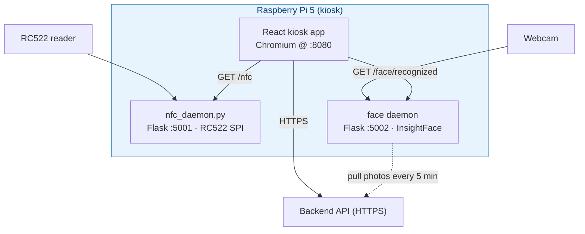

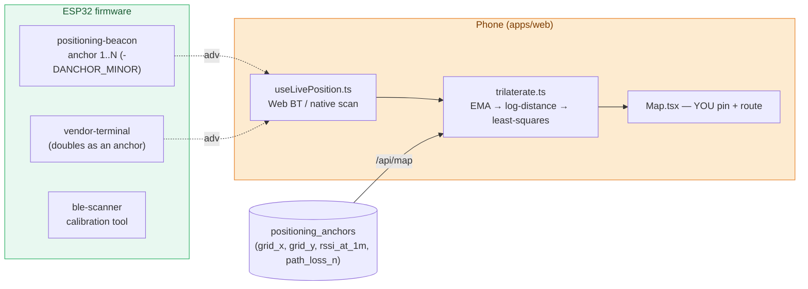

The trilateration algorithm (`trilaterate.ts`) itself is software — see §2.3.

#### Circuit Diagram

**RC522 → ESP32 (terminal, SPI)**

| RC522 | ESP32 |
|-------|-------|
| SS / SDA | GPIO 21 |
| RST | GPIO 22 |
| MOSI | GPIO 23 |
| MISO | GPIO 19 |
| SCK | GPIO 18 |
| VCC / GND | 3.3 V / GND |

**HX711 → ESP32 (terminal)**

| HX711 | ESP32 |
|-------|-------|
| DOUT | GPIO 4 |
| SCK | GPIO 5 |
| VCC / GND | 3.3 V / GND |

**RC522 → Raspberry Pi 5 (kiosk daemon, SPI)**

| RC522 | Pi 5 |
|-------|------|
| SDA (SS) | GPIO 8 (pin 24) |
| SCK | GPIO 11 (pin 23) |
| MOSI | GPIO 10 (pin 19) |
| MISO | GPIO 9 (pin 21) |
| RST | GPIO 25 (pin 22) |
| 3.3 V / GND | pin 1 (**3.3 V only**) / pin 6 |

#### 3D Design / Enclosure

*(diagram pending)*

#### Component List

The prototype is built from five core parts. An ESP32 DevKit v1 runs the firmware for the vendor
terminal and for each BLE anchor. An MFRC522 (RC522) RFID reader appears in two deployment
contexts — the vendor terminal and the kiosk — reading the same NFC card format in both places. An
HX711 load-cell amplifier paired with a load cell does the per-gram weighing at the vendor terminal.
A Raspberry Pi 5 hosts the kiosk, and a USB webcam feeds it for face recognition. Full
specifications, quantities, and cost per item are in §4 Bill of Materials.

### 2.3 Software

Three software surfaces share one backend: the **web/mobile app** (consumer, vendor, and admin
modes in one codebase), the **kiosk app** plus its two local Python daemons, and the **Express
backend** that is the only process holding a database credential. A tool-gated AI assistant sits
on top of the backend.

#### Software Architecture

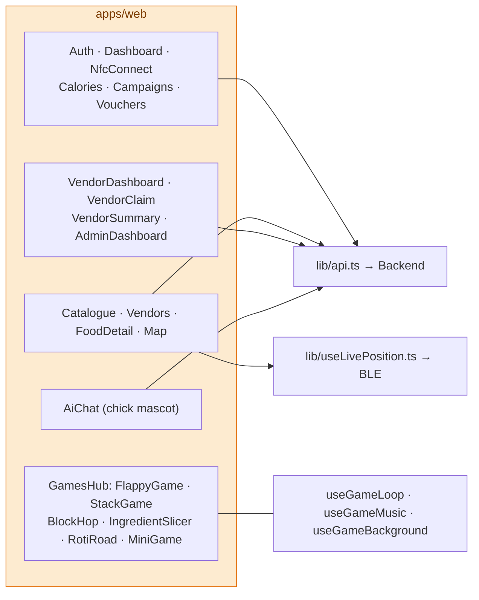

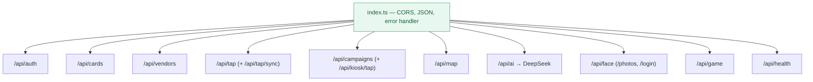

The kiosk app polls the two local daemons shown in the Hardware Diagram (§2.2) over `localhost`,
isolating biometric/RFID hardware access behind small JSON endpoints rather than exposing it to the
React UI directly.

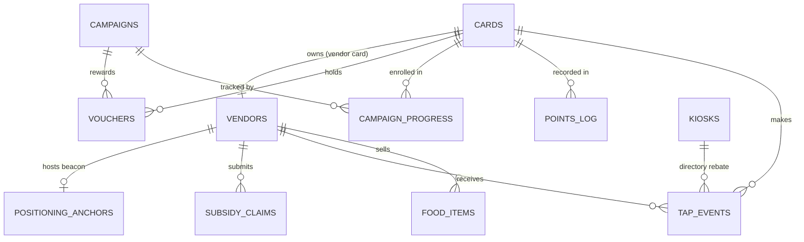

Ten base tables plus a `subsidy_summary` view (live totals for display only — claims are computed
from `vouchers.used_at` for period accuracy) make up the schema, and several invariants are
enforced at that level rather than left to application code. `tap_events` and `points_log` are
**immutable audit trails** (`ON DELETE RESTRICT`), so a purchase or points adjustment can never be
silently erased. `server_timestamp`, set by Express, is the authoritative time for any record,
while the `device_timestamp` an edge device sends along is kept only as informational context.
Each row's `event_type` is constrained to `TAP_PURCHASE` or `DIRECTORY_REBATE`, with a JSONB
`metadata` column typed differently per event. Finally, `campaign_progress` is unique per
`(card_uid, campaign_id)`, and completing it is what triggers a `voucher` to be issued.

A floating AI assistant (DeepSeek V4.0 via `/api/ai`) answers questions and recommends meals within
a calorie budget. It is **tool-gated**: live per-user/market data must come from a tool call, never
from the model's imagination — the tool contract and capabilities are listed in §8.

#### Flowchart / Pseudocode

The vendor terminal's weighing session is a simple two-state machine — tap once to tare, tap again
(same card) to bill the change:

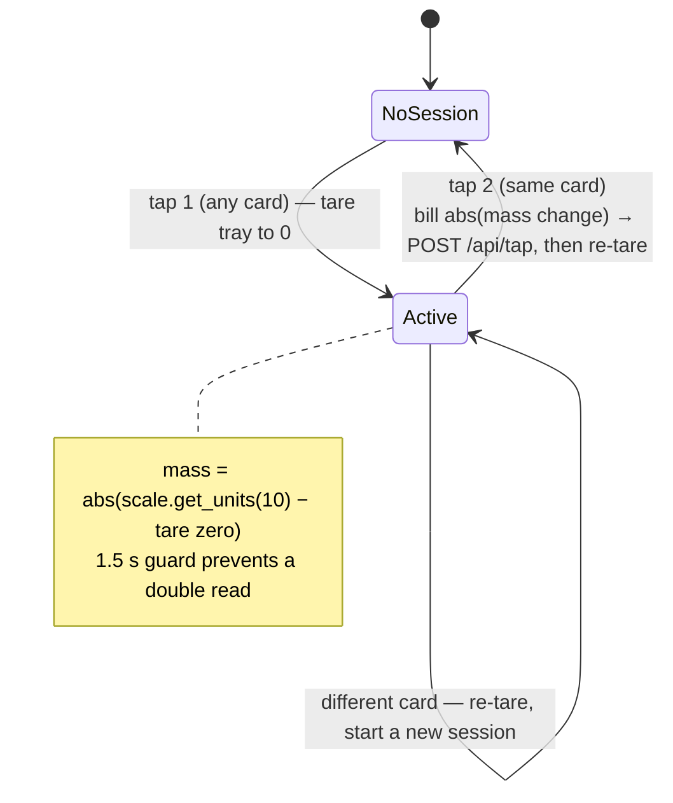

The following sequence diagrams trace how data moves between components for the four core
operations:

**Purchase tap (the core loop)**

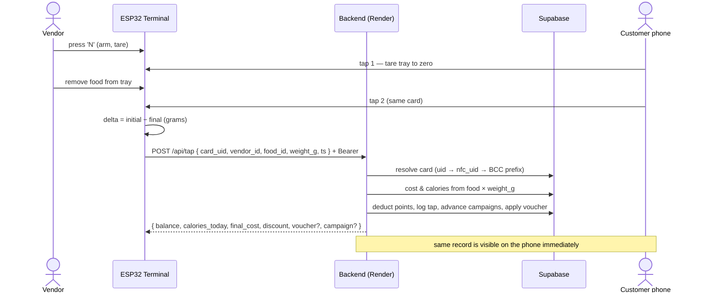

**Face-photo sync (privacy-preserving)**

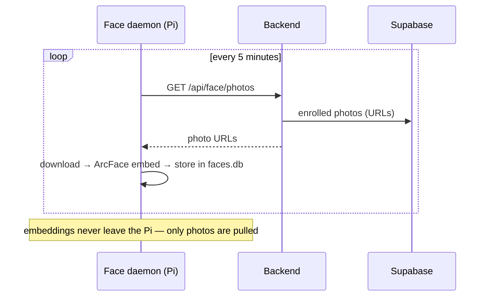

**Indoor positioning**

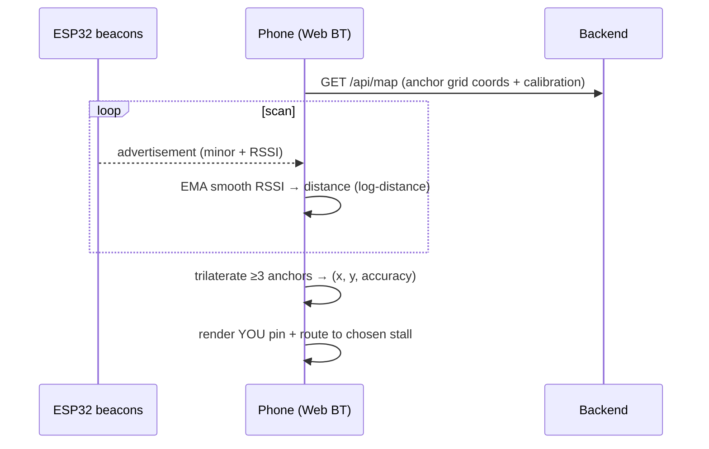

**Kiosk directory tap & face greeting**

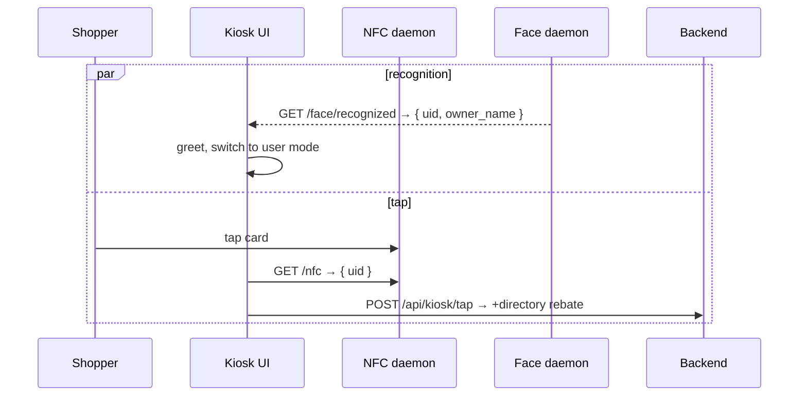

#### Source Code

**Two-tap weighing (ESP32, `tap-weigh-test.ino`)** — tap 1 zeroes the tray, tap 2 bills the change.

```cpp
// SECOND TAP (same card): tray was tared to 0 on tap 1
float currentWeight = scale.get_units(10);
float massChange    = fabs(currentWeight - initialWeight);  // abs change from zero
postTap(lastUID, massChange);                               // POST /api/tap { weight_g: massChange }
scale.tare();                                               // re-zero for the next customer
```

**RSSI → distance → position (web)** — noisy radio made trustworthy.

```ts
// log-distance path-loss model
export function rssiToDistance(rssi, rssiAt1m, pathLossN) {
  const d = Math.pow(10, (rssiAt1m - rssi) / (10 * pathLossN))
  return Math.max(0.01, d)
}
// least-squares trilateration of >= 3 anchors → { x, y, accuracy }
const est = trilaterate(readings)
```

**Server-side UID reconciliation** — one card, three formats.

```ts
// ESP32 sends "831A5308"; kiosk stores "83:1A:53:08:C2" (colon-hex + BCC)
let cardRow = (await supabase.from('cards').select('*').eq('uid', card_uid).single()).data
if (!cardRow) cardRow = (await supabase.from('cards').select('*').eq('nfc_uid', card_uid).single()).data
if (!cardRow) {
  const withColons = card_uid.includes(':') ? card_uid : (card_uid.match(/.{2}/g)?.join(':') ?? card_uid)
  const { data: rows } = await supabase.from('cards').select('*').ilike('nfc_uid', `${withColons}%`).limit(1)
  if (rows?.length) cardRow = rows[0]
}
```

**Confirmed-only temporal smoothing (face)** — identity must be re-proven, not flickered.

```python
# config.py — recognition is gated by agreement over time, then expires
THRESHOLD_CONFIRMED   = 0.40   # cosine similarity for a confirmed match
THRESHOLD_POSSIBLE    = 0.32   # wait-for-more-frames band
SMOOTHING_BUFFER_SIZE = 5      # last N frames
SMOOTHING_VOTES_REQUIRED = 3   # N-of-buffer agreement to confirm
MATCH_TTL_SECONDS     = 3.0    # confirmed identity expires unless re-seen
```

#### Build & Deployment

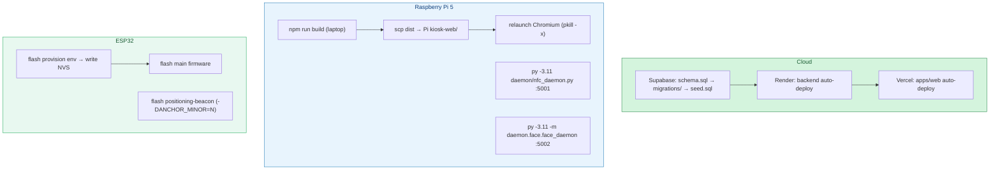

| Component | Build / deploy |
|-----------|----------------|
| Database | Run `schema.sql`, then `migrations/` in order, then `seed.sql` in the Supabase SQL editor |
| Backend | Push → Render auto-deploy (`warungtek-backend.onrender.com`) |
| Web app | Push → Vercel auto-deploy (`nightmarket-web.vercel.app`) |
| Kiosk | `npm run build` on the laptop → `scp dist/*` to the Pi → relaunch Chromium (**`pkill -x chromium`**, never `-f`) |
| Daemons | `py -3.11 daemon/nfc_daemon.py` (`:5001`); `py -3.11 -m daemon.face.face_daemon` (`:5002`, binds `0.0.0.0`) |
| Terminal | Flash **provision** env once to write NVS, then flash the main firmware; `F<number>` calibrates on-site |
| Anchors | Flash `positioning-beacon` per anchor with `-DANCHOR_MINOR=N`; record the grid position in `positioning_anchors` |

---

## 3. Timetable

This section evaluates the phase of works the system went through, retrospectively, rather than
proposing a forward-looking schedule: it groups the architecture, firmware, software, and
calibration work documented in §2 into five phases spread across an illustrative fourteen-week
window, so that progress can be read against a timeline the same way a project proposal's Gantt
chart would be read.

The first phase, Research and Design, spans weeks one and two and covers settling on the
thin-client architecture and the boundary between each surface, selecting the hardware (the ESP32
DevKit v1, MFRC522, HX711, Raspberry Pi 5, and webcam), and drafting the initial database schema
and backend route map. The second phase, Prototyping, spans weeks three to five and covers the
`tap-weigh-test` firmware that proved the two-tap weighing idea, the first Express backend wired to
the Supabase schema, and the earliest web/mobile app screens (`Auth`, `Dashboard`, `NfcConnect`).
The third phase, Development and Integration, spans weeks six to eight and covers the production
vendor-terminal firmware with its `N`/`F` serial keys and stability tracker, the kiosk app's
integration with the NFC and face daemons, and the BLE beacon firmware alongside the phone-side
trilateration client. The fourth phase, Testing and Calibration, spans weeks nine to twelve and
covers deriving the load-cell calibration factor, the least-squares calibration of the BLE
RSSI-to-distance model, and tuning the face-recognition thresholds and temporal-smoothing window.
The fifth and final phase, Final Delivery, spans weeks thirteen and fourteen and covers the
deployment pipeline — Render, Vercel, the Pi `scp` + Chromium relaunch, and firmware flashing — and
the writing of this report.

| Phase | Description of Work | Weeks |
|-------|----------------------|-------|
| 1. Research and Design | Thin-client architecture and surface boundaries; hardware selection; initial database schema and API route map | 1–2 |
| 2. Prototyping | Two-tap weighing firmware proof of concept; Express backend wired to Supabase; earliest web/mobile app screens | 3–5 |
| 3. Development and Integration | Production vendor-terminal firmware; kiosk + NFC/face daemon integration; BLE beacon firmware and trilateration client | 6–8 |
| 4. Testing and Calibration | Load-cell calibration; BLE RSSI-to-distance least-squares calibration; face-recognition threshold and smoothing tuning | 9–12 |
| 5. Final Delivery | Deployment pipeline (Render, Vercel, Pi, firmware flashing); final report | 13–14 |

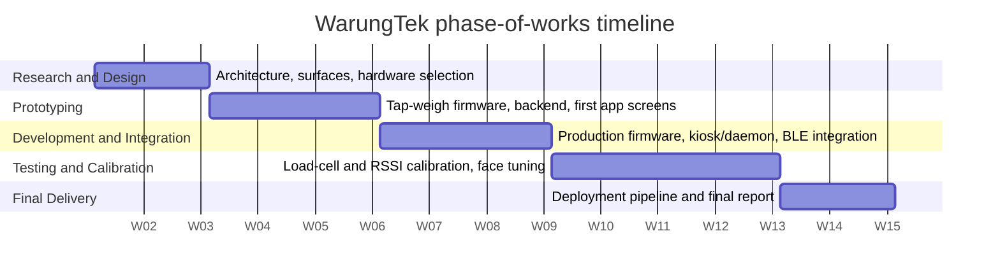

---

## 4. Bill of Materials

Unit costs and quantities below are not yet finalized — no purchase receipts have been compiled
for this prototype, so cost cells are marked pending. Specifications/features reflect what's
already documented and verified in firmware/code.

| Component Code | Part Name | Specification / Feature | Unit Cost | Quantity | Description |
|---|---|---|---|---|---|
| MCU-ESP32 | ESP32 DevKit v1 | WiFi + BLE, Arduino C++ | *pending* | *pending* | Runs vendor terminal and each BLE anchor's firmware |
| RFID-RC522 | MFRC522 reader | SPI, 13.56 MHz | *pending* | *pending* | Reads NFC card UID at the vendor terminal and the kiosk |
| LC-HX711 | HX711 amplifier + load cell | SPI-like 2-wire (DOUT/SCK) | *pending* | *pending* | Weighs served food for per-gram billing |
| SBC-PI5 | Raspberry Pi 5 | Runs React kiosk app + 2 Python daemons | *pending* | *pending* | Kiosk directory, NFC tap, face greeting |
| CAM-USB | USB webcam | — | *pending* | *pending* | Face-recognition camera feed for the kiosk |

## 5. Cost

*(pending — no purchasing receipts have been compiled yet. Once unit costs in §4 are filled in
from receipts, the total prototype development cost will be summed here.)*

## 6. Test

Two calibrated subsystems already have documented calculation formulae from development: load-cell
weighing and BLE indoor positioning. Formal experimental logs (raw readings, repeated trials across
varying conditions) have not yet been captured.

### Calculation Formulae

For **load-cell weighing** at the vendor terminal, mass is computed as
`abs(scale.get_units(10) − tare_zero)`, using a calibration factor of `63.22` set in the sketch, and
a 1.5 s post-tap guard prevents the same card from being read twice in a row. The repo-only
companion `features/load-cell-calibration.md` carries the fuller story behind that one line: why
the two-tap (tare, then re-read) approach was chosen over weighing against a known empty-tray
weight, how the HX711's raw ADC counts are converted to grams, and the on-site procedure for
re-calibrating the factor against a known mass without reflashing the firmware.

For **BLE indoor positioning** on the phone side, RSSI is converted to distance with a log-distance
path-loss model, `d = 10^((rssi@1m − rssi) / (10·n))`, calibrated to `rssi@1m = −79` and `n = 2.4`
by least squares on 2026-06-08. Each anchor's RSSI is first smoothed with an exponential moving
average at `α = 0.3` before that conversion, and the resulting distances feed a least-squares
trilateration of three or more anchors, whose RMS residual is reported back to the user as an
accuracy halo around the estimated position. The repo-only companion `positioning-data-flow.md`
walks through this from two angles — what the shopper actually experiences on the map screen, and
what each component (beacon, phone, backend) does with the data underneath — plus a deployment
checklist for siting and calibrating new beacons at a different venue.

### Data Collected

*(pending — formal test logs, varying-condition trials, and safety/health/legal/cultural review
have not yet been recorded)*

## 7. Results

*(pending — to be computed from §6 Data Collected, once captured, using the formulae in §6
Calculation Formulae)*

## 8. Specifications of the Product Prototype

| Aspect | Detail |
|--------|--------|
| Web/mobile framework | React 19, Vite, TypeScript, Tailwind, React Router, Recharts |
| Web/mobile mobile wrapper | Capacitor (Android/iOS); `@capacitor-community/bluetooth-le` for native scan |
| Web/mobile engagement | 6 mini-games behind `GamesHub`, shared game hooks, in-game music, chick mascot assistant |
| Web/mobile data access | `lib/api.ts` to `VITE_API_URL`; localStorage session |
| Web/mobile positioning | `lib/useLivePosition.ts` + `lib/trilaterate.ts` (Web Bluetooth) |

| Daemon | Port | Endpoint(s) | Returns |
|--------|------|-------------|---------|
| NFC | `5001` | `GET /nfc`, `/health` | `{ uid: "83:1A:53:08" \| null, timestamp }` (fresh ≤ `TAP_TTL` 3 s) |
| Face | `5002` | `GET /face/recognized`, `/stats`, `/health`, `/stream`, `POST /reload` | `{ uid, owner_name, confidence, frames_confirmed, timestamp }` or 204 |

Face recognition pipeline: RetinaFace detect → quality gate → ArcFace embed → cosine match →
temporal smoothing, on-device only. Verified parameters: `buffalo_l` model pack, 512-dim
embeddings, `THRESHOLD_CONFIRMED = 0.40`, `THRESHOLD_POSSIBLE = 0.32`, smoothing **3-of-5** votes,
`MATCH_TTL = 3 s`, detect every 2nd frame, MJPEG `/stream` at 640×480 q60. The repo-only companion
`daemon/face/README.md` explains each pipeline stage in depth, the libraries behind it, and the
privacy-by-design rationale for keeping recognition entirely on-device rather than calling a cloud
face API — including the cost, latency, and data-custody reasons that ruled cloud recognition out.

| Aspect | Detail (vendor terminal, verified in `tap-weigh-test.ino`) |
|--------|--------------------------------------------|
| MCU | ESP32 DevKit v1 (Arduino C++) |
| RFID | MFRC522 over SPI — `SS=21 RST=22 MOSI=23 MISO=19 SCK=18` |
| Load cell | HX711 — `DOUT=4 SCK=5`; calibration factor **`63.22`** |
| Weighing | tap 1 tares to zero; tap 2 (same card) bills `abs(currentWeight − initialWeight)` |
| Same-card re-tap | 1.5 s post-tap delay prevents a double read |
| Network | WiFi non-blocking reconnect (30 s); `POST /api/tap` with Bearer token (non-fatal if unprovisioned) |
| BLE | Also a positioning anchor — `NM-Anchor`, `VENUE_SERVICE_UUID`, manufacturer `0xFFFF + minor`, `ESP_PWR_LVL_P9`, adv 20–40 ms |
| NVS keys | shares `config` namespace: `wifi_ssid, wifi_pass, vendor_id, food_id, api_url, auth_token` |
| Calories | **Not computed on device** — backend derives from the food item + `weight_g` |

| Step | Mechanism (BLE positioning) |
|------|-----------|
| Advertise | 31-byte packet: flags + `VENUE_SERVICE_UUID` + manufacturer `0xFFFF` + 1-byte `ANCHOR_MINOR` |
| Per-anchor identity | `beacon_minor` row in `positioning_anchors`; firmware `-DANCHOR_MINOR=N` build flag |
| Smooth / RSSI → distance / Position | see calculation formulae, §6 |
| Platform | Android Chrome (+ experimental flag) **or** Capacitor native BLE; no iOS Web Bluetooth |

| Service | Port | Host | Notes |
|---------|------|------|-------|
| Backend API | `3000` / Render | cloud | `warungtek-backend.onrender.com` |
| Web app (dev) | `5173` | localhost | Vite |
| Vendor app (dev) | `5174` | localhost | Vite (CORS also allows `5175`) |
| Kiosk web | `8080` | Pi 5 | Chromium kiosk mode |
| NFC daemon | `5001` | Pi 5 | RC522 → `GET /nfc` |
| Face daemon | `5002` | Pi 5 / laptop | InsightFace → `GET /face/recognized` |
| Database | Supabase | cloud | PostgreSQL |
| BLE anchors | — | on-device | advertise-only |

CORS allows `localhost:3000/5173/5174/5175/8080` plus `*.vercel.app`, `*.onrender.com`,
`*.up.railway.app`. Auth is bcrypt password for consumers and a Bearer terminal token for ESP32
devices.

AI assistant tool contract — reproduced in full below, so the repo-only companion
`backend/agent/warungtek-agent.md` it comes from is not required reading; that file additionally
carries the assistant's full system prompt and the exact wording of its safety rules:

| Tool | Triggered when the user asks about… | Kind |
|------|--------------------------------------|------|
| `getMyBalance` | points / money / "can I afford X" | read |
| `getMyCaloriesToday` | calories eaten today / over limit | read |
| `getMyHistory` | recent purchases / what they ate | read |
| `getMyCampaigns` | active campaigns / progress to a voucher | read |
| `searchFood` | what's available / cheap / low-cal / spicy tonight | read |
| `getVendor` | a specific stall's offerings | read |
| `joinCampaign` | "sign me up for…" | **write** (confirm in reply) |
| `setMyCalorieGoal` | "set my limit to N" | **write** (confirm in reply) |

Safety rules: never invent a balance/calorie/history value; never expose the card UID or internal
IDs; execute write tools on clear intent and confirm once.

**Capabilities**: end-to-end purchase, loyalty, and navigation flows already run across all three
surfaces sharing one backend; face recognition keeps biometric data entirely on-device; the vendor
terminal degrades gracefully (non-fatal POST) when offline or unprovisioned.

**Limitations**: indoor positioning has no iOS Web Bluetooth path (Android Chrome or the Capacitor
native wrap only); RSSI calibration constants are specific to the deployment site and would need
re-calibration elsewhere; no enclosure/3D design or formal test data exists yet (§2.2, §6).

## 9. Conclusion

WarungTek's three independently-useful features — cash-free weighed billing, automatic loyalty/
subsidy tracking, and indoor navigation — already work as one coherent system sharing a single
backend, which is the core claim this prototype needed to demonstrate. **Feasibility** is supported
by the fact that the purchase loop, face-greeting flow, and BLE positioning all run end-to-end
today, not just on paper. **Desirability** follows from removing three concrete frictions —
handling cash, tracking paper loyalty, and finding a stall — without requiring a smartphone for the
core pay flow (the NFC card alone is enough). **Viability** rests on the thin-client cost structure:
commodity ESP32 boards and a Raspberry Pi keep the edge cheap, while all business logic — and the
only database credential — lives in one auditable cloud process.

Several of the design choices also support a **circular-economy** reading of the system: because
edge devices hold no logic or credentials of their own, a damaged or obsolete terminal, kiosk, or
beacon can be swapped for another unit of the same commodity hardware without losing any history or
re-deriving any business rule — there is no proprietary "smart" hardware to discard along with the
logic baked into it. Billing by weighed gram rather than fixed portion size also discourages
over-portioning at the stall, a small but direct reduction in food waste.

On safety, social, and environmental grounds: face recognition processes images entirely on-device
and never uploads them, addressing a real privacy concern around biometric data; the cash-free flow
still works for shoppers without a smartphone, since only the NFC card is required; and the admin
console gives the market authority oversight needed for subsidy compliance.

Anticipated near-future issues include scaling the face daemon to more kiosks running concurrently,
formal calibration of BLE positioning at additional deployment sites, and completing the Bill of
Materials costing and Test data collection (§4–§7) that this prototype has not yet finished.

## 10. Reference

*(pending — academic resources, technical manuals/datasheets, policy papers, and other paper
citations to be added)*

---

*WarungTek — React 19 · TypeScript · Express · PostgreSQL (Supabase) · Render · Vercel · ESP32 · Raspberry Pi 5 · InsightFace · DeepSeek V4.0*
