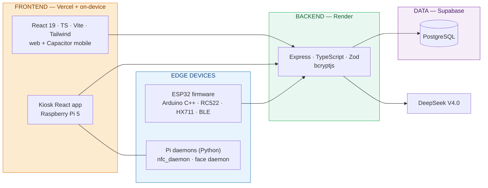
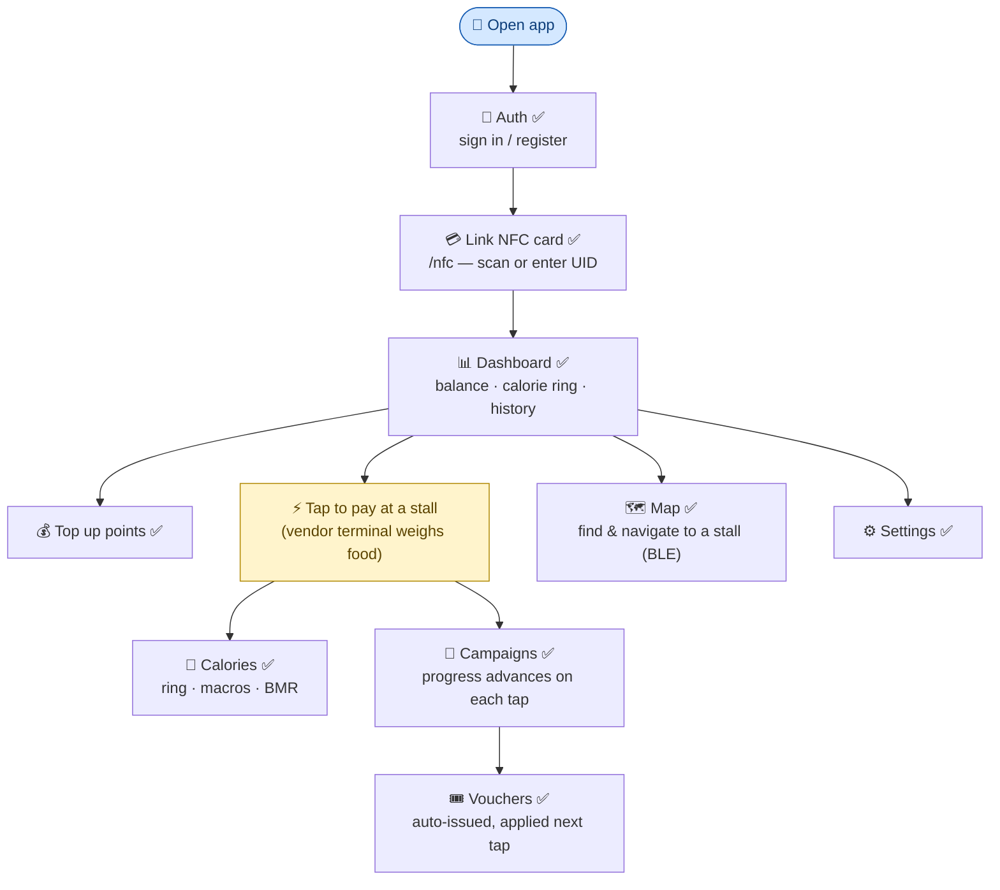
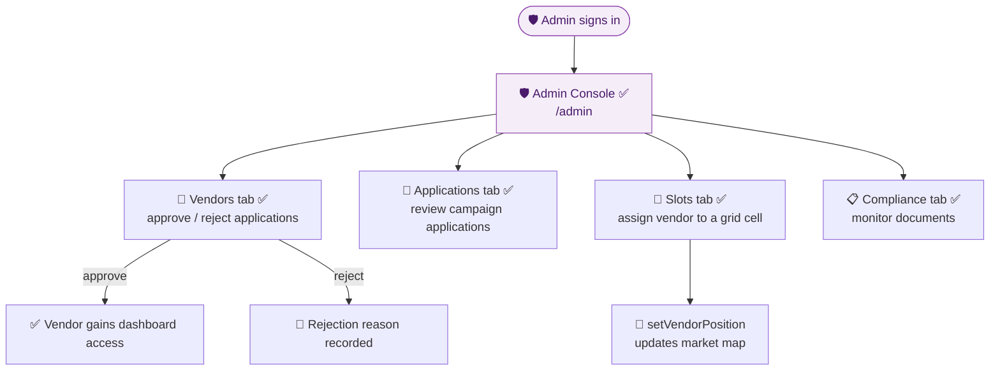
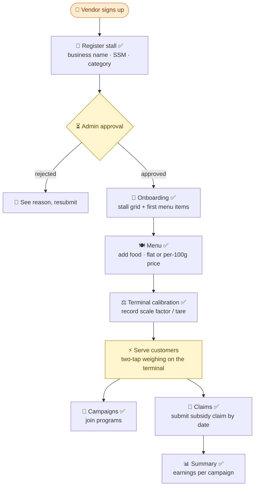
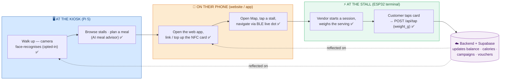
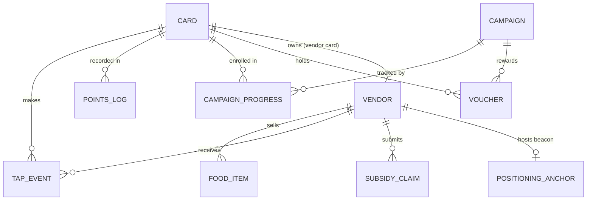

# WarungTek — Master Overview

> The high-level story of the project in plain language: **why it exists, what was built, the
> stack it runs on, and how each kind of user moves through it.** For setup see
> [README.md](README.md); for deep technical detail follow the per-feature links at the end.

> This file supersedes the older `MASTER_v2_refined.md` (now in
> [docs/_archive/](docs/_archive/)). Where the old overview disagreed with what is actually
> shipped, the shipped system wins.

---

## 1. Objective

A night market runs on cash, paper loyalty stamps, and word-of-mouth directions. WarungTek
replaces all three with **one tap-to-pay NFC card and one cloud backend**, so that:

- a **shopper** carries a single card, pays by tapping at any stall, and automatically sees
  their spending, calories, campaign progress, and vouchers — no app sign-up needed to start;
- a **vendor** runs a low-cost ESP32 terminal that weighs food on a load cell and charges by
  the gram, lists their menu online, and claims government subsidies through campaigns;
- an **authority admin** approves who trades, where they sit on the market grid, and whether
  they stay compliant;
- and the market itself becomes **navigable** — a kiosk and the phone help a shopper find and
  walk to a specific stall, and can greet returning customers by face.

The guiding principle is that **the cloud is the single source of truth** and every device —
phone, kiosk, terminal — is a thin client that reads and writes through one API.

---

## 2. Features achieved

### 2.1 The card, points, and tap-to-pay
Each customer has one NFC card whose only stored value is its UID; everything else lives in the
database. Tapping at a vendor terminal deducts points, logs the purchase, adds calories, and
advances any campaigns — all in one backend call ([`backend/src/routes/tap.ts`](backend/src/routes/tap.ts)).
Top-ups adjust the balance directly (no payment gateway).

### 2.2 Weight-based pricing (load cell)
Vendors can price food **per 100 g**. The ESP32 terminal carries an HX711 load cell; a
two-tap weighing flow captures the serving mass and sends it as `weight_g`, and the backend
computes cost and calories from the weighed grams. See
[load-cell calibration](docs/features/load-cell-calibration.md).

### 2.3 Calorie & health tracking
Every weighed purchase contributes calories (from the food's `calories_per_100g`). The app
shows a daily ring against a personal limit, a macro breakdown, and a BMR helper, and the
terminal warns when a customer crosses their limit
([`apps/web/src/pages/Calories.tsx`](apps/web/src/pages/Calories.tsx)).

### 2.4 Campaigns & vouchers
Admins/vendors run campaigns with conditions like "visit N stalls" or "spend N points". Taps
advance a card's progress automatically; completing a campaign issues a voucher that is applied
on the next eligible tap ([`backend/src/routes/campaigns.ts`](backend/src/routes/campaigns.ts),
[`apps/web/src/pages/Vouchers.tsx`](apps/web/src/pages/Vouchers.tsx)).

### 2.5 Vendor portal & subsidy claims
Vendors register a stall (with SSM business number), manage a menu, view earnings by campaign,
and submit subsidy claims by date range ([`apps/web/src/pages/VendorDashboard.tsx`](apps/web/src/pages/VendorDashboard.tsx),
[`VendorClaim.tsx`](apps/web/src/pages/VendorClaim.tsx),
[`VendorSummary.tsx`](apps/web/src/pages/VendorSummary.tsx)). A separate onboarding app
([`apps/vendor`](apps/vendor/README.md)) covers first-time registration and terminal calibration.

### 2.6 Admin authority console
The admin dashboard approves or rejects vendor applications, reviews campaign applications, and
assigns each vendor a slot on the market grid — plus a compliance view
([`apps/web/src/pages/AdminDashboard.tsx`](apps/web/src/pages/AdminDashboard.tsx)).

### 2.7 Directory kiosk + face recognition
A Raspberry Pi 5 kiosk lets shoppers browse stalls, filter by diet/calories, plan a meal, and
navigate. A camera runs an **on-device** face-recognition pipeline: a returning, opted-in
customer is greeted and switched into user mode without tapping. No face image ever leaves the
Pi. See [face recognition](docs/features/face-recognition.md).

### 2.8 Indoor map navigation (BLE)
Fixed ESP32 beacons advertise over Bluetooth; the shopper's phone listens, converts signal
strength to distance, and trilaterates a live "you are here" dot with a route to a chosen
stall — no app install required on supported Android, and a smoother native path in the
Capacitor build. See [map navigation](docs/features/map-navigation.md).

### 2.9 AI assistant
A floating assistant (DeepSeek V4.0) answers questions and recommends meals within a calorie
budget, surfaced both in the app and as the kiosk's meal planner
([`backend/src/routes/ai.ts`](backend/src/routes/ai.ts),
[`apps/web/src/components/AiChat.tsx`](apps/web/src/components/AiChat.tsx)).

### 2.10 Engagement games & mascot
The consumer app carries a light engagement layer: a games hub — Flappy Burger, Stack Tower, Block
Hop, Ingredient Slicer, Roti Road, and a daily spin — where each game is a self-contained page
driven by shared hooks (`useGameLoop`, `useGameBackground`, `useGameMusic`) with in-game music. A
friendly chick mascot fronts the AI assistant and the game intros
([`GamesHub.tsx`](apps/web/src/pages/GamesHub.tsx), [`FlappyGame.tsx`](apps/web/src/pages/FlappyGame.tsx),
[`BlockHop.tsx`](apps/web/src/pages/BlockHop.tsx)).

---

## 3. Tech stack — how the pieces connect

WarungTek is a thin-client architecture: three device families, one API, one database.

| Layer | Technology | Hosting |
|---|---|---|
| Web / mobile app | React 19 · TypeScript · Vite · Tailwind · React Router · Recharts · Capacitor | Vercel |
| Kiosk app | React · TypeScript · Vite | Local on Pi 5 |
| Backend API | Node.js · Express · TypeScript · Zod · bcryptjs | Render |
| Database | PostgreSQL | Supabase |
| Vendor terminal | ESP32 · Arduino C++ · MFRC522 · HX711 · BLE · WiFi/HTTPS | On-device |
| Kiosk daemons | Python · Flask · `mfrc522` · InsightFace · OpenCV | On-device (Pi 5) |
| AI | DeepSeek V4.0 | Via backend |

The consumer web app also bundles an engagement layer — the games hub and chick mascot — built on
shared game hooks (`useGameLoop` / `useGameBackground` / `useGameMusic`) and in-game audio.

Backend route map (mounted in [`backend/src/index.ts`](backend/src/index.ts)):
`/api/auth` · `/api/cards` · `/api/vendors` · `/api/tap` (+ `/api/tap/sync`) · `/api/campaigns`
(+ `/api/kiosk/tap`) · `/api/map` · `/api/ai` · `/api/face` (`/photos`, `/login`).

---

## 4. User journeys

Four flows, one per role plus one that follows a single customer across every surface. (✅ = a
shipped step backed by a real page/endpoint.)

### 4.1 Consumer journey

Pages: [`Auth`](apps/web/src/pages/Auth.tsx) · [`NfcConnect`](apps/web/src/pages/NfcConnect.tsx) ·
[`Dashboard`](apps/web/src/pages/Dashboard.tsx) · [`Calories`](apps/web/src/pages/Calories.tsx) ·
[`Campaigns`](apps/web/src/pages/Campaigns.tsx) · [`Vouchers`](apps/web/src/pages/Vouchers.tsx) ·
[`Vendors`](apps/web/src/pages/Vendors.tsx) · [`Map`](apps/web/src/pages/Map.tsx) ·
[`Settings`](apps/web/src/pages/Settings.tsx).

### 4.2 Admin journey

Backed by [`AdminDashboard.tsx`](apps/web/src/pages/AdminDashboard.tsx) — tabs `vendors`,
`applications`, `compliance`, `slots`; actions `reviewVendor`, `reviewCampaignApplication`,
`setVendorPosition`.

### 4.3 Vendor journey

Pages: onboarding app [`apps/vendor`](apps/vendor/README.md) incl.
[`Onboarding`](apps/vendor/src/pages/Onboarding.tsx), [`Menu`](apps/vendor/src/pages/Menu.tsx),
[`Calibration`](apps/vendor/src/pages/Calibration.tsx); plus in-app vendor mode
[`VendorDashboard`](apps/web/src/pages/VendorDashboard.tsx),
[`VendorInformation`](apps/web/src/pages/VendorInformation.tsx),
[`VendorClaim`](apps/web/src/pages/VendorClaim.tsx),
[`VendorSummary`](apps/web/src/pages/VendorSummary.tsx).

### 4.4 Cross-surface journey — kiosk → website → vendor terminal

A single customer's path through the whole system in one visit:

The kiosk, phone, and terminal share one backend, so points spent at the terminal show up on
the phone immediately, and a face login at the kiosk uses the same card record the phone linked.
The exact endpoints and timing are tabulated in
[backend-sync data flow](docs/backend-sync-dataflow.md).

---

## 5. Data model (overview)

Schema and migrations live in [`database/`](database/) (`schema.sql` + `migrations/001`–`010`).

---

## 6. Deep-dive documents

| Feature | Overview | Authoritative deep dive |
|---|---|---|
| Face recognition | [docs/features/face-recognition.md](docs/features/face-recognition.md) | [daemon/face/README.md](daemon/face/README.md) |
| Indoor map navigation | [docs/features/map-navigation.md](docs/features/map-navigation.md) | [docs/positioning-data-flow.md](docs/positioning-data-flow.md) |
| Load-cell weighing & calibration | [docs/features/load-cell-calibration.md](docs/features/load-cell-calibration.md) | — |
| NFC reading (3 surfaces) | [docs/features/nfc-reading.md](docs/features/nfc-reading.md) | — |
| Multi-terminal backend sync | [docs/backend-sync-dataflow.md](docs/backend-sync-dataflow.md) | — |
| Full technical report (architecture · data flow · hardware · MCP tools · deploy) | [docs/technical-report.md](docs/technical-report.md) | — |
| Design decisions: doubts, challenges & solutions | [docs/system-design-critical-thinking.md](docs/system-design-critical-thinking.md) | — |

---

*React 19 · TypeScript · Express · PostgreSQL (Supabase) · Render · Vercel · ESP32 · Raspberry Pi 5 · DeepSeek V4.0*
